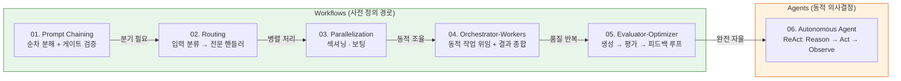
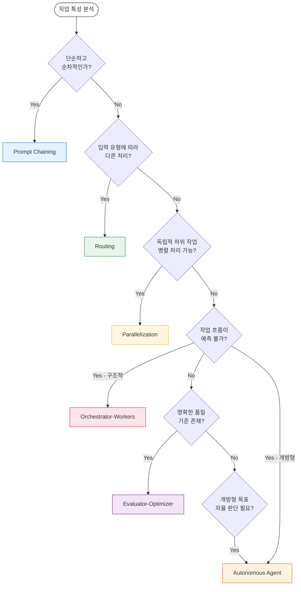

# Effective Agents Diagram

Anthropic의 Building Effective Agents 프레임워크에 기반한 6가지 패턴을 종합한 다이어그램입니다.

---

## 전체 구조

Anthropic 프레임워크는 패턴을 **Workflows**(1~5번, 사전 정의된 코드 경로)와 **Agents**(6번, LLM의 동적 의사결정)로 구분합니다. 단순한 Prompt Chaining에서 완전 자율
에이전트까지, 복잡도와 자율성이 점진적으로 증가하는 스펙트럼을 이룹니다.

## 패턴 선택 흐름

작업의 예측 가능성, 독립성, 품질 기준 유무에 따라 적합한 패턴을 선택합니다.

## 패턴별 핵심 메커니즘

각 패턴의 내부 동작 원리를 요약한 다이어그램입니다.

```mermaid
graph TB
    subgraph PC["Prompt Chaining"]
        pc1["Step 1"] -->|"output"| pc_gate{"Gate"} -->|"pass"| pc2["Step 2"] -->|"output"| pc3["Step 3"]
    end

    subgraph RT["Routing"]
        rt_in["Input"] --> rt_cls["Classifier"] --> rt_a["Handler A"] & rt_b["Handler B"] & rt_c["Handler C"]
    end

    subgraph PL["Parallelization"]
        pl_in["Task"] --> pl_a["Agent A"] & pl_b["Agent B"] & pl_c["Agent C"]
        pl_a & pl_b & pl_c --> pl_agg["Aggregator"]
    end

    subgraph OW["Orchestrator-Workers"]
        ow_orc["Orchestrator"] -->|"위임"| ow_w1["Worker 1"] & ow_w2["Worker 2"]
        ow_w1 & ow_w2 -->|"결과"| ow_orc
    end

    subgraph EO["Evaluator-Optimizer"]
        eo_gen["Generator"] --> eo_out["Output"] --> eo_eval["Evaluator"]
        eo_eval -->|"❌ 피드백"| eo_gen
        eo_eval -->|"✅ 통과"| eo_final["Final"]
    end

    subgraph AA["Autonomous Agent"]
        aa_reason["Reason"] --> aa_act["Act"] --> aa_obs["Observe"]
        aa_obs --> aa_reason
    end

    style PC fill: #e3f2fd, stroke: #1565C0
    style RT fill: #e8f5e9, stroke: #2E7D32
    style PL fill: #fff8e1, stroke: #F9A825
    style OW fill: #fce4ec, stroke: #C62828
    style EO fill: #f3e5f5, stroke: #6A1B9A
    style AA fill: #fff3e0, stroke: #E65100
```

