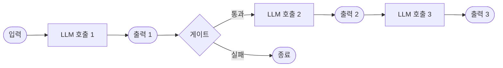
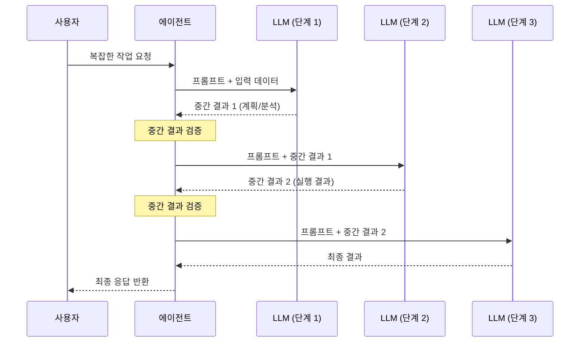

# 프롬프트 체이닝 (Prompt Chaining)

## 정의 및 핵심 요약

프롬프트 체이닝은 복잡한 작업을 일련의 순차적인 단계로 분해하여, 각 단계에서 LLM(대형 언어 모델)의 출력이 다음 단계의 입력으로 전달되는 설계 패턴입니다.

**핵심 특징:**

- 각 LLM 호출은 명확하게 정의된 단일 역할을 수행
- 이전 단계의 결과물이 다음 단계의 컨텍스트가 됨
- 중간 결과를 검증하거나 변환하는 게이트(gate) 단계를 포함할 수 있음
- 단계별 추적과 디버깅이 용이

**적합한 상황:**

- 작업이 명확한 순서를 가진 하위 작업으로 분리될 수 있을 때
- 정확도 향상을 위해 지연(latency)을 허용할 수 있을 때
- 각 단계의 출력을 중간 검증해야 할 때

---

## 작동 원리 및 흐름

### 단계별 데이터 흐름

---

## 실제 사용 예시 (Use Cases)

### 1. 문서 생성 파이프라인

마케팅 팀이 블로그 포스트를 자동 생성할 때:

- **단계 1**: 주제와 타겟 독자를 기반으로 개요(outline) 작성
- **단계 2**: 개요를 바탕으로 초안(draft) 작성
- **단계 3**: 초안을 브랜드 톤과 SEO 가이드라인에 맞게 편집

### 2. 코드 리뷰 자동화

소프트웨어 개발 팀의 코드 품질 관리:

- **단계 1**: 코드에서 보안 취약점 분석
- **단계 2**: 성능 개선 사항 식별
- **단계 3**: 최종 리뷰 보고서 형식으로 종합

### 3. 번역 및 현지화

글로벌 서비스의 콘텐츠 현지화:

- **단계 1**: 원문 텍스트를 직역(literal translation)
- **단계 2**: 문화적 맥락에 맞게 의역(adaptation)
- **단계 3**: 현지 어투와 스타일로 최종 검수

### 4. 문서 작성 파이프라인 (Gate 활용)

아웃라인 기반 문서 작성 시스템 (원문 예시):

- **단계 1**: 주제를 기반으로 문서 아웃라인 작성
- **Gate**: 아웃라인이 특정 기준(구조, 범위, 논리 흐름)을 충족하는지 프로그래밍 방식으로 검증
- **단계 2**: 검증을 통과한 아웃라인을 바탕으로 본문 작성
- **핵심**: Gate가 이전 단계의 출력을 평가하여 계속 진행할지 종료할지 결정

### 5. 금융 보고서 분석

투자 분석 플랫폼:

- **단계 1**: 재무제표에서 핵심 수치 추출
- **단계 2**: 업계 벤치마크와 비교 분석
- **단계 3**: 투자자용 요약 보고서 생성

---

## 장단점

| 구분        | 내용                    |
|-----------|-----------------------|
| ✅ **장점**  | 각 단계별 명확한 책임 분리       |
| ✅ **장점**  | 중간 결과 검증으로 오류 조기 발견   |
| ✅ **장점**  | 단계별 독립적 최적화 가능        |
| ✅ **장점**  | 디버깅 및 추적 용이           |
| ⚠️ **단점** | 단계 수에 비례하여 지연 증가      |
| ⚠️ **단점** | 앞 단계 오류가 뒤 단계에 전파될 위험 |
| ⚠️ **단점** | 각 단계마다 LLM API 비용 발생  |

---

## 추가 학습 자료

- [Anthropic: Building Effective Agents - Prompt Chaining](https://www.anthropic.com/engineering/building-effective-agents)
- [Google Cloud: Agentic AI Design Patterns](https://docs.cloud.google.com/architecture/choose-design-pattern-agentic-ai-system)
- [LangChain: Agents Overview](https://docs.langchain.com/oss/python/langchain/agents)
- [LlamaIndex: Putting It All Together](https://developers.llamaindex.ai/python/framework/understanding/putting_it_all_together/)
