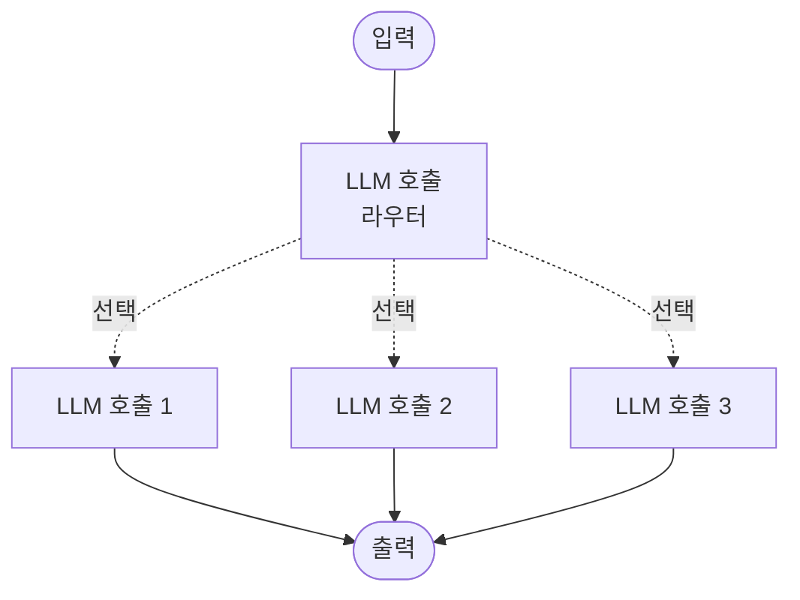
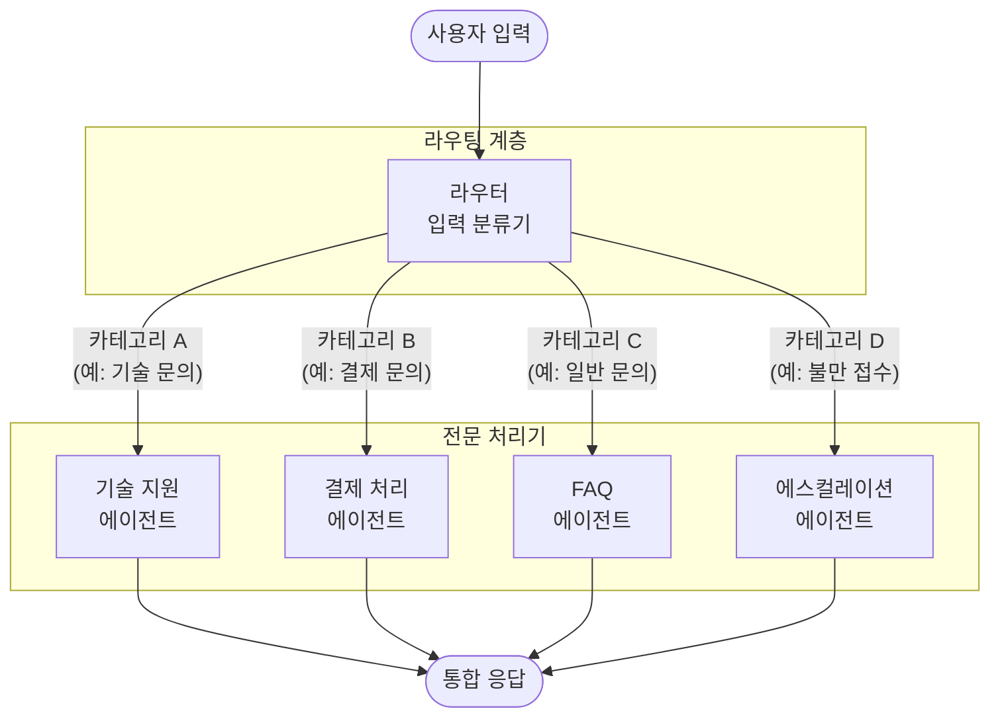

# 라우팅 (Routing)

## 정의 및 핵심 요약

라우팅은 입력을 분류하고 분류 결과에 따라 가장 적합한 전문화된 처리 경로나 에이전트로 전달하는 설계 패턴입니다. 다양한 유형의 입력을 각각에 최적화된 방식으로 처리할 때 사용됩니다.

**핵심 특징:**

- 입력을 먼저 분류(classify)하는 라우터가 핵심 컴포넌트
- 각 경로는 특정 유형의 입력에 최적화된 전문 처리기(handler)를 가짐
- LLM 또는 규칙 기반(rule-based) 분류기로 라우터 구현 가능
- 서로 다른 프롬프트, 모델, 또는 도구를 각 경로에 독립적으로 적용

**적합한 상황:**

- 입력 유형에 따라 명확히 다른 처리가 필요할 때
- 일부 입력은 강력한 모델이 필요하고, 다른 입력은 간단한 처리로 충분할 때
- 전문화된 하위 시스템들을 단일 인터페이스로 통합할 때

---

## 작동 원리 및 흐름

> 점선 화살표는 라우터가 입력에 따라 하나의 경로만 선택함을 나타냅니다.

### 상세 라우팅 흐름

---

## 실제 사용 예시 (Use Cases)

### 1. 고객 서비스 챗봇

대규모 전자상거래 플랫폼의 고객 지원:

- **라우터**: 사용자 메시지를 의도(intent) 분류
- **경로 A**: 주문/배송 문의 → 주문 시스템 연동 에이전트
- **경로 B**: 환불/취소 → 결제 처리 에이전트
- **경로 C**: 제품 질문 → 제품 데이터베이스 검색 에이전트
- **경로 D**: 불만 사항 → 고급 모델 + 인간 에스컬레이션

### 2. 코드 어시스턴트

개발자 도구의 다국어 코드 지원:

- **라우터**: 코드 언어 및 요청 유형 감지
- **경로 A**: Python 코드 → Python 전문 모델
- **경로 B**: SQL 쿼리 → 데이터베이스 최적화 에이전트
- **경로 C**: 버그 수정 → 디버깅 전문 에이전트
- **경로 D**: 문서 작성 → 기술 문서 작성 에이전트

### 3. 의료 정보 시스템

병원 환자 문의 처리 시스템:

- **라우터**: 응급도 및 문의 유형 분류
- **경로 A**: 응급 증상 → 즉각 대응 + 의료진 알림
- **경로 B**: 예약/접수 → 스케줄 관리 에이전트
- **경로 C**: 일반 건강 정보 → FAQ 에이전트
- **경로 D**: 처방전 문의 → 약사 연결 에이전트

### 4. 모델별 비용 최적화 (원문 예시)

쿼리 복잡도에 따라 다른 모델로 라우팅하여 비용과 속도 최적화:

- **라우터**: 쿼리의 복잡도와 난이도 분류
- **경로 A**: 간단하고 빈번한 질문 → 소형 모델(예: Claude Haiku)로 저비용·고속 처리
- **경로 B**: 복잡하고 드문 질문 → 대형 모델(예: Claude Sonnet)로 고품질 처리
- **핵심**: 모든 쿼리에 동일한 대형 모델을 사용하지 않고, 적절한 크기의 모델로 라우팅하여 비용과 품질을 동시에 최적화

### 5. 금융 서비스 플랫폼

다양한 금융 상품을 취급하는 서비스:

- **라우터**: 고객 프로필과 문의 내용 분류
- **경로 A**: 소액 거래 → 경량 모델로 신속 처리
- **경로 B**: 대규모 투자 → 강력한 모델 + 전문 분석
- **경로 C**: 사기 탐지 → 보안 전문 에이전트
- **경로 D**: 규정 준수 문의 → 법률 데이터베이스 연동

---

## 장단점

| 구분        | 내용                        |
|-----------|---------------------------|
| ✅ **장점**  | 각 유형에 최적화된 처리로 품질 향상      |
| ✅ **장점**  | 불필요하게 강력한 모델 사용 방지로 비용 절감 |
| ✅ **장점**  | 새로운 경로 추가가 다른 경로에 영향 없음   |
| ✅ **장점**  | 각 경로 독립적 모니터링 및 개선 가능     |
| ⚠️ **단점** | 라우터 분류 오류 시 전체 처리 품질 저하   |
| ⚠️ **단점** | 경계가 모호한 입력 처리 어려움         |
| ⚠️ **단점** | 경로 수 증가에 따른 유지보수 복잡도 증가   |

---

## 추가 학습 자료

- [Anthropic: Building Effective Agents - Routing](https://www.anthropic.com/engineering/building-effective-agents)
- [Google Cloud: Agentic AI Design Patterns](https://docs.cloud.google.com/architecture/choose-design-pattern-agentic-ai-system)
- [LangChain: Multi-Agent Router](https://docs.langchain.com/oss/python/langchain/multi-agent/router)
- [OpenAI: A practical guide to building agents](https://cdn.openai.com/business-guides-and-resources/a-practical-guide-to-building-agents.pdf)
