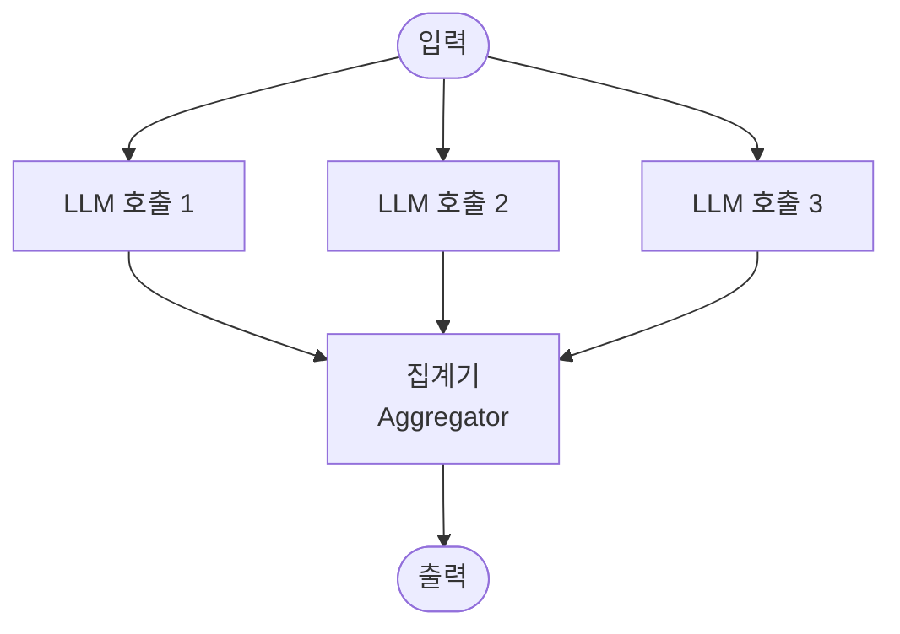
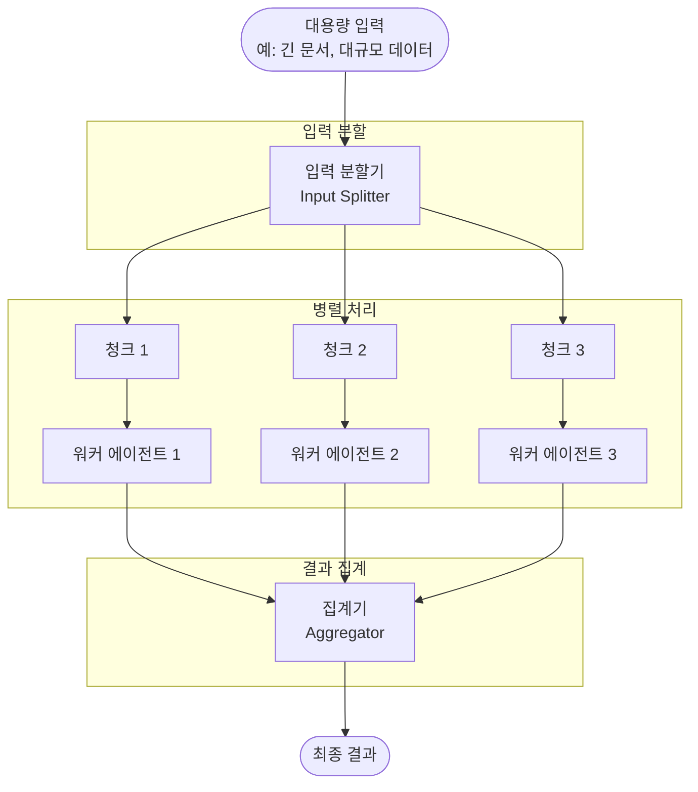
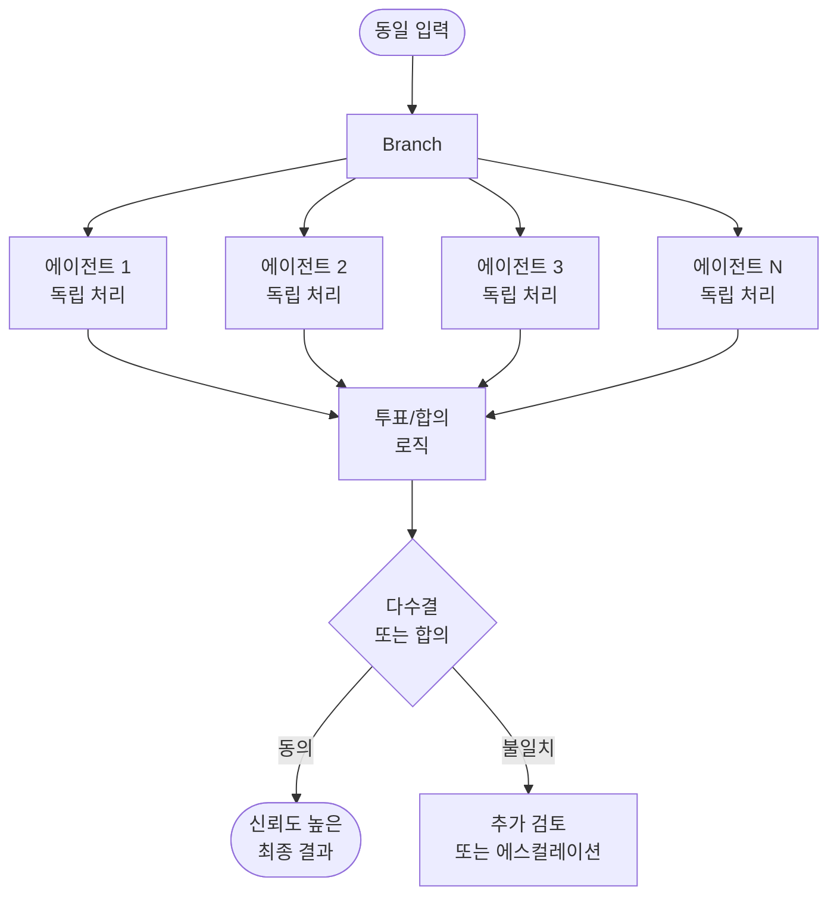

# 병렬화 (Parallelization)

## 정의 및 핵심 요약

병렬화는 작업을 독립적인 하위 작업으로 분해하여 여러 에이전트가 동시에 처리하거나, 동일한 작업을 여러 에이전트가 독립적으로 수행하고 결과를 집계하는 설계 패턴입니다.

**두 가지 주요 변형:**

1. **섹션 처리(Sectioning)**: 큰 입력을 분할하여 여러 에이전트가 병렬로 처리
2. **투표/앙상블(Voting/Ensemble)**: 동일 작업을 여러 에이전트가 독립 수행 후 결과 집계

**핵심 특징:**
- 작업 완료까지의 총 시간(wall-clock time)을 단축
- 단일 컨텍스트 창 한계를 분산 처리로 극복
- 복수의 독립적 관점을 통한 신뢰성 향상
- 결과 집계(aggregation) 로직 필요

**적합한 상황:**
- 하위 작업 간 의존성이 없어 독립적으로 처리 가능할 때
- 처리 속도가 중요하고 병렬 API 호출이 가능할 때
- 단일 LLM 호출로 처리하기에 입력이 너무 클 때
- 다양한 관점이나 검증이 필요한 의사 결정 시

---

## 작동 원리 및 흐름

### 섹션 처리 (Sectioning)

### 투표 / 앙상블 (Voting)

### 병렬 처리 타임라인 비교

```mermaid
gantt
    title 순차 처리 vs 병렬 처리 시간 비교
    dateFormat X
    axisFormat %s초

    section 순차 처리
    작업 1           : 0, 3
    작업 2           : 3, 6
    작업 3           : 6, 9

    section 병렬 처리
    작업 1           : 0, 3
    작업 2           : 0, 3
    작업 3           : 0, 3
    집계             : 3, 4
```

---

## 실제 사용 예시 (Use Cases)

### 1. 대용량 문서 요약 (섹션 처리)
법률 회사의 계약서 검토 시스템:
- **분할**: 100페이지 계약서를 10페이지씩 10개 청크로 분할
- **병렬 처리**: 각 청크에서 핵심 조항 및 위험 요소 추출
- **집계**: 전체 계약서에 대한 위험 평가 보고서 생성
- **결과**: 처리 시간 10분 → 1분으로 단축

### 2. 코드 보안 감사 (섹션 처리)
대규모 코드베이스 보안 검토:
- **분할**: 모듈/파일별로 코드를 분리
- **병렬 처리**: 각 모듈에서 보안 취약점 동시 분석
- **집계**: 전체 보안 감사 보고서와 우선순위별 수정 사항 정리

### 3. 콘텐츠 안전성 검사 (투표)
소셜 미디어 플랫폼의 콘텐츠 모더레이션:
- **복수 에이전트**: 3~5개 에이전트가 동일 콘텐츠를 독립적으로 평가
- **투표**: 과반수 동의 시 해당 결정 확정
- **에스컬레이션**: 불일치 시 인간 검토자에게 전달
- **효과**: 단일 모델 대비 허위 양성/음성 오류율 감소

### 4. 금융 리스크 평가 (투표)
투자 포트폴리오 위험 분석:
- **복수 에이전트**: 각각 다른 분석 방법론(기술적, 기본적, 감성 분석)으로 평가
- **집계**: 가중 평균 또는 앙상블 방식으로 최종 리스크 점수 산출
- **효과**: 단일 분석 방법의 편향 제거

### 5. 다국어 번역 품질 검증 (투표)
글로벌 서비스의 번역 검증:
- **복수 에이전트**: 3개 에이전트가 동일 번역 독립적으로 평가
- **집계**: 각 에이전트의 품질 점수와 피드백 취합
- **결과**: 합의된 품질 점수 및 개선 제안

---

## 장단점

| 구분 | 내용 |
|------|------|
| ✅ **장점** | 전체 처리 시간 획기적 단축 |
| ✅ **장점** | 컨텍스트 창 한계 극복 |
| ✅ **장점** | 복수 관점으로 신뢰도 향상 (투표) |
| ✅ **장점** | 확장성(scalability) 우수 |
| ⚠️ **단점** | API 비용이 병렬 수에 비례하여 증가 |
| ⚠️ **단점** | 청크 간 의존성이 있는 경우 적용 어려움 |
| ⚠️ **단점** | 집계 로직 설계의 복잡성 |
| ⚠️ **단점** | 결과 불일치 시 해결 전략 필요 |

---

## 추가 학습 자료

- [Anthropic: Building Effective Agents - Parallelization](https://www.anthropic.com/engineering/building-effective-agents)
- [Google Cloud: Agentic AI Design Patterns](https://cloud.google.com/architecture/choose-design-pattern-agentic-ai-system)
- [LangChain: Parallel Processing](https://python.langchain.com/docs/expression_language/primitives/parallel)
- [MapReduce 패턴 개념 이해](https://en.wikipedia.org/wiki/MapReduce)
