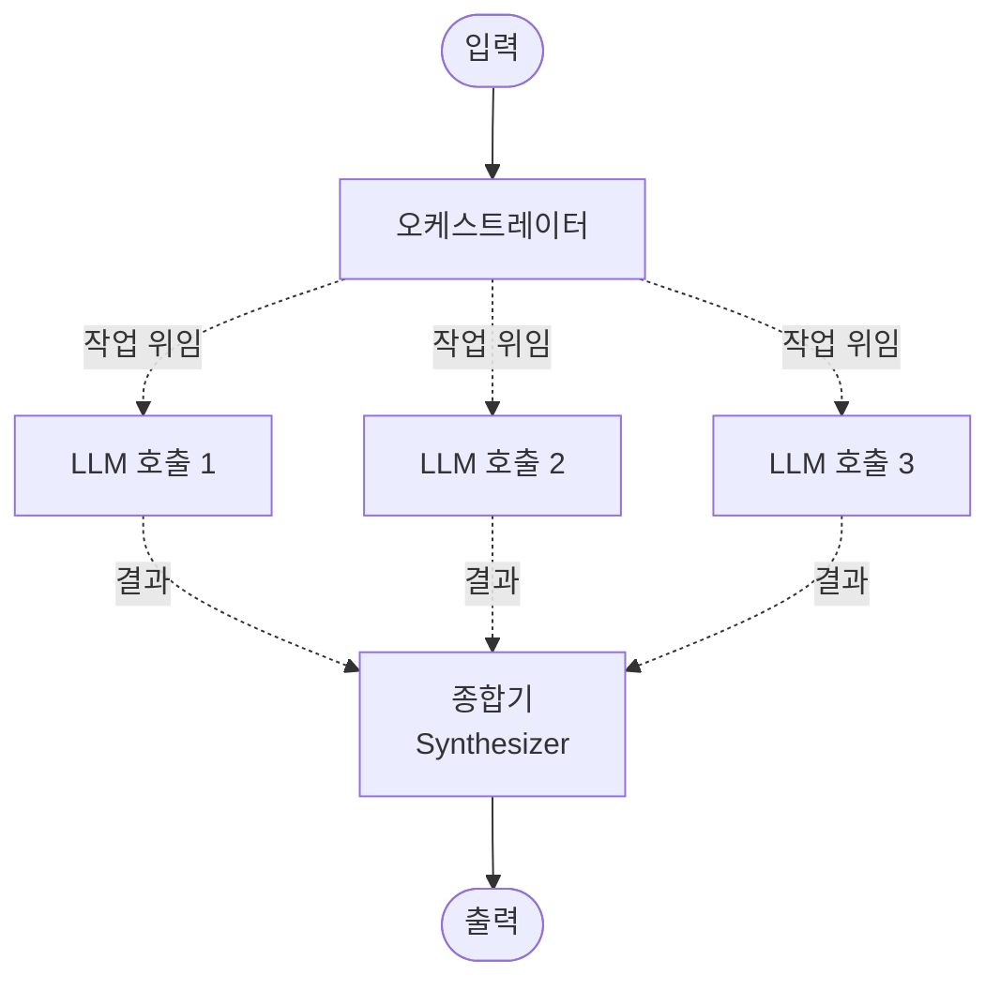
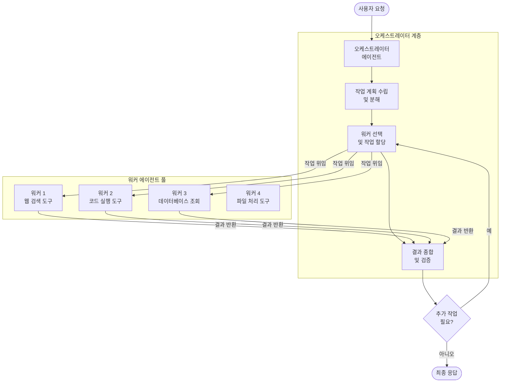
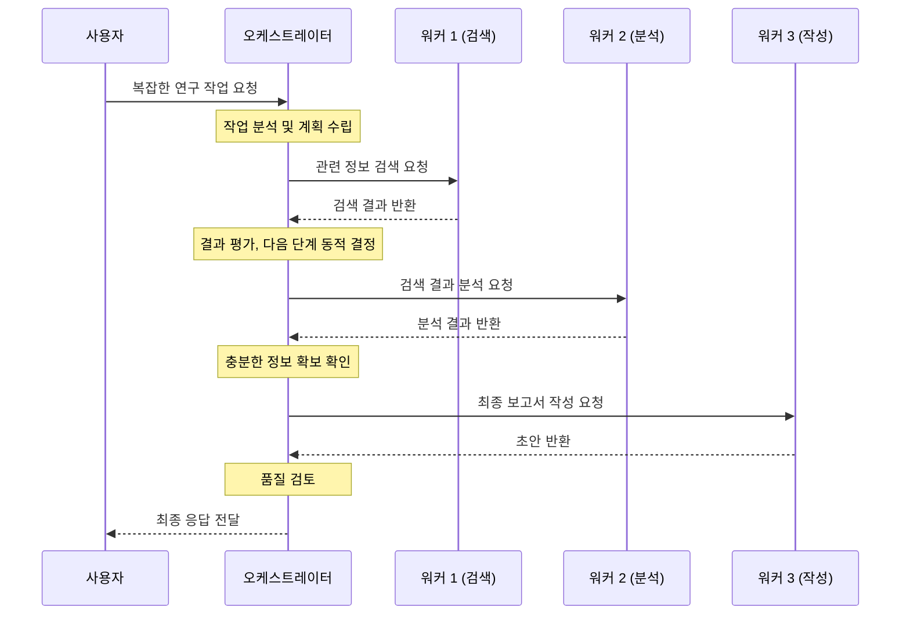

# 오케스트레이터-워커 (Orchestrator-Workers)

## 정의 및 핵심 요약

오케스트레이터-워커 패턴은 중앙의 오케스트레이터 에이전트가 작업을 동적으로 분해하고 전문화된 워커 에이전트들에게 위임하며, 워커들의 결과를 취합하여 최종 응답을 생성하는 설계 패턴입니다.

**핵심 특징:**
- **오케스트레이터(Orchestrator)**: 전체 계획 수립, 작업 분배, 결과 통합을 담당
- **워커(Workers)**: 각자 특정 도구나 전문 지식을 가진 전문화된 에이전트
- 오케스트레이터는 실행 전 전체 계획을 알 수 없으며, 결과에 따라 동적으로 결정
- 워커는 서로 독립적으로 동작하며 오케스트레이터를 통해서만 조율

**프롬프트 체이닝과의 차이:**
- 프롬프트 체이닝: 미리 정해진 고정 순서의 단계
- 오케스트레이터-워커: 오케스트레이터가 런타임에 동적으로 워크플로우 결정

**적합한 상황:**
- 작업 완료를 위한 단계를 사전에 예측하기 어려울 때
- 다양한 도구와 전문성을 유연하게 조합해야 할 때
- 중간 결과에 따라 다음 단계가 바뀔 수 있을 때

---

## 작동 원리 및 흐름

> 점선 화살표는 오케스트레이터가 런타임에 동적으로 워커를 선택하고 작업을 위임함을 나타냅니다. 워커 수와 작업 내용은 고정되지 않습니다.

### 상세 아키텍처

### 동적 워크플로우 시퀀스

---

## 실제 사용 예시 (Use Cases)

### 1. AI 연구 어시스턴트
학술 연구 플랫폼:
- **오케스트레이터**: 연구 질문을 분석하고 필요한 정보 수집 전략 수립
- **워커 A**: 학술 데이터베이스에서 논문 검색 및 수집
- **워커 B**: 각 논문의 핵심 내용 추출 및 요약
- **워커 C**: 통계 데이터 분석 및 시각화
- **워커 D**: 종합 연구 보고서 작성
- **특징**: 초기 검색 결과에 따라 추가 검색 방향 동적 조정

### 2. 소프트웨어 개발 자동화
DevOps 파이프라인 자동화:
- **오케스트레이터**: 개발 요청을 분석하고 필요한 작업 식별
- **워커 A**: 기존 코드베이스 분석 및 관련 파일 탐색
- **워커 B**: 새 코드 생성 또는 기존 코드 수정
- **워커 C**: 자동 테스트 실행 및 결과 분석
- **워커 D**: 문서 업데이트 및 PR 생성
- **특징**: 테스트 실패 시 오케스트레이터가 수정 사이클 재개

### 3. 비즈니스 인텔리전스 시스템
기업 의사결정 지원 플랫폼:
- **오케스트레이터**: 비즈니스 질문 해석 및 데이터 수집 계획
- **워커 A**: 내부 ERP/CRM 데이터베이스 조회
- **워커 B**: 외부 시장 데이터 및 경쟁사 정보 수집
- **워커 C**: 재무 모델링 및 예측 분석
- **워커 D**: 경영진용 인사이트 보고서 생성

### 4. 사이버보안 위협 분석
보안 운영 센터(SOC):
- **오케스트레이터**: 보안 이벤트를 평가하고 조사 우선순위 결정
- **워커 A**: 로그 파일 및 네트워크 트래픽 분석
- **워커 B**: 위협 인텔리전스 데이터베이스 조회
- **워커 C**: 영향받은 시스템 격리 및 대응 조치 실행
- **워커 D**: 인시던트 보고서 작성 및 알림 발송

---

## 장단점

| 구분 | 내용 |
|------|------|
| ✅ **장점** | 복잡하고 예측 불가능한 작업 처리 가능 |
| ✅ **장점** | 다양한 전문 도구와 에이전트를 유연하게 조합 |
| ✅ **장점** | 중간 결과에 따른 동적 적응 |
| ✅ **장점** | 워커 추가/제거로 시스템 확장 용이 |
| ⚠️ **단점** | 오케스트레이터의 복잡한 의사결정 로직 |
| ⚠️ **단점** | 전체 실행 경로 예측 및 디버깅 어려움 |
| ⚠️ **단점** | 오케스트레이터 오류 시 전체 시스템 영향 |
| ⚠️ **단점** | 오케스트레이터-워커 간 통신 오버헤드 |

---

## 추가 학습 자료

- [Anthropic: Building Effective Agents - Orchestrator-Workers](https://www.anthropic.com/engineering/building-effective-agents)
- [Google Cloud: Agentic AI Design Patterns](https://cloud.google.com/architecture/choose-design-pattern-agentic-ai-system)
- [LangGraph: Multi-Agent Workflows](https://langchain-ai.github.io/langgraph/tutorials/multi_agent/multi-agent-collaboration/)
- [AutoGen: Multi-Agent Conversation Framework](https://microsoft.github.io/autogen/)
- [CrewAI: Role-Based Agent Orchestration](https://docs.crewai.com/)
