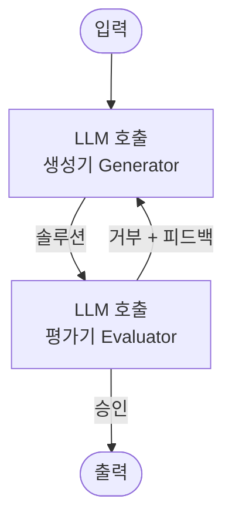
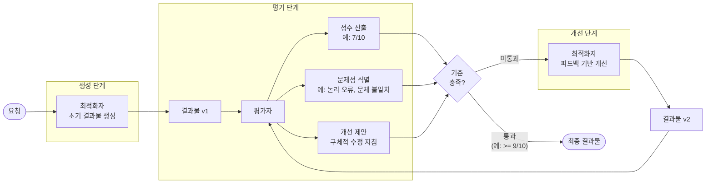
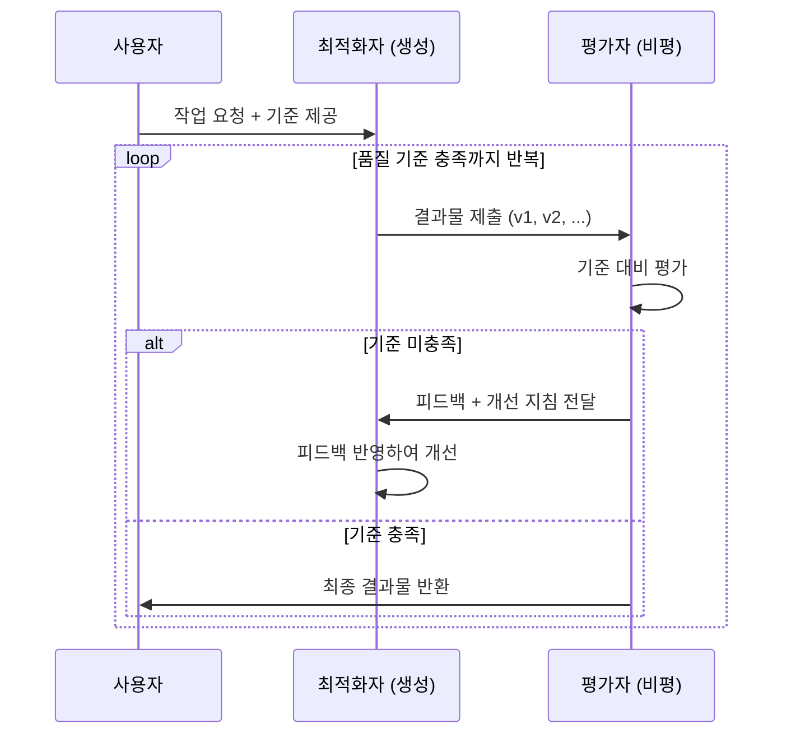

# 평가자-최적화자 (Evaluator-Optimizer)

## 정의 및 핵심 요약

평가자-최적화자 패턴은 생성 에이전트(최적화자)가 결과물을 생성하고, 별도의 평가 에이전트(평가자)가 해당 결과물을 기준에 따라 평가한 뒤, 그 피드백을 바탕으로 생성 에이전트가 반복적으로 결과물을 개선하는 설계
패턴입니다.

**핵심 특징:**

- **최적화자(Optimizer)**: 초기 결과물을 생성하고 피드백을 반영해 개선
- **평가자(Evaluator/Critic)**: 결과물을 정의된 기준으로 평가하고 구체적 피드백 제공
- 두 역할을 동일 LLM 또는 서로 다른 LLM으로 구현 가능
- 반복 횟수 또는 품질 기준 충족 시 루프 종료

**다른 패턴과의 차이:**

- 단일 에이전트가 자신의 결과를 직접 검증하는 것과 달리, 독립적인 평가자가 더 객관적인 피드백 제공
- 평가 기준을 명시적으로 정의하고 분리함으로써 품질 관리 강화

**적합한 상황:**

- 명확한 품질 기준이 있고 반복 개선이 효과적인 작업 (글쓰기, 코드, 번역 등)
- 사람의 피드백 루프를 자동화하고 싶을 때
- 첫 번째 결과보다 여러 번의 개선을 통해 품질이 유의미하게 향상될 때

---

## 작동 원리 및 흐름

### 상세 평가 흐름

### 반복 개선 과정 예시

---

## 실제 사용 예시 (Use Cases)

### 1. 코드 품질 자동 개선

개발 팀의 CI/CD 파이프라인:

- **최적화자**: 기능 요구사항 기반 코드 생성
- **평가자**: 코딩 표준, 성능, 보안, 테스트 커버리지 평가
- **반복**: 평가자 피드백을 반영해 코드 수정 (평균 3~4회)
- **종료 조건**: 모든 검사 통과 + 코드 리뷰 기준 충족
- **효과**: 코드 리뷰 시간 40% 단축

### 2. 학술 논문 초안 작성

연구 보조 도구:

- **최적화자**: 연구 데이터 기반 논문 초안 작성
- **평가자**: 논리적 일관성, 인용 정확성, 학술 글쓰기 규범 평가
- **기준**: 동료 심사(peer review) 체크리스트
- **반복**: 각 섹션별 품질 기준 충족 시까지 개선

### 3. 마케팅 카피 최적화

디지털 마케팅 에이전시:

- **최적화자**: 제품 정보와 타겟 고객 기반 광고 카피 생성
- **평가자**: 클릭률 예측, 브랜드 일관성, 법적 컴플라이언스 평가
- **A/B 테스트 변형**: 여러 버전 생성 후 각각 독립 평가
- **효과**: 캠페인 ROI 25% 향상

### 4. 법률 문서 검토

법률 사무소 문서 자동화:

- **최적화자**: 표준 계약서 조항 생성 및 수정
- **평가자**: 법적 효력, 불명확한 표현, 누락 조항 평가
- **기준**: 관할 법령, 판례, 사내 법률 가이드라인
- **반복**: 법적 리스크가 허용 수준 이하로 내려올 때까지

### 5. 복잡한 정보 검색 (원문 예시)

종합적인 정보 수집이 필요한 검색 작업:

- **최적화자**: 다수 라운드의 검색과 분석을 수행하여 정보 수집
- **평가자**: 수집된 정보의 완전성을 평가하고, 추가 검색이 필요한지 결정
- **반복**: 평가자가 충분한 정보가 수집되었다고 판단할 때까지 검색 라운드 반복
- **핵심**: 단순 검색과 달리, 평가자가 정보 누락 여부를 판단하여 검색 범위를 동적으로 확장

### 6. 번역 품질 향상

글로벌 콘텐츠 팀:

- **최적화자**: 원문 텍스트의 기계 번역 생성
- **평가자**: 자연스러움, 문화적 적합성, 전문 용어 정확성 평가
- **반복**: 각 평가 기준이 만족스러운 수준에 도달할 때까지 개선
- **효과**: 인간 번역사 후편집 시간 60% 단축

---

## 장단점

| 구분        | 내용                       |
|-----------|--------------------------|
| ✅ **장점**  | 자동화된 품질 관리 루프로 결과물 품질 향상 |
| ✅ **장점**  | 명확한 평가 기준으로 일관성 보장       |
| ✅ **장점**  | 평가자와 생성자 분리로 더 객관적인 피드백  |
| ✅ **장점**  | 사람의 반복 검토 작업 자동화         |
| ⚠️ **단점** | 반복 횟수에 따른 지연 및 비용 증가     |
| ⚠️ **단점** | 평가 기준 설계의 어려움 (주관적 품질)   |
| ⚠️ **단점** | 무한 루프 방지를 위한 종료 조건 필요    |
| ⚠️ **단점** | 평가자 자체의 오류 가능성           |

---

## 추가 학습 자료

- [Anthropic: Building Effective Agents - Evaluator-Optimizer](https://www.anthropic.com/engineering/building-effective-agents)
- [Google Cloud: Agentic AI Design Patterns](https://docs.cloud.google.com/architecture/choose-design-pattern-agentic-ai-system)
- [Constitutional AI: Harmlessness from AI Feedback (Anthropic)](https://arxiv.org/abs/2212.08073)
- [Reflexion: Language Agents with Verbal Reinforcement Learning](https://arxiv.org/abs/2303.11366)
- [LangGraph Documentation](https://docs.langchain.com/oss/python/langgraph/overview)
