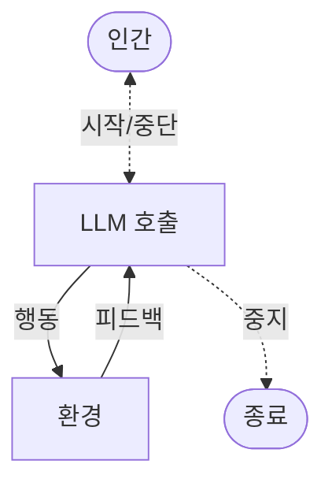
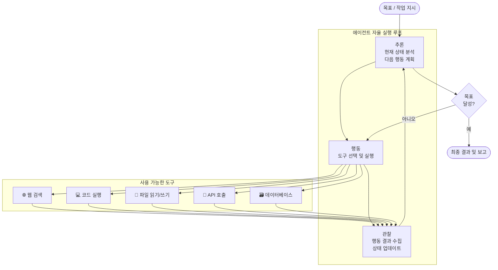
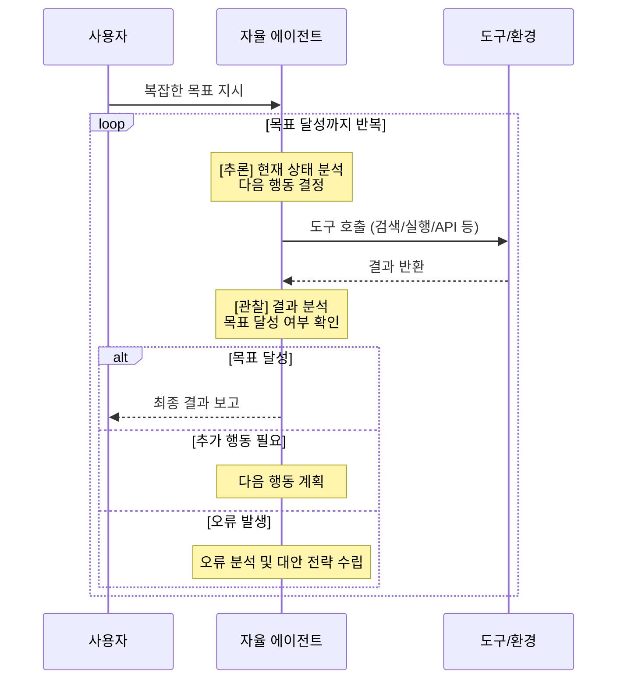
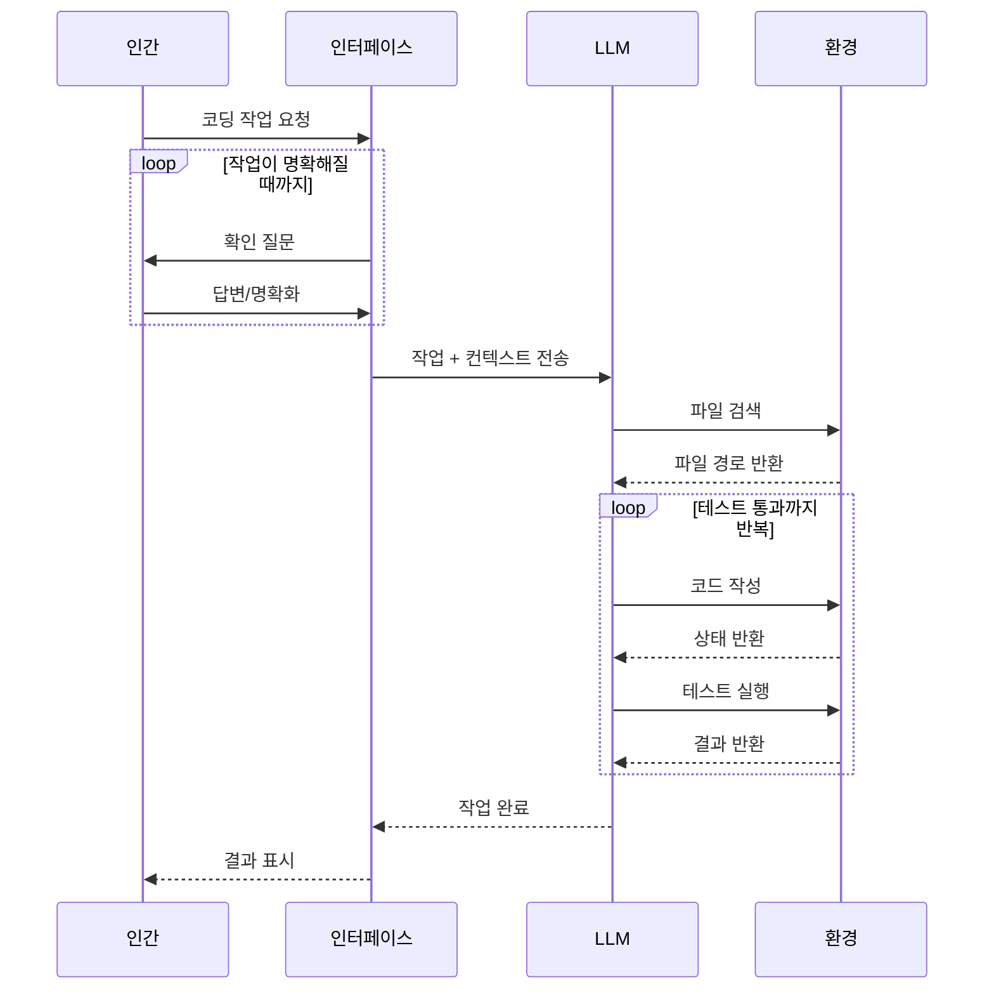
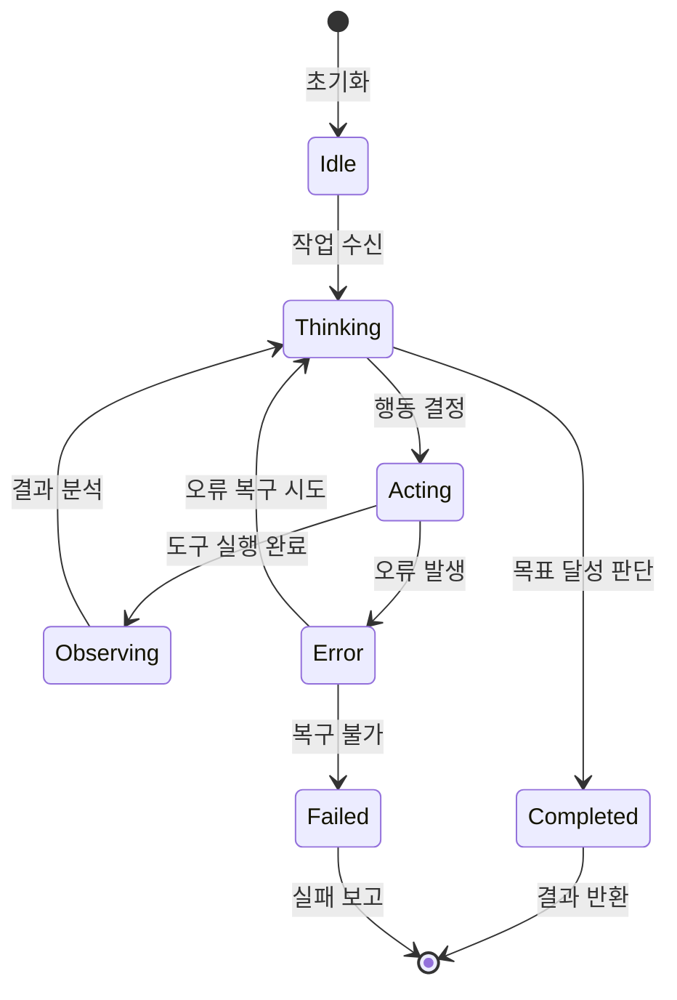
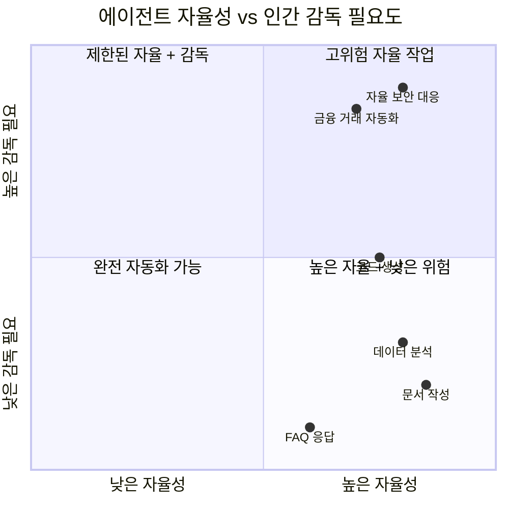

# 자율 에이전트 (Autonomous Agent)

## 정의 및 핵심 요약

자율 에이전트는 복잡한 장기 실행 작업을 독립적으로 수행하기 위해 도구를 사용하고, 환경과 상호작용하며, 이전 결과를 바탕으로 다음 행동을 스스로 결정하는 가장 자율적인 수준의 에이전트 설계 패턴입니다.

**핵심 특징:**

- 사전 정의된 단계 없이 LLM이 매 루프마다 다음 행동을 동적으로 결정
- 다양한 도구(웹 검색, 코드 실행, 파일 시스템, API 등)를 자율적으로 선택하여 사용
- 작업 완료를 스스로 판단하거나 외부 기준에 의해 종료
- 오류 발생 시 스스로 복구하거나 대안 전략 시도

**ReAct 패턴 (Reasoning + Acting):**
자율 에이전트의 핵심 메커니즘으로, 각 단계에서 에이전트는:

1. **추론(Reason)**: 현재 상황 분석 및 다음 행동 계획
2. **행동(Act)**: 도구 호출 또는 환경과 상호작용
3. **관찰(Observe)**: 행동 결과 확인 및 다음 추론에 반영

**적합한 상황:**

- 작업을 완료하기 위한 정확한 단계를 미리 예측하기 어려운 개방형 목표
- 다양한 도구와 외부 시스템에 접근이 필요한 복잡한 작업
- 오랜 시간에 걸쳐 진행되는 장기 실행 작업

---

## 작동 원리 및 흐름

### 자율 에이전트 핵심 루프

> 인간은 에이전트와 간접적으로 상호작용합니다(점선). 에이전트는 환경과의 상호작용 루프를 자율적으로 반복하며, 스스로 종료를 결정합니다.

### 상세 아키텍처

### ReAct 패턴 상세 흐름

### 코딩 에이전트 흐름 (Anthropic 예시)

### 에이전트 상태 관리

---

## 실제 사용 예시 (Use Cases)

### 1. AI 소프트웨어 엔지니어 (Devin 유형)

완전 자율 코딩 에이전트:

- **목표**: "결제 모듈의 단위 테스트 커버리지를 80%에서 95%로 향상"
- **행동**: 기존 코드 분석 → 테스트 갭 식별 → 테스트 코드 작성 → 테스트 실행 → 실패 수정 → PR 생성
- **도구**: 코드 에디터, 터미널, 테스트 러너, Git
- **자율성**: 어떤 파일을 수정할지, 어떤 테스트 전략을 사용할지 스스로 결정
- **실제 사례**: GitHub Copilot Workspace, Devin (Cognition AI)

### 2. 자율 데이터 분석 에이전트

비즈니스 인텔리전스 자동화:

- **목표**: "지난 분기 매출 감소 원인 분석 및 개선 방안 제시"
- **행동**: 데이터베이스 접속 → 다양한 SQL 쿼리 실행 → 패턴 발견 → 가설 수립 → 추가 분석 → 시각화 → 보고서 작성
- **도구**: SQL 실행기, 데이터 시각화, 통계 분석 라이브러리
- **자율성**: 어떤 데이터를 어떻게 분석할지 스스로 결정하며 필요시 분석 방향 전환

### 3. 사이버보안 자율 대응 에이전트

보안 운영 자동화(SOAR):

- **목표**: "탐지된 침입 시도를 조사하고 자동 대응"
- **행동**: 로그 분석 → 위협 인텔리전스 조회 → 영향 범위 파악 → 위협 격리 → 포렌식 증거 수집 → 보고서 작성
- **도구**: SIEM, 방화벽 API, 엔드포인트 관리 시스템, 위협 인텔리전스 DB
- **자율성**: 위협 심각도에 따라 자동 대응 수준 결정

### 4. 자율 고객 지원 에이전트

엔터프라이즈 고객 서비스:

- **목표**: "고객의 복잡한 기술적 문제 완전 해결"
- **행동**: 문제 이해 → 관련 문서 검색 → 진단 단계 수행 → 솔루션 적용 → 검증 → 고객 안내
- **도구**: 지식 베이스, 고객 시스템 API, 티켓 관리 시스템, 진단 도구
- **자율성**: 표준 절차를 벗어난 복잡한 케이스에서도 스스로 해결 경로 탐색

### 5. 자율 연구 에이전트

과학 연구 가속화:

- **목표**: "특정 질병에 대한 새로운 치료법 가설 생성"
- **행동**: 문헌 검색 → 기존 연구 분석 → 패턴 식별 → 가설 수립 → 시뮬레이션 → 결과 검증
- **도구**: 학술 검색 API, 생물정보학 데이터베이스, 분자 시뮬레이션 도구
- **실제 사례**: ChemCrow (화학 연구 에이전트), 자율 실험 플랫폼

---

## 자율성 수준과 인간 감독

---

## 장단점 및 위험 관리

| 구분        | 내용                    |
|-----------|-----------------------|
| ✅ **장점**  | 복잡하고 개방형 작업 처리 가능     |
| ✅ **장점**  | 최소한의 인간 개입으로 장기 작업 완수 |
| ✅ **장점**  | 예상치 못한 상황에 대한 적응적 대응  |
| ✅ **장점**  | 다양한 도구를 자율적으로 조합      |
| ⚠️ **단점** | 오류가 연쇄적으로 증폭될 위험      |
| ⚠️ **단점** | 비용 및 시간 예측 어려움        |
| ⚠️ **단점** | 의도치 않은 행동 발생 가능성      |
| ⚠️ **단점** | 디버깅 및 감사(audit) 복잡성   |

**위험 관리 전략:**

- 중요 행동 전 인간 승인(Human-in-the-loop) 체크포인트 설정
- 도구 권한 최소화 원칙(최소 권한 원칙 적용)
- 최대 반복 횟수 및 비용 한도 설정
- 모든 행동의 상세 로깅 및 롤백 기능 구현

---

## 도구 설계 원칙 (Agent-Computer Interface)

에이전트의 성공은 프롬프트만큼이나 도구 설계에 달려 있습니다. Anthropic은 SWE-bench 구현에서 전체 프롬프트보다 도구와 설명을 최적화하는 데 더 많은 시간을 투자했다고 밝혔습니다.

1. **도구와 문서를 명확하고 모호하지 않게 설계**: 도구의 입출력, 사용 조건을 정확히 문서화하여 LLM이 올바르게 사용할 수 있게 합니다.
2. **도구 수를 최소화하여 LLM의 집중 유지**: 너무 많은 도구를 제공하면 선택 오류가 증가합니다. 핵심 도구만 노출하세요.
3. **성공/실패 신호를 명시적으로 제공**: 도구 실행 결과에 성공/실패 여부와 오류 메시지를 명확히 포함하여, 에이전트가 다음 행동을 올바르게 결정할 수 있게 합니다.

---

## 추가 학습 자료

- [Anthropic: Building Effective Agents - Autonomous Agent](https://www.anthropic.com/engineering/building-effective-agents)
- [Google Cloud: Agentic AI Design Patterns](https://docs.cloud.google.com/architecture/choose-design-pattern-agentic-ai-system)
- [ReAct: Synergizing Reasoning and Acting in Language Models](https://arxiv.org/abs/2210.03629)
- [LangGraph Documentation](https://docs.langchain.com/oss/python/langgraph/overview)
- [OpenAI: Swarm (경량 멀티 에이전트 프레임워크)](https://github.com/openai/swarm)
- [Devin: AI Software Engineer (Cognition AI)](https://www.cognition.ai/blog/introducing-devin)
