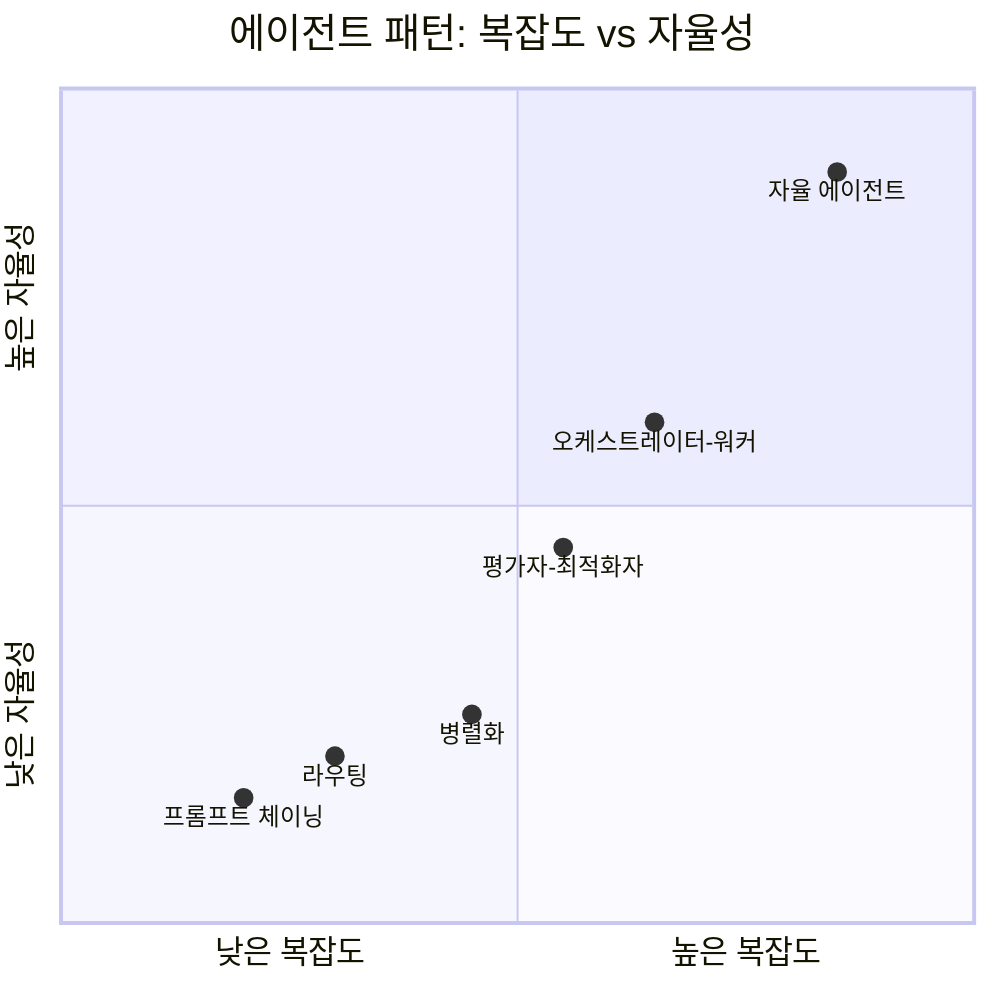

# 에이전틱 AI 시스템 설계 패턴

에이전틱 AI 시스템의 주요 설계 패턴을 분석하고 정리한 문서입니다.
[Anthropic - Building Effective Agents](https://www.anthropic.com/engineering/building-effective-agents) 를 기반으로 작성되었습니다.

> **Augmented LLM**: 에이전틱 시스템의 기본 구성 요소는 검색(retrieval), 도구(tools), 메모리(memory)로 강화된 LLM입니다. 모든 패턴은 이 Augmented LLM을 빌딩
> 블록으로 사용합니다.
>
> **Workflows vs Agents**: 패턴 1~5는 사전 정의된 코드 경로로 LLM과 도구를 오케스트레이션하는 **워크플로(Workflows)**이며, 패턴 6만이 LLM이 동적으로 자신의 프로세스와 도구
> 사용을 결정하는 **에이전트(Agents)**입니다.
>
> 복잡성은 필요할 때만 추가하세요. 단순한 접근 방식으로 충분하다면 에이전틱 시스템을 구축할 필요가 없습니다.

---

## 패턴 개요

| 패턴                                         | 핵심 개념                              | 적합한 상황                      |
|--------------------------------------------|------------------------------------|-----------------------------|
| [프롬프트 체이닝](./01-prompt-chaining.md)        | 작업을 순차적 단계로 분해, 각 LLM 출력이 다음 단계 입력 | 명확한 순서의 하위 작업, 중간 검증 필요     |
| [라우팅](./02-routing.md)                     | 입력 분류 후 최적화된 전문 처리기로 전달            | 입력 유형에 따라 다른 처리가 필요한 경우     |
| [병렬화](./03-parallelization.md)             | 독립 작업의 동시 처리 또는 다수결 투표             | 처리 속도 중요, 대용량 입력, 신뢰도 향상 필요 |
| [오케스트레이터-워커](./04-orchestrator-workers.md) | 오케스트레이터가 동적으로 작업 분배 및 통합           | 복잡하고 예측 불가능한 다단계 작업         |
| [평가자-최적화자](./05-evaluator-optimizer.md)    | 생성-평가-개선의 반복 피드백 루프                | 명확한 품질 기준으로 반복 개선이 효과적인 경우  |
| [자율 에이전트](./06-autonomous-agent.md)        | 도구를 자율적으로 사용하여 개방형 목표 달성           | 장기 실행, 예측 불가한 개방형 목표        |

---

## 패턴 선택 가이드

```mermaid
flowchart TD
    Start([작업 특성 파악]) --> Q1

    Q1{작업이 명확한\n순서로 분해 가능?}
    Q1 -- "예" --> Q2
    Q1 -- "아니오" --> Q5

    Q2{입력 유형에 따라\n처리 방식이 다른가?}
    Q2 -- "예" --> Routing[라우팅]
    Q2 -- "아니오" --> Q3

    Q3{독립적인 하위 작업으로\n나눌 수 있는가?}
    Q3 -- "예" --> Q4
    Q3 -- "아니오" --> Chaining[프롬프트 체이닝]

    Q4{신뢰도 향상을 위한\n다중 관점이 필요한가?}
    Q4 -- "예" --> Parallel[병렬화\n(투표/앙상블)]
    Q4 -- "아니오" --> Parallel2[병렬화\n(섹션 처리)]

    Q5{명확한 품질 기준으로\n반복 개선이 가능한가?}
    Q5 -- "예" --> EvalOpt[평가자-최적화자]
    Q5 -- "아니오" --> Q6

    Q6{다양한 도구가 필요한\n복잡한 동적 작업?}
    Q6 -- "단계 예측 가능" --> OrchestratorWorker[오케스트레이터-워커]
    Q6 -- "완전 개방형 목표" --> Autonomous[자율 에이전트]
```

---

## 복잡도 및 자율성 비교



---

## 참고 자료

- [Anthropic: Building Effective Agents](https://www.anthropic.com/engineering/building-effective-agents)
- [Google Cloud: Choose a design pattern for an agentic AI system](https://docs.cloud.google.com/architecture/choose-design-pattern-agentic-ai-system)
- [OpenAI: A practical guide to building agents](https://cdn.openai.com/business-guides-and-resources/a-practical-guide-to-building-agents.pdf)
- [LangGraph Documentation](https://docs.langchain.com/oss/python/langgraph/overview)
- [AutoGen: Multi-Agent Conversation Framework](https://microsoft.github.io/autogen/)
