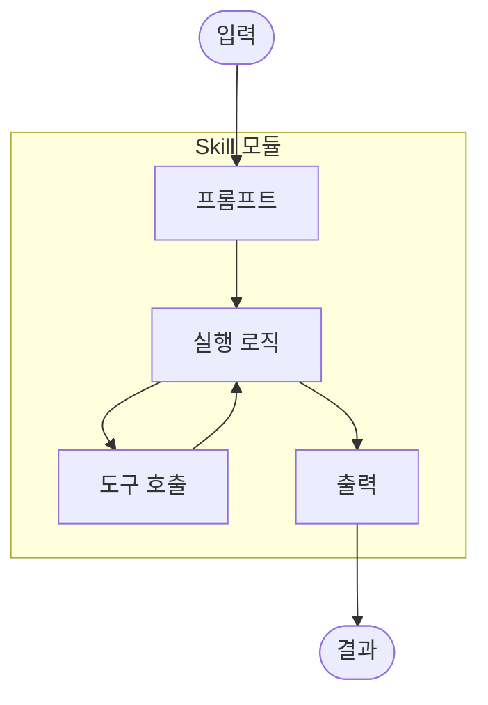
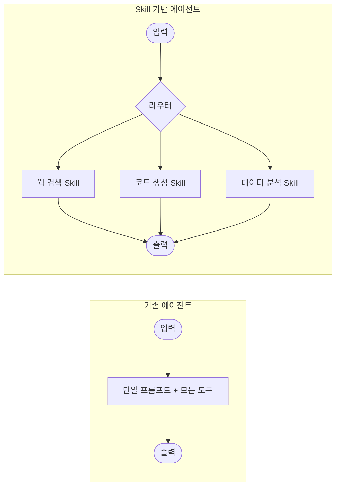
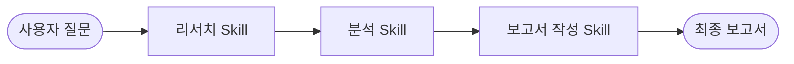
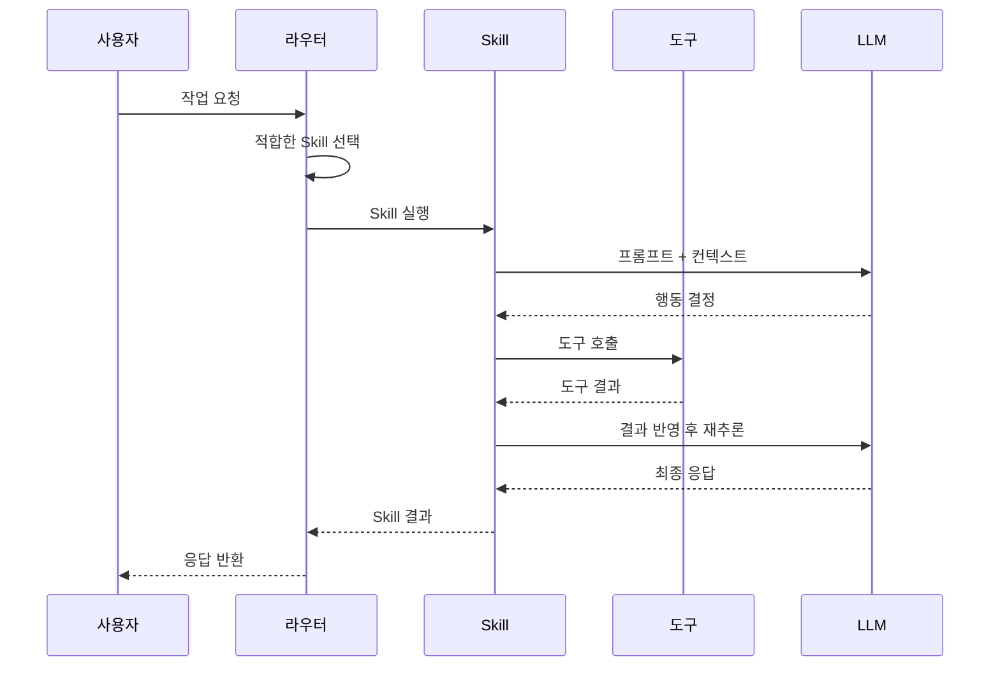
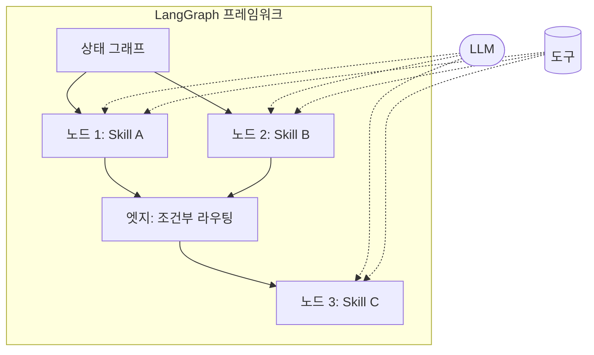

# LangChain Skills

## 개요

LangChain Skills는 에이전트가 수행할 수 있는 **재사용 가능한 능력 단위**를 정의하는 개념이다.
기존에는 도구(Tool)와 프롬프트를 개별적으로 구성했지만, Skill은 특정 작업을 완수하기 위한 **프롬프트, 도구, 실행 로직을 하나의 모듈로 묶어** 관리한다.

> **핵심 아이디어**: 에이전트를 모놀리식으로 구축하는 대신, 독립적으로 테스트·배포·조합 가능한 Skill 단위로 설계한다.

---

## Skill의 구성 요소

하나의 Skill은 다음 요소로 구성된다:

| 구성 요소               | 역할                              |
|---------------------|---------------------------------|
| **프롬프트 (Prompt)**   | Skill이 수행할 작업을 정의하는 시스템 프롬프트   |
| **도구 (Tools)**       | Skill이 사용할 수 있는 외부 도구 목록        |
| **실행 로직 (Logic)**    | 도구 호출 순서, 조건 분기, 반복 등의 워크플로 정의 |
| **입출력 스키마 (Schema)** | Skill의 입력과 출력 형식을 명시           |



---

## Skill 기반 에이전트 아키텍처

전통적인 에이전트는 하나의 큰 프롬프트에 모든 도구를 연결하는 구조였다. Skill 기반 아키텍처는 이를 모듈화한다.

### 기존 방식 vs Skill 방식



### Skill 구성 예시

```python
from langchain_core.tools import tool
from langgraph.prebuilt import create_react_agent

@tool
def search_web(query: str) -> str:
    """웹에서 최신 정보를 검색합니다."""
    # 검색 API 호출
    ...

@tool
def summarize_text(text: str) -> str:
    """긴 텍스트를 요약합니다."""
    # 요약 로직
    ...

# Skill: 웹 리서치
research_skill = create_react_agent(
    model="gpt-4o",
    tools=[search_web, summarize_text],
    prompt="당신은 웹 리서치 전문가입니다. 주어진 주제에 대해 검색하고 핵심을 요약하세요.",
)
```

---

## Skill의 핵심 특성

### 1. 재사용성 (Reusability)

한 번 정의한 Skill은 여러 에이전트에서 공유할 수 있다.

- 웹 검색 Skill → 리서치 에이전트, 고객 지원 에이전트 모두에서 활용
- 코드 리뷰 Skill → CI/CD 파이프라인, 개발 어시스턴트에서 재사용

### 2. 조합 가능성 (Composability)

여러 Skill을 조합하여 복잡한 워크플로를 구성할 수 있다.



### 3. 독립적 테스트 (Independent Testing)

각 Skill은 독립적으로 테스트할 수 있어 품질 관리가 용이하다.

- 단위 테스트: 개별 Skill의 입출력 검증
- 통합 테스트: Skill 간 연결 동작 검증
- 성능 테스트: Skill별 지연 시간, 비용 측정

### 4. 버전 관리 (Versioning)

Skill 단위로 버전을 관리하여 안전한 업데이트가 가능하다.

---

## 실행 흐름

Skill 기반 에이전트의 실행 흐름은 다음과 같다:



---

## 대표적인 Skill 유형

| Skill 유형     | 설명                    | 사용 도구 예시                   |
|--------------|-----------------------|----------------------------|
| 웹 리서치        | 웹 검색 및 정보 요약          | Tavily, Brave Search       |
| 코드 생성        | 요구사항 기반 코드 작성 및 실행    | Python REPL, 파일 시스템        |
| 데이터 분석       | 데이터셋 분석 및 시각화         | Pandas, SQL 실행기            |
| RAG          | 문서 기반 질의응답            | 벡터 저장소, 임베딩 모델             |
| 작업 관리        | 할 일 생성, 일정 관리         | 캘린더 API, 프로젝트 관리 도구        |
| 커뮤니케이션       | 이메일 작성, 메시지 전송        | Gmail API, Slack API       |

---

## LangGraph와의 관계

LangChain Skills는 [LangGraph](https://langchain-ai.github.io/langgraph/)를 실행 엔진으로 활용한다.

- **LangGraph**: 상태 기반 그래프로 에이전트 워크플로를 정의하는 프레임워크
- **Skill**: LangGraph 위에서 동작하는 재사용 가능한 워크플로 단위



---

## 참고 자료

- [LangChain Skills](https://blog.langchain.com/langchain-skills/)
- [LangGraph Documentation](https://langchain-ai.github.io/langgraph/)
- [LangChain Tools](https://python.langchain.com/docs/integrations/tools/)
- [Anthropic: Building Effective Agents](https://www.anthropic.com/engineering/building-effective-agents)
