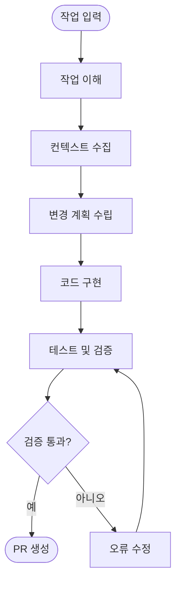
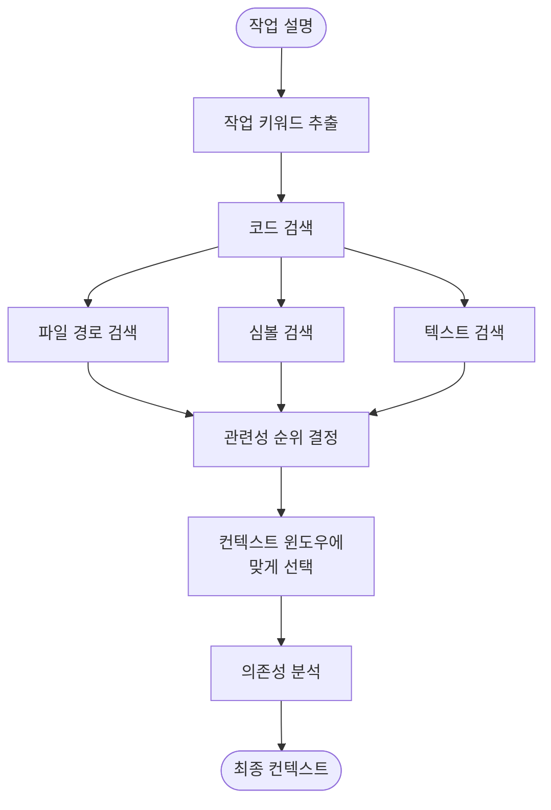
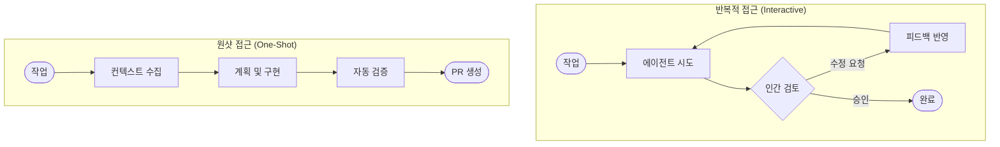
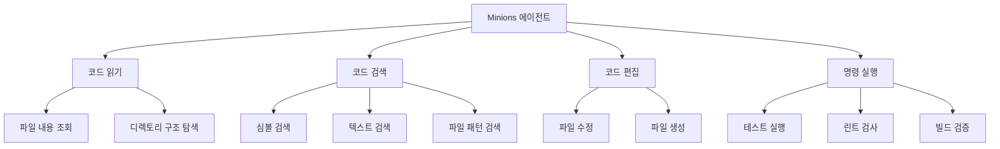

# Stripe Minions: One-Shot 코딩 에이전트

## 개요

Stripe의 Minions는 코딩 작업을 **원샷(One-Shot)으로 엔드투엔드(End-to-End) 완료**하는 내부 AI 코딩 에이전트 시스템이다.
개발자가 작업을 할당하면, 에이전트가 코드베이스를 분석하고 변경 사항을 구현하여 Pull Request를 생성한다.

> **One-Shot**: 실행 중 인간의 추가 입력 없이, 한 번의 실행으로 작업을 완료하는 방식을 의미한다.
> **End-to-End**: 작업 이해부터 PR 생성까지 전체 개발 사이클을 에이전트가 자율적으로 수행한다.

---

## 핵심 아키텍처

### 전체 파이프라인

Minions의 실행 흐름은 다음과 같은 단계로 구성된다:

### 단계별 설명

| 단계       | 설명                                | 핵심 활동                         |
|----------|-----------------------------------|-------------------------------|
| 작업 이해    | 작업 설명을 분석하여 요구사항 파악               | 자연어 해석, 요구사항 구조화              |
| 컨텍스트 수집  | 대규모 코드베이스에서 관련 코드를 수집             | 코드 검색, 의존성 분석, 파일 탐색          |
| 변경 계획 수립 | 수집된 컨텍스트를 바탕으로 구체적인 변경 계획 생성      | 수정 대상 파일 식별, 변경 범위 결정         |
| 코드 구현    | 계획에 따라 코드를 수정하거나 새로 작성            | 코드 편집, 새 파일 생성, 리팩토링          |
| 테스트 및 검증 | 변경 사항이 기존 기능을 깨뜨리지 않는지 확인        | 기존 테스트 실행, 린트 검사, 타입 검사       |
| PR 생성    | 검증을 통과한 변경 사항으로 Pull Request를 생성  | 커밋 메시지 작성, PR 설명 생성           |

---

## 컨텍스트 수집 전략

대규모 모노레포에서 정확한 컨텍스트를 수집하는 것은 코딩 에이전트의 핵심 과제이다.
Minions는 다층적 컨텍스트 수집 전략을 사용한다.

### 컨텍스트 수집 흐름

### 주요 기법

| 기법          | 설명                                          |
|-------------|---------------------------------------------|
| 코드 검색       | 키워드, 심볼명, 파일 경로 등을 기반으로 관련 코드를 탐색           |
| 의존성 그래프 탐색  | import/require 관계를 추적하여 연관 파일을 식별            |
| 컨텍스트 윈도우 관리 | LLM의 컨텍스트 윈도우 제한 내에서 가장 관련성 높은 코드를 선택       |
| 점진적 탐색      | 초기 컨텍스트에서 시작하여 필요에 따라 추가 파일을 탐색              |

---

## One-Shot 접근 방식

### 기존 접근 방식과의 비교

| 비교 항목   | 반복적 접근 (Interactive)       | 원샷 접근 (One-Shot)              |
|---------|---------------------------|-------------------------------|
| 인간 개입   | 매 단계마다 피드백 필요              | 실행 완료 후 최종 리뷰만 수행             |
| 실행 시간   | 인간 응답 대기로 인해 긴 리드타임        | 자동 실행으로 빠른 완료                 |
| 적합한 작업  | 모호하거나 창의적 판단이 필요한 작업       | 명확한 요구사항이 있는 구조화된 작업          |
| 품질 보장   | 인간 피드백으로 품질 보장             | 자동 테스트 및 검증으로 품질 보장           |

### One-Shot이 효과적인 조건

1. **명확한 작업 정의**: 요구사항이 구체적이고 모호하지 않음
2. **충분한 테스트 인프라**: 자동화된 테스트로 변경 사항 검증 가능
3. **패턴화된 작업**: 반복적으로 발생하는 유사한 유형의 작업
4. **제한된 변경 범위**: 변경이 소수의 파일에 국한됨

---

## 에이전트 도구 설계

Minions가 코드베이스와 상호작용하기 위해 사용하는 핵심 도구:

### 도구 설계 원칙

| 원칙             | 설명                                    |
|----------------|---------------------------------------|
| 명확한 인터페이스      | 각 도구의 입출력과 사용 조건을 정확히 정의              |
| 최소한의 도구 집합     | 핵심 기능에 집중하여 에이전트의 선택 오류 최소화           |
| 명시적 피드백        | 도구 실행 결과에 성공/실패 여부와 상세 정보를 포함         |
| 안전한 실행 환경      | 샌드박스 환경에서 실행하여 프로덕션 시스템에 영향 방지        |

---

## 장단점

| 구분        | 내용                                      |
|-----------|-----------------------------------------|
| ✅ **장점**  | 개발자 개입 없이 작업을 자율적으로 완료                  |
| ✅ **장점**  | 반복적이고 구조화된 작업에서 높은 생산성                  |
| ✅ **장점**  | 기존 테스트 인프라를 활용한 품질 보장                   |
| ✅ **장점**  | 일관된 코드 스타일과 패턴 적용                       |
| ⚠️ **단점** | 모호한 요구사항에서는 정확도가 낮아질 수 있음               |
| ⚠️ **단점** | 대규모 리팩토링 등 광범위한 변경에는 한계                 |
| ⚠️ **단점** | 컨텍스트 윈도우 제한으로 인한 정보 누락 가능성              |
| ⚠️ **단점** | 새로운 아키텍처 설계 등 창의적 판단이 필요한 작업에는 부적합      |

---

## 참고 자료

- [Stripe: Minions — Stripe's one-shot, end-to-end coding agents](https://stripe.dev/blog/minions-stripes-one-shot-end-to-end-coding-agents)
- [Anthropic: Building Effective Agents](https://www.anthropic.com/engineering/building-effective-agents)
