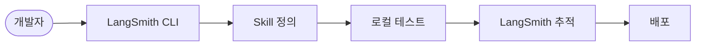
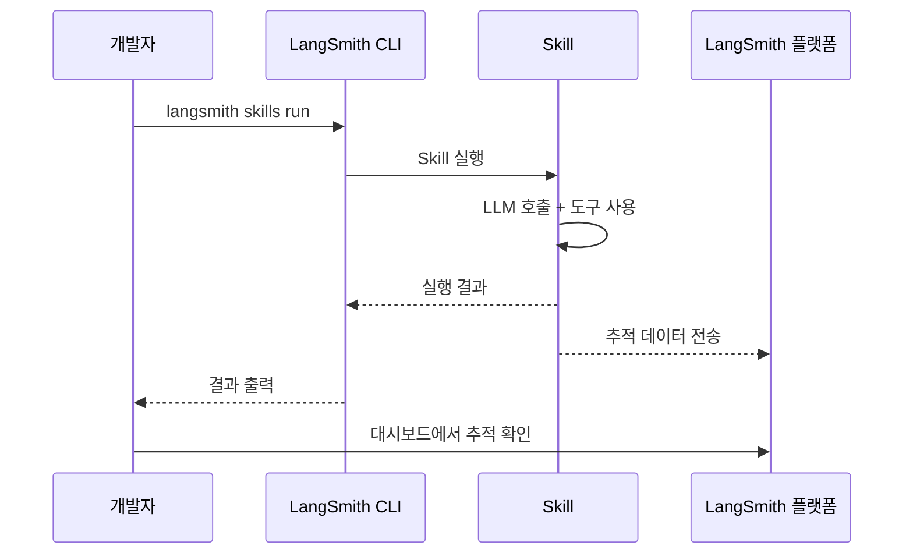
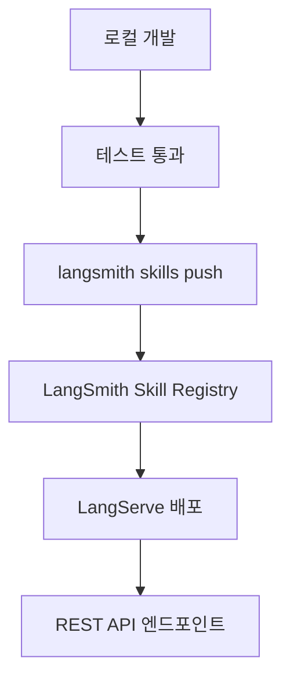
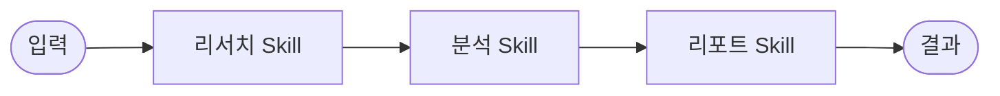
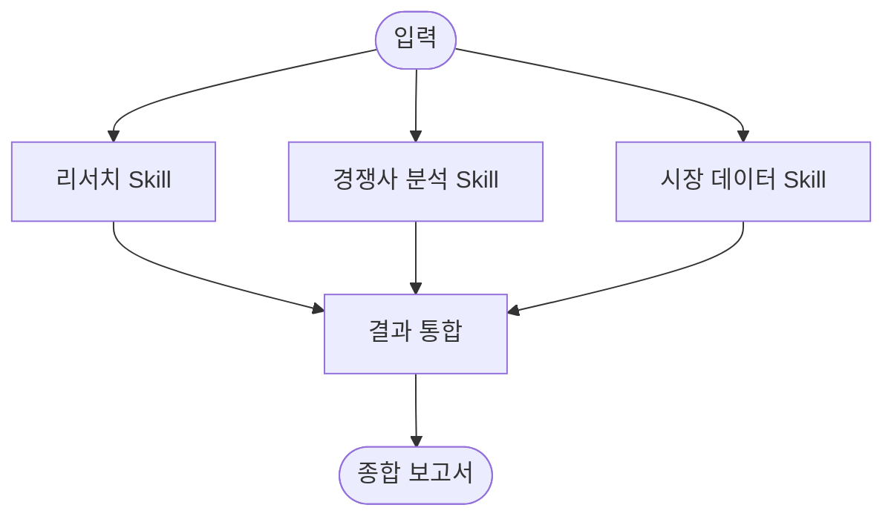

# LangSmith CLI Skills

## 개요

LangSmith CLI Skills는 LangChain Skills를 **명령줄 인터페이스(CLI)를 통해 생성, 테스트, 배포, 관리**할 수 있는 도구이다.
[LangSmith](https://smith.langchain.com/) 플랫폼과 연동하여 Skill의 전체 생명주기를 관리한다.

> **핵심 아이디어**: Skill을 코드로 정의하고, CLI로 실행·추적·배포하여 개발 워크플로에 자연스럽게 통합한다.

---

## Skill 실행 방식

### 로컬 실행 흐름



### CLI 기본 명령어

| 명령어                      | 설명                |
|--------------------------|-------------------|
| `langsmith skills list`  | 등록된 Skill 목록 조회   |
| `langsmith skills run`   | Skill 로컬 실행       |
| `langsmith skills test`  | Skill 테스트 실행      |
| `langsmith skills push`  | Skill을 LangSmith에 배포 |

---

## Skill 정의 및 실행

### Skill 프로젝트 구조

```text
my-skill/
├── skill.py          # Skill 실행 로직
├── config.yaml       # Skill 설정 (모델, 도구, 파라미터)
├── tests/
│   ├── test_cases.yaml   # 테스트 케이스
│   └── test_skill.py     # 테스트 코드
└── README.md         # Skill 설명
```

### config.yaml 예시

```yaml
name: web-research
description: 웹에서 정보를 검색하고 요약하는 Skill
model: gpt-4o
tools:
  - tavily_search
  - text_summarizer
parameters:
  max_search_results: 5
  summary_max_length: 500
```

### Skill 실행 코드

```python
from langchain_core.tools import tool
from langgraph.prebuilt import create_react_agent

@tool
def tavily_search(query: str) -> str:
    """Tavily API를 사용하여 웹 검색을 수행합니다."""
    ...

@tool
def text_summarizer(text: str) -> str:
    """텍스트를 요약합니다."""
    ...

def create_skill():
    """웹 리서치 Skill을 생성합니다."""
    return create_react_agent(
        model="gpt-4o",
        tools=[tavily_search, text_summarizer],
        prompt="주어진 주제에 대해 웹에서 검색하고 핵심 내용을 요약하세요.",
    )
```

---

## LangSmith 추적 연동

Skill 실행 시 LangSmith로 자동 추적(tracing)이 활성화되어, 각 실행의 상세 정보를 확인할 수 있다.



### 추적에서 확인 가능한 정보

| 항목          | 설명                     |
|-------------|------------------------|
| **실행 트리**   | LLM 호출, 도구 호출의 계층적 시각화 |
| **입출력**     | 각 단계의 입력값과 출력값         |
| **지연 시간**   | 각 단계별 소요 시간            |
| **토큰 사용량**  | LLM 호출당 토큰 수 및 비용      |
| **오류 추적**   | 실패 시 오류 발생 위치 및 메시지    |

---

## 배포 및 운영

### 배포 프로세스



### LangServe를 통한 API 배포

배포된 Skill은 REST API로 호출할 수 있다.

```python
from langserve import RemoteRunnable

# 배포된 Skill을 원격으로 호출
research_skill = RemoteRunnable("https://my-server.com/skills/web-research")
result = research_skill.invoke({"query": "LangChain Skills의 최신 동향"})
```

---

## Skill 조합 패턴

여러 Skill을 조합하여 복잡한 워크플로를 구성할 수 있다.

### 순차 조합



### 병렬 조합



---

## 참고 자료

- [LangSmith CLI Skills](https://blog.langchain.com/langsmith-cli-skills/)
- [LangSmith Documentation](https://docs.smith.langchain.com/)
- [LangServe Documentation](https://python.langchain.com/docs/langserve/)
- [LangGraph Documentation](https://langchain-ai.github.io/langgraph/)
