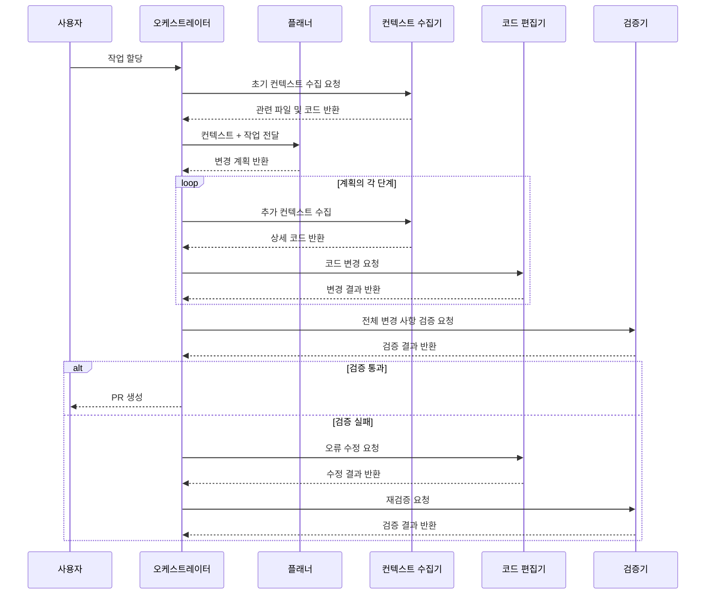
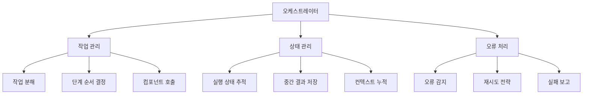
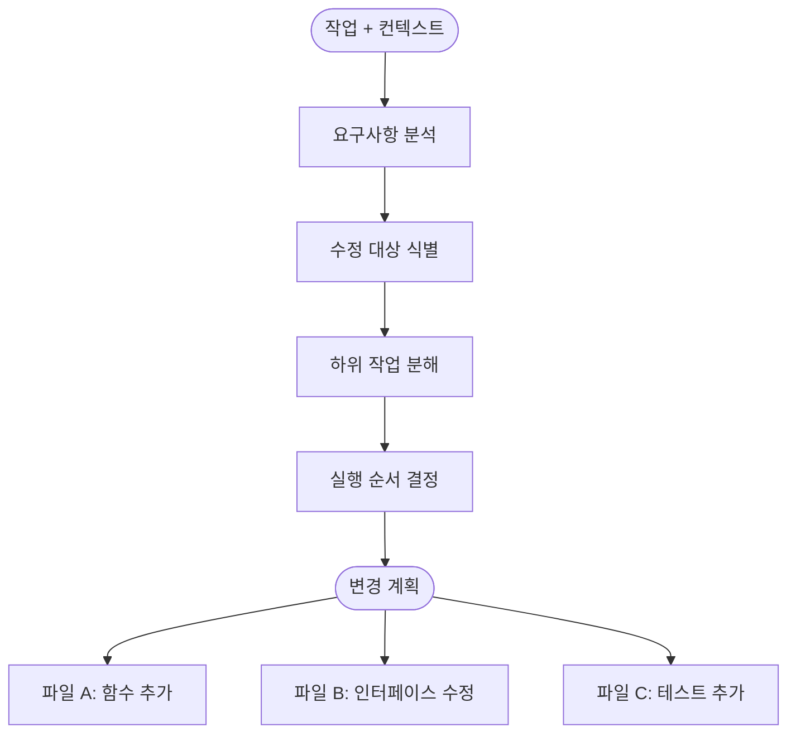
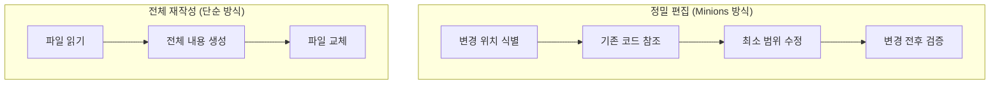
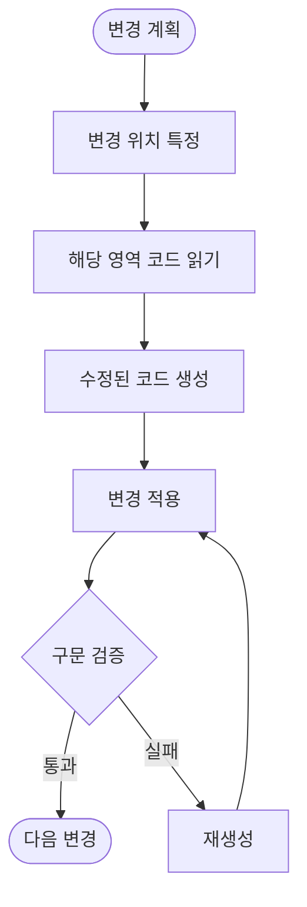
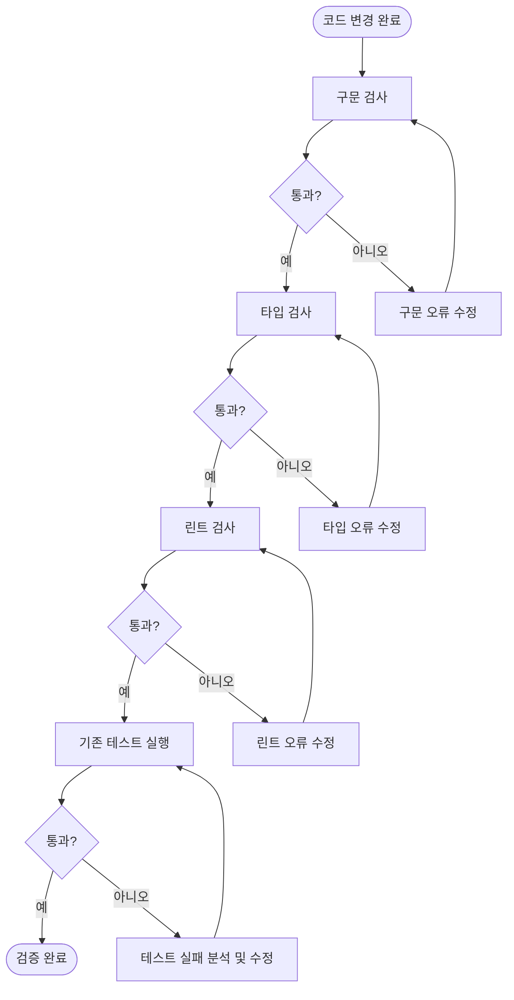
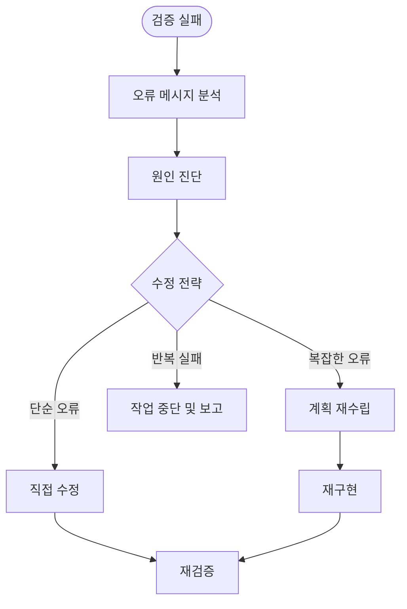
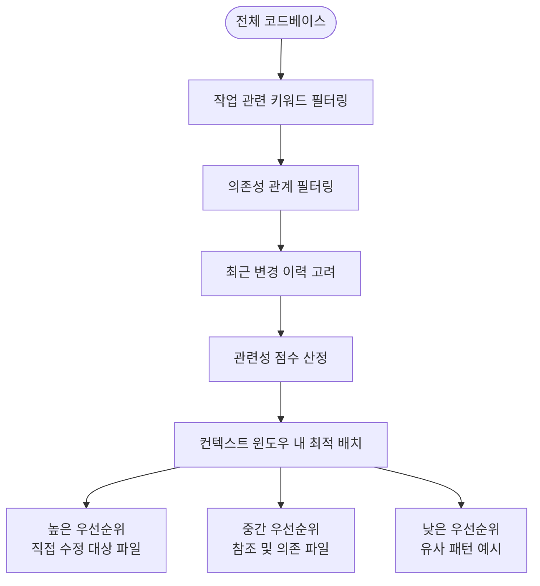
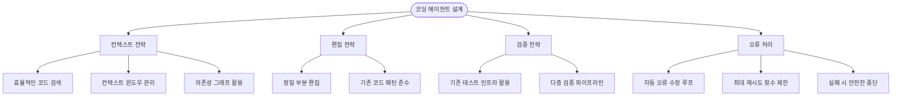

# Stripe Minions: 시스템 설계 상세

## 개요

이 문서는 Stripe Minions의 내부 시스템 설계를 상세히 다룬다.
에이전트 실행 파이프라인의 각 단계, 코드 편집 전략, 테스트 및 검증 메커니즘, 그리고 대규모 코드베이스에서의 확장 전략을 설명한다.

---

## 에이전트 실행 파이프라인

### 상세 실행 흐름

### 오케스트레이터의 역할

오케스트레이터는 전체 파이프라인을 조율하는 중앙 컴포넌트이다.

---

## 변경 계획 수립

### 계획 수립 프로세스

에이전트는 작업을 바로 구현하지 않고, 먼저 구체적인 변경 계획을 수립한다.

### 계획의 구성 요소

| 요소        | 설명                          | 예시                            |
|-----------|-----------------------------|-------------------------------|
| 수정 대상 파일  | 변경이 필요한 파일 목록                | `src/payments/processor.ts`   |
| 변경 유형     | 각 파일에 대한 변경의 종류             | 함수 추가, 파라미터 변경, 타입 수정         |
| 의존성 순서    | 변경 간의 선후 관계                  | 인터페이스 수정 → 구현체 수정 → 테스트 추가   |
| 검증 기준     | 변경 성공을 판단하는 기준              | 기존 테스트 통과, 타입 검사 통과           |

---

## 코드 편집 전략

### 편집 방식

Minions는 파일 전체를 재작성하는 대신, 정밀한 부분 편집 방식을 사용한다.

| 비교 항목    | 정밀 편집                | 전체 재작성             |
|----------|----------------------|-------------------|
| 변경 범위    | 필요한 부분만 수정           | 파일 전체를 새로 생성      |
| 기존 코드 보존 | 변경하지 않는 부분은 그대로 유지   | 의도치 않은 변경 발생 가능   |
| 대규모 파일   | 효율적 (토큰 사용 최소화)     | 비효율적 (전체 파일 생성 필요) |
| 정확도      | 변경 위치를 정확히 특정해야 함    | 파일 구조를 정확히 재현해야 함 |

### 코드 편집 흐름

---

## 테스트 및 검증

### 다층 검증 파이프라인

Minions는 코드 변경 후 여러 단계의 검증을 수행하여 품질을 보장한다.

### 검증 단계

| 단계      | 도구         | 목적                       |
|---------|------------|--------------------------|
| 구문 검사   | 파서/컴파일러    | 코드가 문법적으로 올바른지 확인        |
| 타입 검사   | 타입 체커      | 타입 안전성 확인                |
| 린트 검사   | 린터         | 코드 스타일 및 잠재적 문제 감지       |
| 기존 테스트  | 테스트 러너     | 변경 사항이 기존 기능을 깨뜨리지 않는지 확인 |

### 오류 수정 루프

검증 실패 시 에이전트는 자동으로 오류를 분석하고 수정을 시도한다.

---

## 대규모 코드베이스 대응

### 모노레포 환경의 과제

Stripe와 같은 대규모 모노레포에서 코딩 에이전트가 직면하는 핵심 과제:

| 과제             | 설명                              | 대응 전략                    |
|----------------|---------------------------------|--------------------------|
| 코드베이스 규모       | 수백만 줄의 코드에서 관련 부분을 찾아야 함        | 효율적인 코드 검색 및 인덱싱         |
| 컨텍스트 윈도우 제한    | LLM이 한 번에 처리할 수 있는 토큰 수 제한     | 관련성 기반 컨텍스트 선택 및 우선순위 지정 |
| 내부 규칙 및 패턴     | 팀별 코딩 규칙, 내부 프레임워크 사용법          | 기존 코드 패턴 학습 및 일관성 유지     |
| 상호 의존성         | 한 파일의 변경이 다른 파일에 영향을 줄 수 있음     | 의존성 그래프 분석 및 영향 범위 파악    |

### 컨텍스트 우선순위

---

## 확장 사례

### 적용 가능한 작업 유형

| 작업 유형       | 설명                      | 난이도  |
|-------------|-------------------------|------|
| 버그 수정       | 오류 보고를 기반으로 원인 파악 및 수정  | 중간   |
| 기능 추가       | 기존 패턴을 따르는 새로운 기능 구현    | 중간   |
| 마이그레이션      | API 버전 업그레이드, 라이브러리 교체  | 높음   |
| 리팩토링        | 코드 구조 개선, 중복 제거         | 높음   |
| 테스트 추가      | 기존 코드에 대한 테스트 작성        | 낮음   |
| 문서 업데이트     | 코드 변경에 따른 문서 수정         | 낮음   |

### 코딩 에이전트 설계 시 고려사항

#### ✅ 핵심 원칙

1. **컨텍스트 품질이 코드 품질을 결정한다**: 정확한 컨텍스트 수집이 가장 중요한 단계
2. **기존 인프라를 최대한 활용한다**: 테스트, 린트, 타입 검사 등 기존 도구를 검증에 활용
3. **실패는 안전하게 처리한다**: 수정 불가능한 오류는 인간에게 보고하고 중단
4. **변경 범위를 최소화한다**: 작업에 필요한 최소한의 변경만 수행

#### ⚠️ 주의사항

1. **컨텍스트 윈도우 초과 방지**: 불필요한 코드를 컨텍스트에 포함하지 않도록 관리
2. **무한 수정 루프 방지**: 오류 수정 재시도 횟수에 상한선 설정
3. **부수 효과 최소화**: 변경 사항이 의도하지 않은 영역에 영향을 주지 않도록 확인
4. **보안 고려**: 에이전트의 실행 권한을 최소화하고 샌드박스 환경에서 실행

---

## 참고 자료

- [Stripe: Minions — Stripe's one-shot, end-to-end coding agents (Part 2)](https://stripe.dev/blog/minions-stripes-one-shot-end-to-end-coding-agents-part-2)
- [Stripe: Minions — Stripe's one-shot, end-to-end coding agents](https://stripe.dev/blog/minions-stripes-one-shot-end-to-end-coding-agents)
