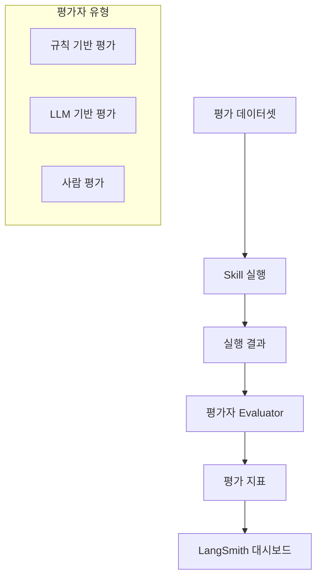
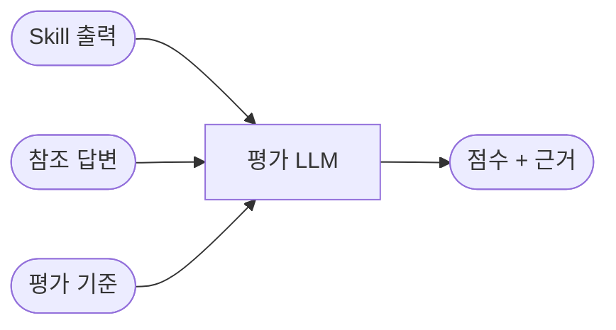
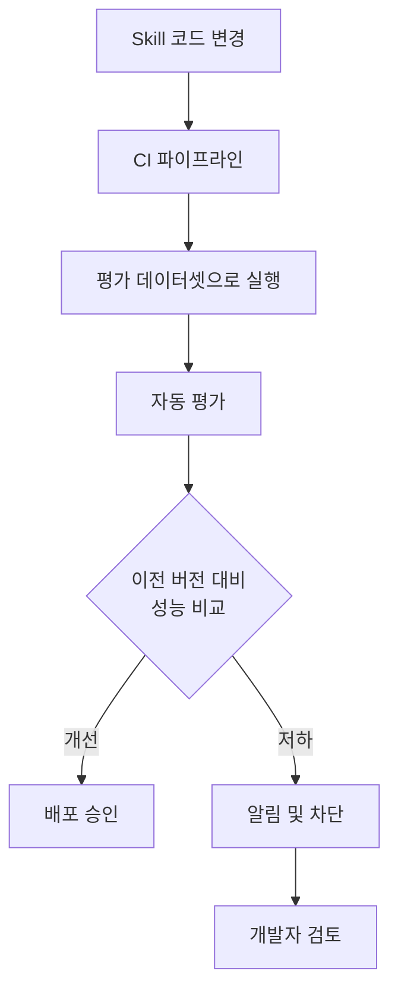

# Skills 평가 (Evaluating Skills)

## 개요

Skill의 품질을 체계적으로 측정하고 개선하기 위한 평가 시스템이다.
[LangSmith](https://smith.langchain.com/)의 평가 프레임워크를 활용하여 Skill의 정확도, 신뢰성, 비용 효율성을 정량적으로 평가한다.

> **핵심 아이디어**: 에이전트의 성능은 감(感)이 아니라 데이터로 측정한다. 평가 데이터셋과 자동화된 평가 파이프라인으로 Skill 품질을 관리한다.

---

## 평가가 필요한 이유

에이전트 시스템은 비결정적(non-deterministic)이다. 동일한 입력에도 다른 결과가 나올 수 있으므로, 체계적인 평가 없이는 품질 보장이 어렵다.

| 과제                | 설명                            |
|-------------------|-------------------------------|
| **비결정성**          | 동일 입력에 대해 매번 다른 출력 가능         |
| **다단계 실행**        | 중간 단계의 오류가 최종 결과에 전파          |
| **도구 의존성**        | 외부 도구의 응답 변화가 결과에 영향          |
| **프롬프트 민감성**      | 프롬프트 변경이 예측하기 어려운 방식으로 성능에 영향 |

---

## 평가 구조



---

## 평가 데이터셋

### 데이터셋 구성

평가 데이터셋은 입력-기대 출력 쌍으로 구성된다.

```yaml
# test_cases.yaml
examples:
  - input:
      query: "Python에서 비동기 프로그래밍이란?"
    expected_output:
      contains: ["async", "await", "asyncio"]
      tone: "technical"

  - input:
      query: "2024년 AI 트렌드 요약"
    expected_output:
      min_length: 200
      contains: ["LLM", "에이전트"]
```

### LangSmith에서 데이터셋 관리

```python
from langsmith import Client

client = Client()

# 데이터셋 생성
dataset = client.create_dataset("web-research-eval")

# 예제 추가
client.create_example(
    inputs={"query": "LangChain이란 무엇인가?"},
    outputs={"answer": "LangChain은 LLM 애플리케이션 개발 프레임워크입니다."},
    dataset_id=dataset.id,
)
```

---

## 평가자 유형

### 1. 규칙 기반 평가 (Heuristic)

프로그래밍 방식으로 결과를 검증한다.

| 평가 기준      | 설명                  | 예시                |
|------------|---------------------|-------------------|
| 정확도        | 기대값과의 일치 여부         | 정답 포함 여부 확인       |
| 형식 검증      | 출력 형식이 스키마에 맞는지     | JSON 구조 검증        |
| 길이 제한      | 출력 길이가 범위 내인지       | 최소 100자, 최대 1000자 |
| 키워드 포함     | 필수 키워드가 포함되었는지      | 특정 용어 존재 여부       |

```python
from langsmith.evaluation import evaluate

def contains_keywords(run, example):
    """필수 키워드 포함 여부를 평가합니다."""
    output = run.outputs["answer"]
    expected_keywords = example.outputs["contains"]
    found = all(kw in output for kw in expected_keywords)
    return {"score": 1.0 if found else 0.0, "key": "keyword_coverage"}

results = evaluate(
    skill.invoke,
    data="web-research-eval",
    evaluators=[contains_keywords],
)
```

### 2. LLM 기반 평가 (LLM-as-Judge)

LLM을 평가자로 활용하여 정성적 품질을 측정한다.



주요 평가 기준:

| 기준            | 설명                 |
|---------------|--------------------|
| **정확성**       | 사실에 기반한 올바른 정보인가   |
| **관련성**       | 질문에 대한 적절한 답변인가    |
| **완전성**       | 충분한 정보를 포함하고 있는가   |
| **일관성**       | 논리적으로 모순이 없는가      |
| **유해성**       | 유해하거나 부적절한 내용이 없는가 |

```python
from langsmith.evaluation import LangChainStringEvaluator

# LLM 기반 평가자 생성
correctness_evaluator = LangChainStringEvaluator("correctness")
helpfulness_evaluator = LangChainStringEvaluator("helpfulness")

results = evaluate(
    skill.invoke,
    data="web-research-eval",
    evaluators=[correctness_evaluator, helpfulness_evaluator],
)
```

### 3. 사람 평가 (Human-in-the-Loop)

LangSmith 대시보드에서 사람이 직접 결과를 검토하고 점수를 부여한다.

- 자동 평가로 걸러낸 후 경계 사례만 사람이 검토
- 평가 결과를 데이터셋에 반영하여 자동 평가 개선

---

## 평가 파이프라인

### 자동화된 평가 흐름



### 회귀 테스트

Skill 업데이트 시 기존 성능이 유지되는지 확인한다.

```python
# 이전 버전과 현재 버전 비교 평가
results_v1 = evaluate(skill_v1.invoke, data="web-research-eval", evaluators=evaluators)
results_v2 = evaluate(skill_v2.invoke, data="web-research-eval", evaluators=evaluators)

# 성능 비교
assert results_v2.aggregate_score >= results_v1.aggregate_score, "성능 회귀 발생"
```

---

## 평가 지표 요약

| 지표 유형     | 측정 항목              | 활용                    |
|-----------|--------------------|-----------------------|
| **정확도**   | 정답률, 키워드 커버리지      | Skill 품질의 기본 지표       |
| **지연 시간** | 응답 시간, 도구 호출 시간    | 사용자 경험 및 SLA 관리       |
| **비용**    | 토큰 사용량, API 호출 횟수  | 운영 비용 최적화             |
| **신뢰도**   | 동일 입력 반복 시 일관성     | 프로덕션 안정성 평가           |
| **안전성**   | 유해 콘텐츠 생성 비율       | 가드레일 효과 측정            |

---

## 참고 자료

- [Evaluating Skills](https://blog.langchain.com/evaluating-skills/)
- [LangSmith Evaluation Documentation](https://docs.smith.langchain.com/evaluation)
- [LangChain Skills](https://blog.langchain.com/langchain-skills/)
- [LangSmith CLI Skills](https://blog.langchain.com/langsmith-cli-skills/)
