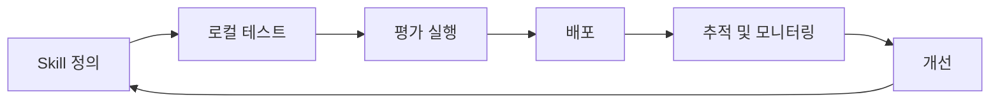

# Agent Examples

LangChain Skills를 활용한 에이전트 구축 사례와 실행 방식을 정리한 문서입니다.

> **Skill**: 에이전트가 수행할 수 있는 재사용 가능한 능력 단위. 프롬프트, 도구, 실행 로직을 하나의 모듈로 묶어 독립적으로 테스트·배포·조합할 수 있다.

---

## 문서 구성

| 문서                                              | 내용                                    |
|-------------------------------------------------|---------------------------------------|
| [LangChain Skills](./01-langchain-skills.md)    | Skill의 개념, 구성 요소, 아키텍처, 실행 흐름         |
| [LangSmith CLI Skills](./02-langsmith-cli-skills.md) | CLI를 통한 Skill 생성, 테스트, 배포, 추적 연동     |
| [Skills 평가](./03-evaluating-skills.md)          | 평가 데이터셋, 평가자 유형, 자동화된 평가 파이프라인       |

---

## Skill 기반 개발 흐름

---

## 참고 자료

- [LangChain Skills](https://blog.langchain.com/langchain-skills/)
- [LangSmith CLI Skills](https://blog.langchain.com/langsmith-cli-skills/)
- [Evaluating Skills](https://blog.langchain.com/evaluating-skills/)
- [LangGraph Documentation](https://langchain-ai.github.io/langgraph/)
- [LangSmith Documentation](https://docs.smith.langchain.com/)
