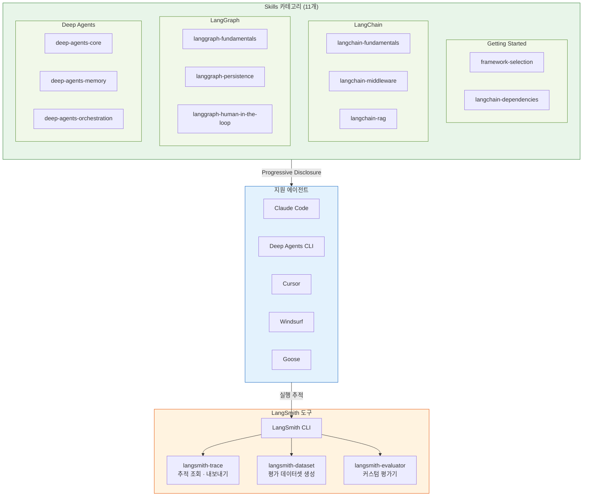
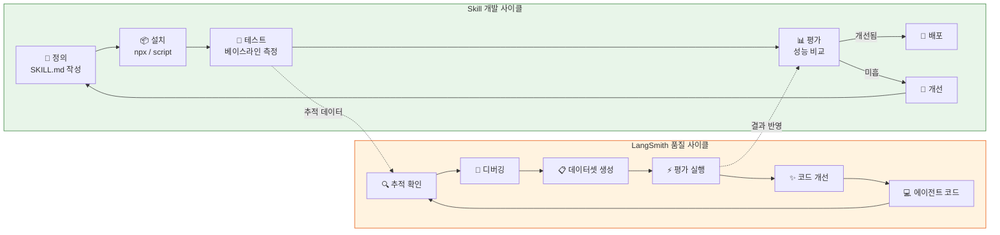

# LangChain Skills Diagram

LangChain Skills 시스템의 구조, 개발 사이클, 평가 파이프라인을 종합한 다이어그램입니다.

---

## 전체 구조

LangChain Skills는 코딩 에이전트의 특정 도메인 성능을 향상시키는 큐레이션된 가이드라인입니다. **Progressive Disclosure** 패턴으로 YAML frontmatter만 먼저 로드하고,
관련성이 확인되면 전체 SKILL.md를 로드합니다. Skills 적용 시 작업 통과율이 크게 향상됩니다(LangChain 블로그 기준 25% → 95%, 평가 블로그 기준 9% → 82%).

## 개발·평가 통합 사이클

Skills 기반 개발은 **정의 → 설치 → 테스트 → 평가 → 개선**의 반복 사이클과, LangSmith를 활용한 **추적 → 디버깅 → 데이터셋 → 평가**의 품질 사이클이 연동됩니다.

