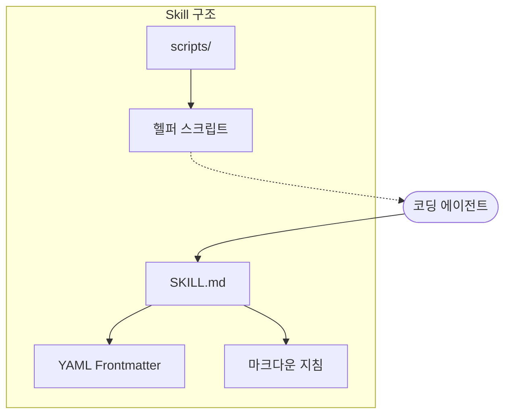
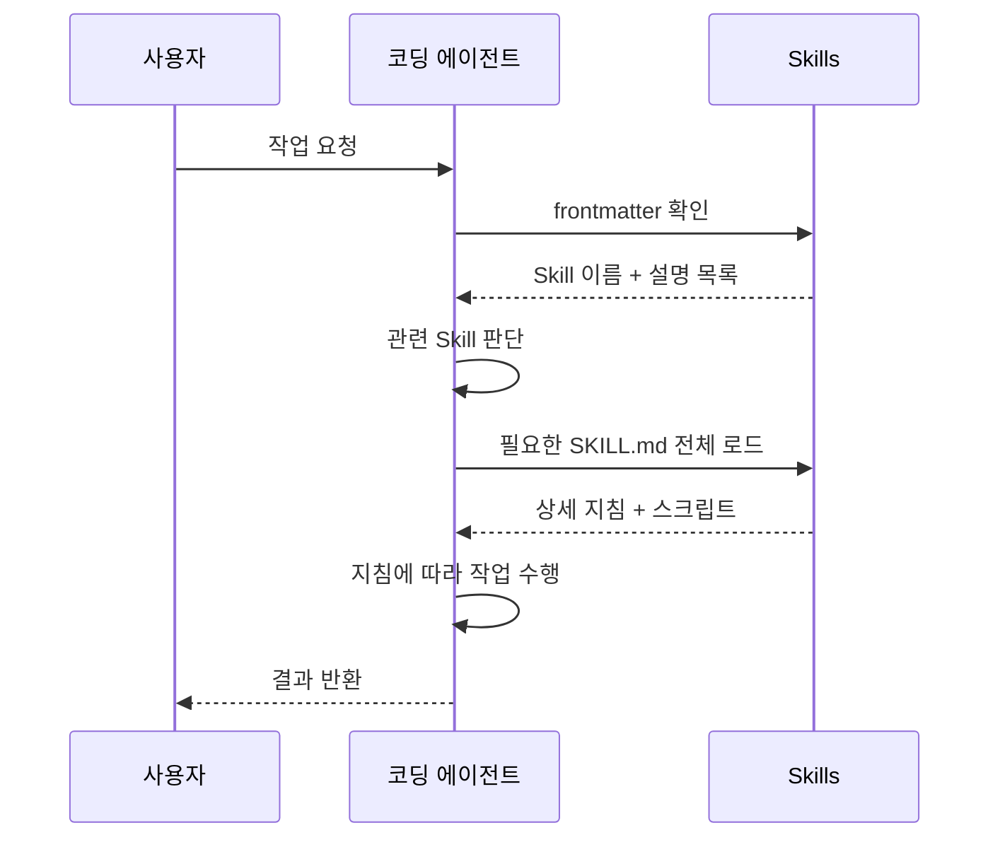
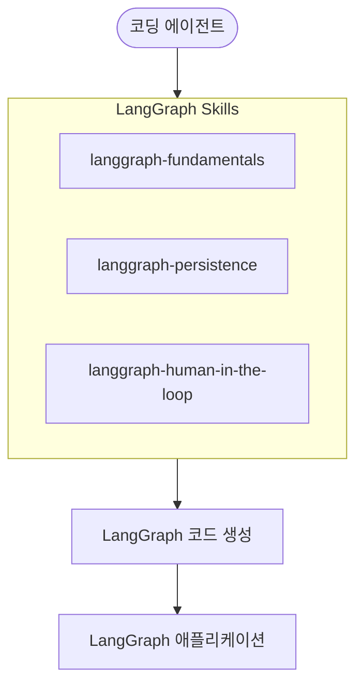

# LangChain Skills

## 개요

LangChain Skills는 **코딩 에이전트의 성능을 특정 도메인에서 향상시키는 큐레이션된 지침 모음**이다.
SKILL.md 파일과 선택적 헬퍼 스크립트로 구성되며, 에이전트가 필요할 때 동적으로 로드하는 **점진적 공개(Progressive Disclosure)** 방식으로 동작한다.

> **핵심 아이디어**: 에이전트에게 모든 것을 한 번에 주는 대신, 특정 도메인의 전문 지침을 필요할 때만 제공하여 성능을 극대화한다.

---

## Skill의 구성 요소

하나의 Skill은 다음 요소로 구성된다:

| 구성 요소            | 역할                                    |
|------------------|---------------------------------------|
| **SKILL.md**     | YAML frontmatter와 마크다운 지침으로 구성된 핵심 파일 |
| **헬퍼 스크립트 (선택)** | Python/TypeScript 유틸리티 스크립트           |
| **리소스 (선택)**     | 템플릿, 예제 코드, 참조 문서 등                   |



### SKILL.md 구조

Skill의 핵심 파일인 SKILL.md는 YAML frontmatter와 마크다운 본문으로 구성된다:

```markdown
---
name: langchain-fundamentals
description: Agent creation and tool usage with LangChain
---

# LangChain Fundamentals

## When to Use This Skill

Use this skill when working with LangChain agents, tools, or chains.

## Key Patterns

### Creating a Basic Agent

(에이전트 생성 지침과 코드 예제...)
```

---

## 점진적 공개 (Progressive Disclosure)

Skills는 **점진적 공개** 방식으로 동작한다. 에이전트는 기본적으로 YAML frontmatter만 로드하며, 해당 Skill이 현재 작업에 필요하다고 판단할 때만 전체 SKILL.md를 읽는다.



이 방식의 장점:

- **컨텍스트 절약**: 불필요한 지침을 로드하지 않아 토큰 사용량 감소
- **정확도 향상**: 관련 지침만 로드하여 에이전트의 집중도 유지
- **확장성**: Skill 수가 늘어나도 성능 저하 없음

---

## 사용 가능한 Skills

LangChain Skills 저장소에는 11개의 Skill이 4개 카테고리로 구성되어 있다.

### Getting Started

| Skill                  | 설명                 |
|------------------------|--------------------|
| framework-selection    | 프레임워크 비교 및 선택 가이드  |
| langchain-dependencies | 패키지 버전 및 의존성 관리 참조 |

### LangChain

| Skill                  | 설명                        |
|------------------------|---------------------------|
| langchain-fundamentals | 에이전트 생성 및 도구 사용           |
| langchain-middleware   | Human-in-the-loop 승인 워크플로 |
| langchain-rag          | RAG 파이프라인 구현              |

### LangGraph

| Skill                       | 설명                |
|-----------------------------|-------------------|
| langgraph-fundamentals      | StateGraph와 상태 관리 |
| langgraph-persistence       | Checkpointer와 메모리 |
| langgraph-human-in-the-loop | 인터럽트와 승인 워크플로     |

### Deep Agents

| Skill                     | 설명                     |
|---------------------------|------------------------|
| deep-agents-core          | 에이전트 아키텍처와 SKILL.md 형식 |
| deep-agents-memory        | 메모리 및 영속성 기능           |
| deep-agents-orchestration | 서브에이전트와 작업 계획          |

---

## 설치 방법

### npx를 통한 설치

```bash
# 모든 LangChain Skills 설치
npx skills add langchain-ai/langchain-skills --skill '*' --yes

# 특정 Skill만 설치
npx skills add langchain-ai/langchain-skills --skill 'langchain-fundamentals' --yes
```

### 설치 스크립트를 통한 설치

```bash
git clone https://github.com/langchain-ai/langchain-skills.git
cd langchain-skills

# 로컬 설치
./install.sh

# 글로벌 설치
./install.sh --global

# Deep Agents CLI용 설치
./install.sh --deepagents
```

### 지원하는 코딩 에이전트

Skills는 다음 코딩 에이전트에서 사용할 수 있다:

- Claude Code
- Deep Agents CLI
- Cursor
- Windsurf
- Goose

---

## 성능 효과

LangChain 블로그에 따르면, Skills 적용 전후 코딩 에이전트의 성능 차이가 크다:

| 조건                      | 태스크 통과율 |
|-------------------------|---------|
| Claude Code (Skills 없음) | 25%     |
| Claude Code (Skills 적용) | 95%     |

---

## LangGraph와의 관계

LangChain Skills에는 LangGraph 관련 Skill이 포함되어 있어, 에이전트가 [LangGraph](https://langchain-ai.github.io/langgraph/) 기반 애플리케이션을
구축할 때 도움을 받을 수 있다.

- **LangGraph**: 상태 기반 그래프로 에이전트 워크플로를 정의하는 프레임워크
- **LangGraph Skills**: LangGraph의 StateGraph, Checkpointer, Human-in-the-loop 패턴 등에 대한 전문 지침



---

## 참고 자료

- [LangChain Skills](https://blog.langchain.com/langchain-skills/)
- [langchain-ai/langchain-skills (GitHub)](https://github.com/langchain-ai/langchain-skills)
- [LangGraph Documentation](https://langchain-ai.github.io/langgraph/)
- [LangChain Tools](https://python.langchain.com/docs/integrations/tools/)
- [Anthropic: Building Effective Agents](https://www.anthropic.com/engineering/building-effective-agents)
