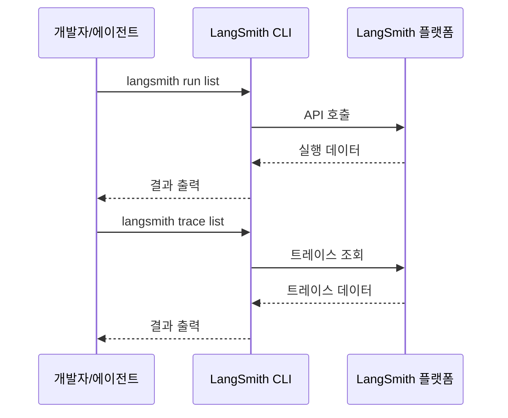
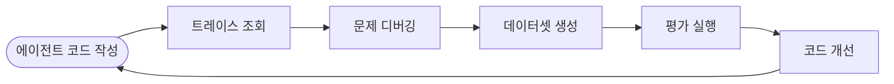

# LangSmith CLI & Skills

## 개요

LangSmith CLI는 [LangSmith](https://smith.langchain.com/) 플랫폼의 기능을 **터미널에서 직접 사용**할 수 있게 하는 명령줄 도구이다.
LangSmith Skills와 결합하면, 코딩 에이전트가 터미널을 벗어나지 않고 트레이스 조회, 데이터셋 생성, 평가 실행을 수행할 수 있다.

> **핵심 아이디어**: 코딩 에이전트가 LangSmith CLI와 Skills를 활용하여 에이전트 엔지니어링 라이프사이클을 터미널에서 완결한다.

---

## LangSmith CLI

### 설치

```bash
curl -sSL https://raw.githubusercontent.com/langchain-ai/langsmith-cli/main/scripts/install.sh | sh
```

### 주요 명령어

LangSmith CLI는 `langsmith` 명령으로 실행하며, 주요 기능은 다음과 같다:

| 명령어 예시                                                      | 설명            |
|-------------------------------------------------------------|---------------|
| `langsmith run list --project my-app --last-n-minutes 1440` | 최근 24시간 실행 조회 |
| `langsmith run get <run-id>`                                | 특정 실행 상세 조회   |
| `langsmith trace list --project X --limit 10`               | 트레이스 목록 조회    |
| `langsmith dataset list`                                    | 데이터셋 목록 조회    |
| `langsmith experiment list --project production`            | 실험 결과 조회      |
| `langsmith evaluator list`                                  | 평가자 목록 조회     |

### 실행 흐름



---

## LangSmith Skills

LangSmith Skills는 코딩 에이전트가 LangSmith의 트레이싱, 데이터셋, 평가 기능을 활용할 수 있도록 하는 전문 지침 모음이다.

### 사용 가능한 Skills

| Skill                   | 설명                             |
|-------------------------|--------------------------------|
| **langsmith-trace**     | 트레이스 조회 및 내보내기 (헬퍼 스크립트 포함)    |
| **langsmith-dataset**   | 트레이스에서 평가 데이터셋 생성 (헬퍼 스크립트 포함) |
| **langsmith-evaluator** | 커스텀 평가자 생성 (헬퍼 스크립트 포함)        |

### 설치

```bash
# 모든 LangSmith Skills 설치
npx skills add langchain-ai/langsmith-skills --skill '*' --yes

# 설치 스크립트 사용 (Claude Code & Deep Agents CLI)
git clone https://github.com/langchain-ai/langsmith-skills.git
cd langsmith-skills
./install.sh [--global] [--deepagents] [--force]
```

### 지원하는 코딩 에이전트

- Claude Code
- Deep Agents CLI
- Cursor
- Windsurf
- Goose

---

## CLI + Skills 통합 워크플로

LangSmith CLI와 Skills를 결합하면 에이전트 개발 라이프사이클 전체를 터미널에서 관리할 수 있다.



### 워크플로 예시

#### 1. 트레이스 기반 디버깅

코딩 에이전트가 `langsmith-trace` Skill의 지침에 따라 트레이스를 조회하고 분석한다:

```bash
# 최근 실행 조회
langsmith run list --project my-agent --last-n-minutes 1440

# 특정 실행의 상세 정보 확인
langsmith run get <run-id>
```

#### 2. 데이터셋 생성

`langsmith-dataset` Skill의 지침에 따라 트레이스에서 평가 데이터셋을 생성한다:

```bash
# 트레이스에서 데이터셋 생성을 위한 실행 목록 조회
langsmith trace list --project my-agent --limit 50
```

#### 3. 평가 실행 및 분석

`langsmith-evaluator` Skill의 지침에 따라 커스텀 평가자를 생성하고 평가를 실행한다:

```bash
# 평가 실험 결과 조회
langsmith experiment list --project my-agent
```

---

## LangSmith 추적 정보

LangSmith 플랫폼에서 확인할 수 있는 추적 정보:

| 항목         | 설명                     |
|------------|------------------------|
| **실행 트리**  | LLM 호출, 도구 호출의 계층적 시각화 |
| **입출력**    | 각 단계의 입력값과 출력값         |
| **지연 시간**  | 각 단계별 소요 시간            |
| **토큰 사용량** | LLM 호출당 토큰 수 및 비용      |
| **오류 추적**  | 실패 시 오류 발생 위치 및 메시지    |

---

## 참고 자료

- [LangSmith CLI & Skills](https://blog.langchain.com/langsmith-cli-skills/)
- [langchain-ai/langsmith-skills (GitHub)](https://github.com/langchain-ai/langsmith-skills)
- [langchain-ai/langsmith-cli (GitHub)](https://github.com/langchain-ai/langsmith-cli)
- [LangSmith Documentation](https://docs.smith.langchain.com/)
- [LangGraph Documentation](https://langchain-ai.github.io/langgraph/)
