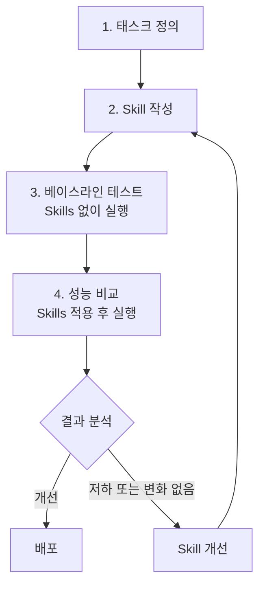
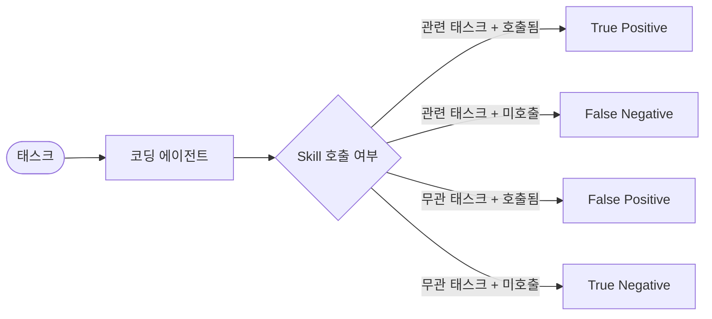
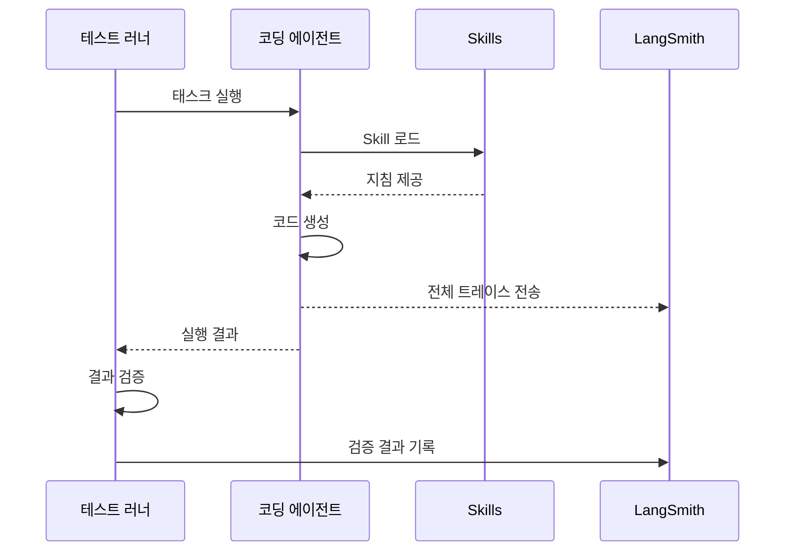
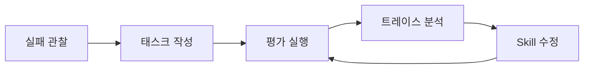
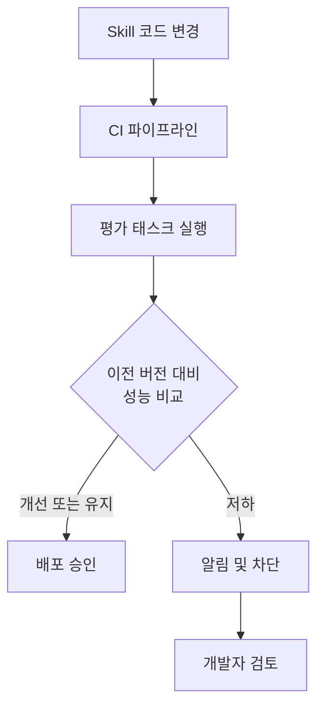

# Skills 평가 (Evaluating Skills)

## 개요

Skill의 품질을 체계적으로 측정하고 개선하기 위한 평가 방법론이다.
Skills는 코딩 에이전트에 동적으로 로드되는 프롬프트이므로, 프롬프트와 마찬가지로 체계적인 테스트가 필요하다.

> **핵심 아이디어**: Skills는 프롬프트처럼 동작하며, 프롬프트처럼 테스트해야 한다. 실제 실패 사례를 기반으로 태스크를 정의하고, Skills 유무에 따른 성능 차이를 정량적으로 측정한다.

---

## 평가가 필요한 이유

에이전트 시스템은 비결정적(non-deterministic)이다. Skills를 추가하거나 수정하면 예측하기 어려운 방식으로 에이전트 행동이 변할 수 있다.

| 과제             | 설명                              |
|----------------|---------------------------------|
| **비결정성**       | 동일 입력에 대해 매번 다른 출력 가능           |
| **동적 로딩 영향**   | Skill 로드 여부가 에이전트 행동에 영향        |
| **의도치 않은 부작용** | 특정 Skill이 다른 태스크의 성능을 저하시킬 수 있음 |
| **프롬프트 민감성**   | 지침 변경이 예측하기 어려운 방식으로 성능에 영향     |

---

## 평가 프로세스

LangChain 블로그에서 제시하는 4단계 평가 프로세스:



### 1단계: 태스크 정의

실제 코딩 에이전트의 **실패 사례를 기반**으로 태스크를 정의한다.

- 실제 관찰된 실패에서 출발
- 실패를 재현할 수 있는 가장 단순한 테스트 케이스 작성
- 태스크 결과를 검증할 수 있도록 설계

```python
# 예: LangGraph StateGraph 작성 태스크
task = {
    "description": "Create a LangGraph StateGraph that manages a simple chatbot with memory",
    "expected_files": ["agent.py"],
    "validation": "agent.py must use StateGraph, add_node, add_edge correctly"
}
```

### 2단계: Skill 작성

태스크 수행에 필요한 도메인 지침을 SKILL.md로 작성한다.

### 3단계: 베이스라인 테스트

Skills 없이 코딩 에이전트에게 동일한 태스크를 수행시키고 결과를 기록한다.

### 4단계: 성능 비교

Skills를 적용한 후 동일 태스크를 수행시키고 결과를 비교한다.

---

## 평가 지표

### 핵심 측정 항목

| 지표               | 설명                      | 측정 방법             |
|------------------|-------------------------|-------------------|
| **태스크 완료율**      | 태스크를 성공적으로 완료한 비율       | 자동화된 검증 스크립트      |
| **Skill 호출 정확도** | 관련 Skill이 적절히 호출되었는지    | LangSmith 트레이스 분석 |
| **턴 수**          | 태스크 완료까지 필요한 대화 턴 수     | 트레이스에서 자동 측정      |
| **실행 시간**        | 태스크 완료까지 소요된 시간         | 트레이스에서 자동 측정      |
| **출력 정확성**       | 생성된 코드/파일이 기대 결과와 일치하는지 | 파일 비교, 테스트 실행     |

### Skill 호출 검증

Skill이 **적절할 때만 호출**되는지 검증하는 것이 중요하다:

- 관련 태스크에서 Skill이 호출되었는가? (True Positive)
- 무관한 태스크에서 Skill이 호출되지 않았는가? (True Negative)



---

## LangSmith를 활용한 평가 관찰

### 트레이스 기반 분석

LangSmith의 pytest 통합과 트레이싱 기능을 활용하여 코딩 에이전트의 전체 실행 경로를 관찰한다:

- 파일 읽기, 스크립트 생성, Skill 호출 등 모든 행동 기록
- 실패 시 원인을 트레이스에서 추적
- 반복 실행 간 행동 패턴 비교



### 평가 결과 예시

LangChain 블로그에서 보고한 실제 성능 데이터:

| 조건                      | 태스크 통과율 |
|-------------------------|---------|
| Claude Code (Skills 없음) | 25%     |
| Claude Code (Skills 적용) | 95%     |

---

## 평가 모범 사례

### 1. 실제 실패에서 출발

감으로 태스크를 만들지 않는다. 코딩 에이전트가 **실제로 실패한 사례**를 관찰하고, 그 실패를 재현하는 태스크를 작성한다.

### 2. 가장 단순한 테스트 케이스

실패를 재현할 수 있는 **최소한의 테스트 케이스**를 작성한다. 복잡한 태스크는 실패 원인을 파악하기 어렵다.

### 3. 오픈엔디드 출력 제약

코딩 에이전트의 출력이 자유롭면 평가가 어렵다. 버그 수정처럼 **출력이 제약된 태스크**가 검증하기 쉽다.

### 4. 반복적 개선

평가 → Skill 수정 → 재평가 사이클을 반복한다. 관찰 가능성(Observability)을 통해 점진적으로 개선한다.



---

## 자동화된 평가 파이프라인

Skill 변경 시 자동으로 평가를 실행하는 CI 파이프라인을 구성할 수 있다:



---

## 참고 자료

- [Evaluating Skills](https://blog.langchain.com/evaluating-skills/)
- [LangChain Skills](https://blog.langchain.com/langchain-skills/)
- [LangSmith CLI & Skills](https://blog.langchain.com/langsmith-cli-skills/)
- [langchain-ai/skills-benchmarks (GitHub)](https://github.com/langchain-ai/skills-benchmarks)
- [LangSmith Evaluation Documentation](https://docs.smith.langchain.com/evaluation)
