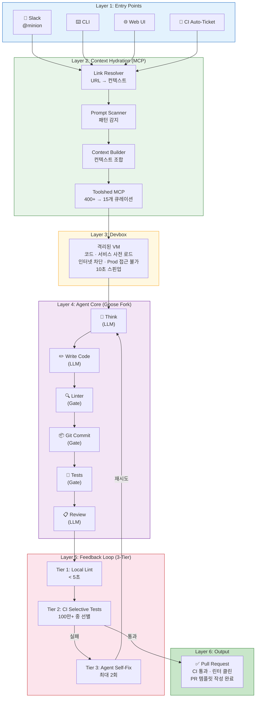
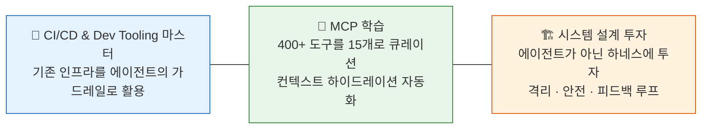

# Stripe Minions Diagram

Stripe의 프로덕션 AI 코딩 에이전트 시스템 Minions의 6계층 아키텍처와 실행 파이프라인을 종합한 다이어그램입니다.

---

## 6계층 아키텍처

Minions는 **Entry Points → Context Hydration → Devbox → Agent Core → Feedback Loop → Output(PR)** 6개 계층으로 구성됩니다. Stripe의
기존 개발 인프라(CI/CD, 린터, MCP)를 최대한 재활용하며, 에이전트가 아닌 하네스(harness) 설계에 투자하는 것이 핵심 철학입니다.

## 3대 설계 원칙

Minions의 핵심 설계 철학인 3가지 원칙을 요약합니다. 에이전트 자체보다 에이전트를 둘러싼 **하네스**(harness) — CI/CD, 린터, MCP, 격리 환경 — 에 투자하는 것이 성공의 열쇠입니다.

