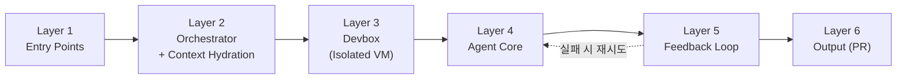
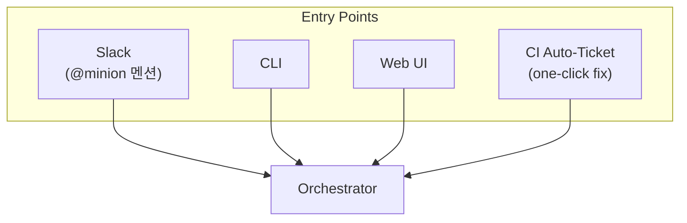
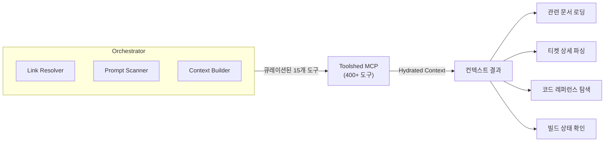
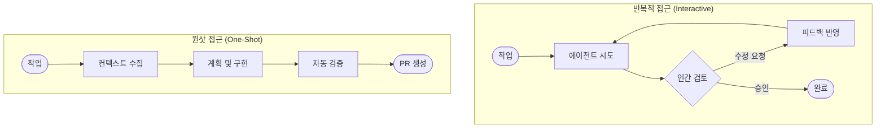

# Stripe Minions: One-Shot 코딩 에이전트

## 개요

Stripe의 Minions는 코딩 작업을 **원샷(One-Shot)으로 엔드투엔드(End-to-End) 완료**하는 내부 AI 코딩 에이전트 시스템이다.
개발자가 작업을 할당하면, 에이전트가 코드베이스를 분석하고 변경 사항을 구현하여 Pull Request를 생성한다.

> **One-Shot**: 실행 중 인간의 추가 입력 없이, 한 번의 실행으로 작업을 완료하는 방식을 의미한다.
> **End-to-End**: 작업 이해부터 PR 생성까지 전체 개발 사이클을 에이전트가 자율적으로 수행한다.

### 핵심 공식

Minions는 특별한 기술이 아니라, 기존 인프라와 AI 에이전트의 결합이다:

```text
Developer Workflow (기존 인프라, 실전 검증 완료) + AI Agent (오픈소스 도구 포크) = Minions (주당 1,000+ PR)
```

> **"Not exotic — just great engineering"**

---

## Stripe 환경의 세 기둥

Minions가 동작하는 Stripe 환경은 세 가지 축으로 구성된다:

| 기둥 | 구성 요소 | 역할 |
|-----|---------|-----|
| **Stripe Context** | Internal APIs, Sorbet types, 도메인 특화 패턴 | 에이전트가 Stripe 코드베이스를 이해하기 위한 맥락 |
| **Stripe Tools** | Custom linters, CI pipelines, dev environments | 에이전트가 사용하는 개발 도구 체인 |
| **Stripe Guardrails** | Payment safety, regulatory compliance, audit trails | 에이전트의 행동을 제한하는 안전장치 |

에이전트는 인간 엔지니어와 **동일한 도구와 환경**을 사용한다. 에이전트 전용 특수 도구를 만드는 대신, 기존 개발 인프라를 그대로 활용하는 것이 Minions의 설계 철학이다.

---

## 6개 레이어 아키텍처

Minions의 전체 시스템은 6개 레이어로 구성된다:



| 레이어 | 이름 | 핵심 역할 |
|-------|------|---------|
| Layer 1 | Entry Points | 작업 진입 (Slack, CLI, Web UI, CI Auto-Ticket) |
| Layer 2 | Context Hydration via MCP | 결정론적 컨텍스트 수집 및 조합 |
| Layer 3 | Devbox | 격리된 VM 환경에서 안전한 실행 |
| Layer 4 | Agent Core | LLM 추론 + 결정론적 게이트 기반 코드 생성 |
| Layer 5 | Feedback Loop | 3단계 검증 및 자동 수정 |
| Layer 6 | Output | 리뷰 준비된 PR 생성 |

---

## Layer 1: Entry Point

작업은 4가지 경로로 진입한다:



| 채널 | 설명 |
|-----|------|
| **Slack** | `@minion` 멘션으로 작업 요청 (주 사용 채널) |
| **CLI** | 커맨드라인에서 직접 실행 |
| **Web UI** | 웹 인터페이스를 통한 요청 |
| **CI Auto-Ticket** | CI 실패 시 자동 생성되는 원클릭 수정 티켓 |

### Slack 요청 예시

```text
@minion Fix the flaky test in checkout_flow_test.rb
```

요청 시 자동으로 다음 정보가 첨부된다:

- **Stack traces**: 관련 에러 스택 추적
- **Linked docs**: 연결된 문서
- **Thread context**: 슬랙 스레드의 전체 대화 맥락

> 사용자의 메시지만이 아니라, **스레드 전체를 읽는다**(Reads the entire thread — not just your message).

---

## Layer 2: Context Hydration via MCP

Orchestrator가 작업에 필요한 컨텍스트를 **결정론적으로** 수집하는 단계이다.



### Orchestrator 구성

| 컴포넌트 | 역할 |
|---------|------|
| **Link Resolver** | 메시지에 포함된 링크를 해석하여 관련 리소스 연결 |
| **Prompt Scanner** | 프롬프트를 분석하여 필요한 컨텍스트 유형 판별 |
| **Context Builder** | 수집된 정보를 에이전트가 소화할 수 있는 형태로 조합 |

### Toolshed MCP Server

Toolshed는 **400개 이상의 도구**를 제공하는 MCP 서버다. 실행당 **15개를 큐레이션**하여 사용한다.

| 도구 카테고리 | 기능 |
|-----------|------|
| Internal Docs | Stripe 내부 문서 검색 |
| Sourcegraph | 코드 검색 및 탐색 |
| Build Status | 빌드 상태 조회 |
| Ticket Details | 티켓 상세 정보 |
| Code Search | 코드베이스 전체 검색 |
| SaaS Platforms | 연동된 외부 서비스 정보 |

> **핵심**: Pre-fetching은 **결정론적(deterministic)**이다 — LLM의 판단에 의존하지 않는다.

---

## One-Shot 접근 방식

### 기존 접근 방식과의 비교



| 비교 항목 | 반복적 접근 (Interactive) | 원샷 접근 (One-Shot) |
|---------|----------------------|-------------------|
| 인간 개입 | 매 단계마다 피드백 필요 | 실행 완료 후 최종 리뷰만 수행 |
| 실행 시간 | 인간 응답 대기로 인해 긴 리드타임 | 자동 실행으로 빠른 완료 |
| 적합한 작업 | 모호하거나 창의적 판단이 필요한 작업 | 명확한 요구사항이 있는 구조화된 작업 |
| 품질 보장 | 인간 피드백으로 품질 보장 | 자동 테스트 및 검증으로 품질 보장 |

### One-Shot이 효과적인 조건

1. **명확한 작업 정의**: 요구사항이 구체적이고 모호하지 않음
2. **충분한 테스트 인프라**: 자동화된 테스트로 변경 사항 검증 가능
3. **패턴화된 작업**: 반복적으로 발생하는 유사한 유형의 작업
4. **제한된 변경 범위**: 변경이 소수의 파일에 국한됨

---

## 참고 자료

- [Stripe: Minions — Stripe's one-shot, end-to-end coding agents](https://stripe.dev/blog/minions-stripes-one-shot-end-to-end-coding-agents)
- [Stripe: Minions — Stripe's one-shot, end-to-end coding agents (Part 2)](https://stripe.dev/blog/minions-stripes-one-shot-end-to-end-coding-agents-part-2)
