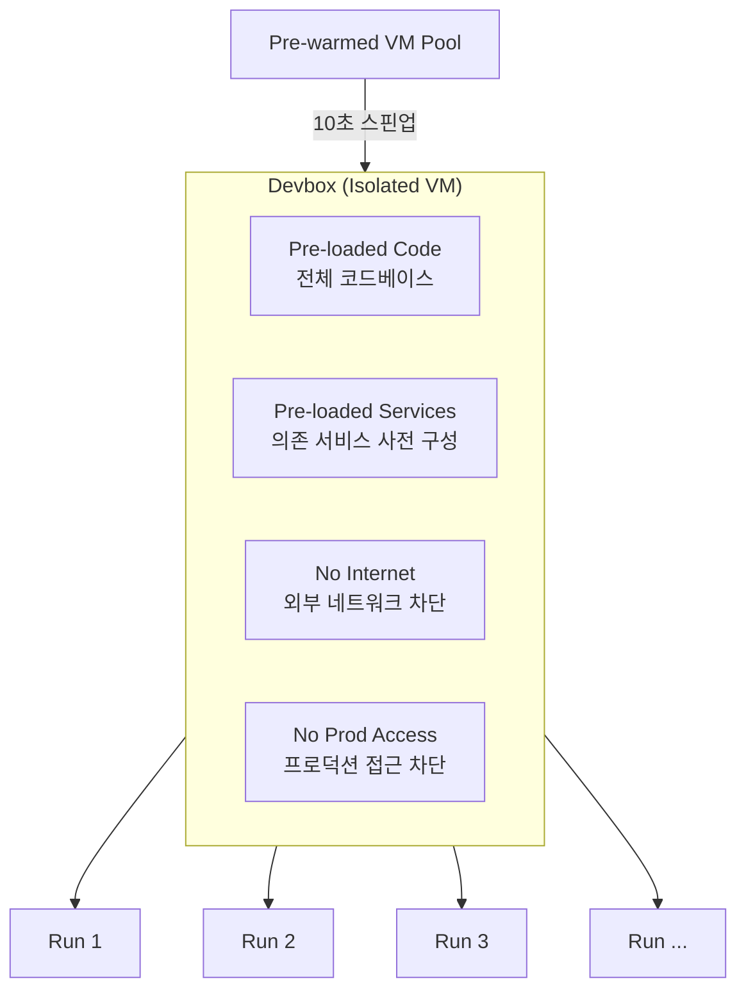
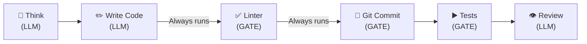
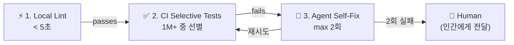
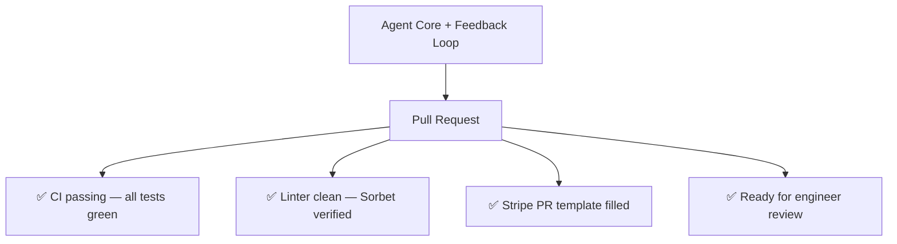
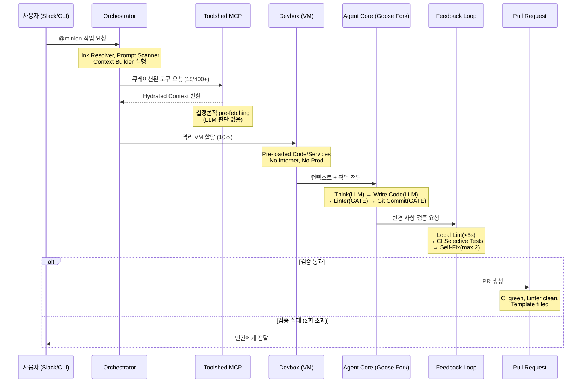
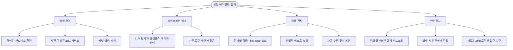

# Stripe Minions: 시스템 설계 상세

## 개요

이 문서는 Stripe Minions의 내부 시스템 설계를 상세히 다룬다.
격리된 실행 환경(Devbox), Agent Core의 LLM과 결정론적 게이트 결합 전략, 3단계 피드백 루프, 그리고 최종 산출물인 PR 생성까지의 과정을 설명한다.

---

## Layer 3: Devbox — Isolated VM

에이전트는 격리된 VM(Devbox) 안에서 실행된다. 인간 엔지니어가 사용하는 것과 **동일한 개발 환경**이다.

### 환경 구성

| 특성 | 설명 |
|-----|------|
| **Pre-loaded Code** | 전체 Stripe 코드베이스가 미리 로딩됨 |
| **Pre-loaded Services** | 의존 서비스(dependencies)가 사전 구성됨 |
| **No Internet** | 외부 네트워크 접근 차단 |
| **No Prod Access** | 프로덕션 환경 접근 차단 |

### 성능 최적화

- **10초 스핀업**: Pre-warmed VM pool에서 즉시 할당
- **병렬 실행**: 여러 작업을 동시에 실행 가능 (True parallelization)

### Sandbox = Permission

인터넷과 프로덕션 접근이 구조적으로 차단되어 있기 때문에, **인간의 승인 없이도 안전하게 실행**할 수 있다.
샌드박스의 격리 수준 자체가 권한 모델이 되는 것이다.

| 제약 | 효과 |
|-----|------|
| No Internet | 외부 유출 불가 |
| No Prod Access | 프로덕션 영향 불가 |
| No human approval needed | 승인 대기 없이 즉시 실행 |

---

## Layer 4: Agent Core — Goose Fork

### Block의 Goose 포크

Minions의 Agent Core는 Block(구 Square)이 개발한 오픈소스 코딩 에이전트 **Goose**의 포크 버전이다.

### 실행 파이프라인

Agent Core는 **LLM 창의적 단계**와 **결정론적 게이트**를 교차 배치한다:

각 단계는 두 가지 유형으로 구분된다:

| 유형 | 단계 | 특성 |
|-----|------|------|
| **LLM creative step** | Think, Write Code, Review | LLM이 창의적으로 판단하는 단계 |
| **Deterministic gate** | Linter, Git Commit, Tests | 항상 실행되며 결과가 예측 가능한 검증 단계 |

> **"Creativity of an LLM + reliability of deterministic code"**

### Guardrails + Rule Files

LLM의 창의성과 결정론적 코드의 신뢰성 사이에서 균형을 잡기 위해, 에이전트가 절대 우회할 수 없는 규칙이 존재한다:

| 규칙 | 효과 |
|-----|------|
| Cannot skip the linter | 린터를 건너뛸 수 없음 |
| Cannot forget tests | 테스트를 누락할 수 없음 |
| Cannot push without committing | 커밋 없이 푸시할 수 없음 |

이러한 가드레일은 에이전트가 "지름길"을 택하는 것을 **구조적으로** 방지한다.
LLM에게 "린터를 실행하세요"라고 프롬프트하는 것이 아니라, 린터 게이트를 파이프라인에 하드코딩한 것이다.

---

## Layer 5: Three-Tier Feedback Loop

코드 변경 후 3단계 피드백 루프가 동작한다:

### 단계별 상세

| 단계 | 설명 | 특성 |
|-----|------|------|
| **1. Local Lint** | 휴리스틱 기반으로 선별된 린터 실행. 타입 에러, 포매팅 검사 | **5초 이내** |
| **2. CI Selective Tests** | 1M+ 전체 테스트 중 변경과 관련된 테스트만 선별 실행. 다수 auto-fix 지원 | **선별적 실행** |
| **3. Agent Self-Fix** | 실패 내용을 읽고 수정 시도 후 재푸시 | **최대 2회** |

### 실패 처리 원칙

> **"Can't fix in 2 tries? Surface it to the human — no wasted tokens"**

2번 시도해도 수정할 수 없으면 인간에게 돌려준다. 무한 재시도로 토큰을 낭비하지 않는다.

---

## Layer 6: Output — PR Ready for Review

모든 레이어를 통과한 결과물은 리뷰 준비가 완료된 PR이다.

### PR 완성 기준

| 체크리스트 | 설명 |
|----------|------|
| CI passing | 모든 테스트 통과 (all tests green) |
| Linter clean | Sorbet 타입 검사 포함 린터 통과 |
| PR template filled | Stripe 내부 PR 템플릿 작성 완료 |
| Ready for review | 엔지니어가 바로 리뷰 가능한 상태 |

---

## 에이전트 실행 파이프라인 (전체 흐름)

6개 레이어를 통합한 전체 실행 흐름이다:

---

## 설계 핵심 인사이트

### Human Engineers = AI Agents

Minions의 핵심 설계 원칙은 인간 엔지니어와 AI 에이전트가 **동일한 도구**를 사용한다는 것이다:

| 도구 | 인간 엔지니어 | AI 에이전트 |
|-----|-----------|-----------|
| Dev Environments | ✅ | ✅ |
| Linters | ✅ | ✅ |
| CI/CD | ✅ | ✅ |
| Docs | ✅ | ✅ |
| Code Review | ✅ | ✅ |

에이전트 전용 도구를 별도로 만드는 것이 아니라, 인간이 이미 사용하는 인프라를 그대로 활용한다.

### 코딩 에이전트 시스템 구축을 위한 3가지 지침

| # | 지침 | 설명 |
|---|------|------|
| 1 | **Master CI/CD & Dev Tooling** | databases, linters, test infra, MCP curation을 숙달하라 |
| 2 | **Learn MCP** | 에이전트를 실제 시스템에 연결하는 프로토콜 레이어를 학습하라 |
| 3 | **Invest in System Design** | 에이전트가 아니라 **하네스(harness)를 설계**하라 |

> **"Design the harness, not the agent"**
> 에이전트 자체를 개선하는 것보다, 에이전트가 동작하는 시스템 환경을 설계하는 데 투자하라.

---

## 코딩 에이전트 설계 시 고려사항

### 핵심 원칙

1. **결정론적 컨텍스트 수집**: LLM 판단에 의존하지 않는 사전 수집으로 일관된 품질 확보
2. **LLM 창의성 + 결정론적 신뢰성**: 코드 생성은 LLM에게, 검증은 하드코딩된 게이트에 맡김
3. **제한된 재시도**: 무한 루프 대신 2회 실패 시 인간에게 전달하여 토큰 낭비 방지
4. **환경이 곧 권한**: 샌드박스 격리 수준이 권한 모델을 대체하여 승인 프로세스 생략
5. **하네스 설계 우선**: 에이전트 모델 자체보다 에이전트가 동작하는 시스템 환경에 투자

### 주의사항

1. **컨텍스트 윈도우 초과 방지**: 400+ 도구 중 15개만 큐레이션하는 것처럼, 필요한 정보만 선별
2. **무한 수정 루프 방지**: Self-Fix 최대 2회로 제한하고 인간에게 에스컬레이션
3. **게이트 우회 방지**: 린터, 테스트, 커밋 등 검증 단계를 프롬프트가 아닌 구조로 강제
4. **보안은 격리로**: 네트워크 차단과 프로덕션 접근 차단으로 근본적 안전성 확보

---

## 참고 자료

- [Stripe: Minions — Stripe's one-shot, end-to-end coding agents (Part 2)](https://stripe.dev/blog/minions-stripes-one-shot-end-to-end-coding-agents-part-2)
- [Stripe: Minions — Stripe's one-shot, end-to-end coding agents](https://stripe.dev/blog/minions-stripes-one-shot-end-to-end-coding-agents)
