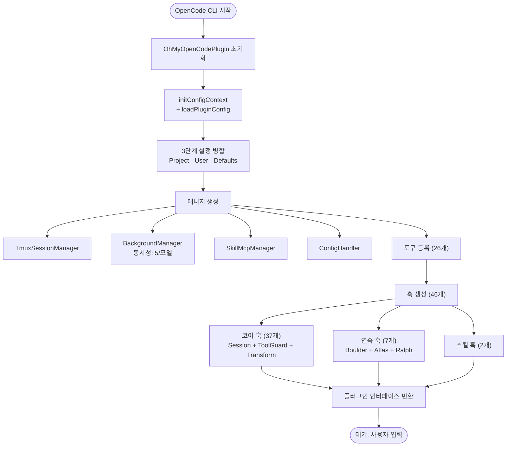
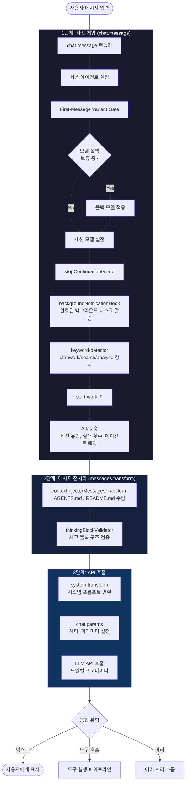
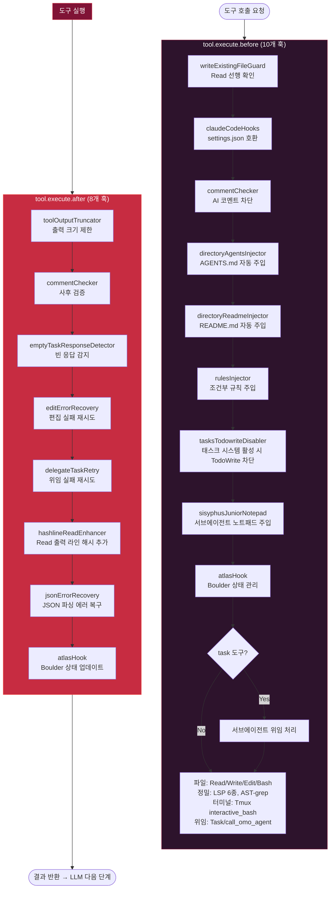
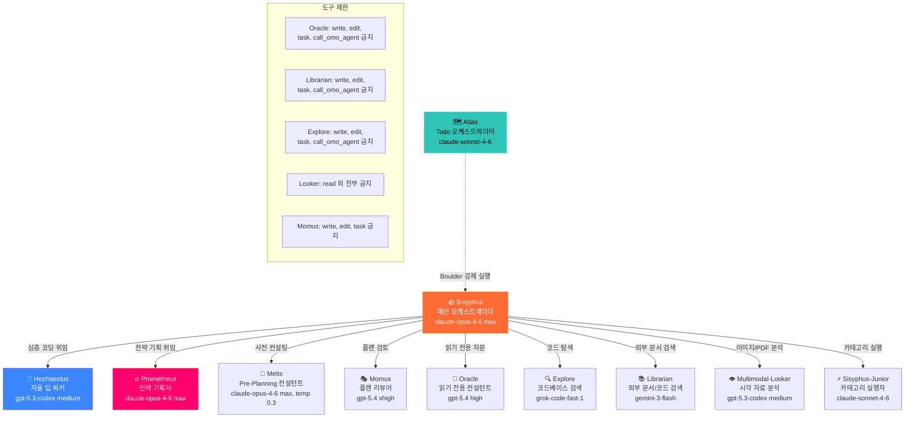
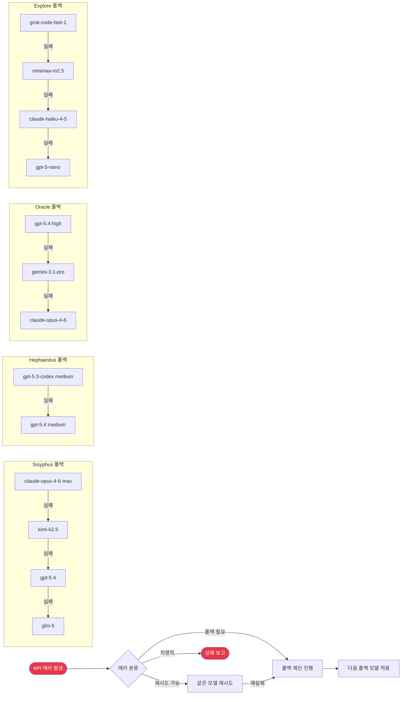
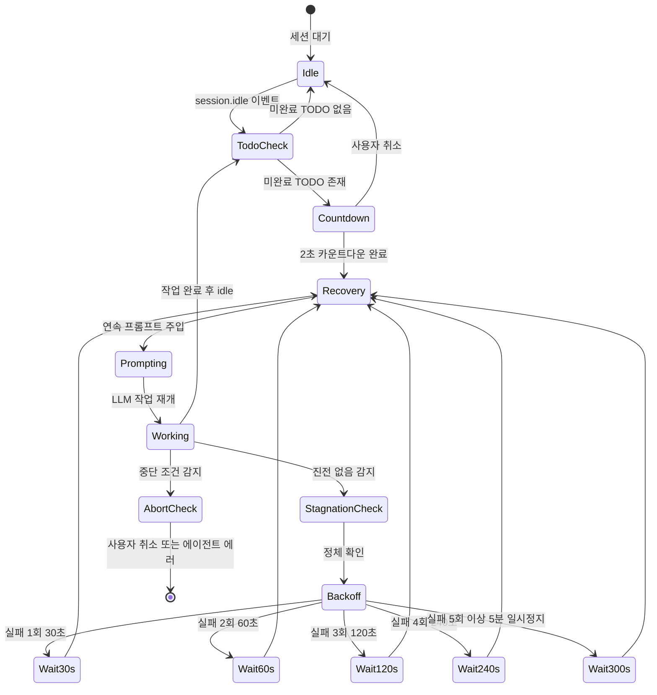
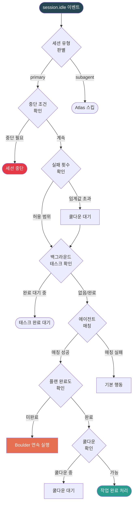
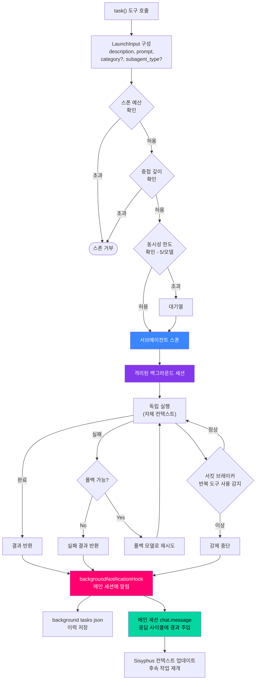
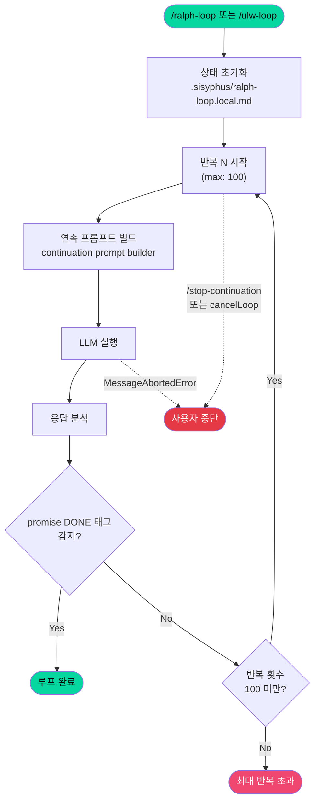
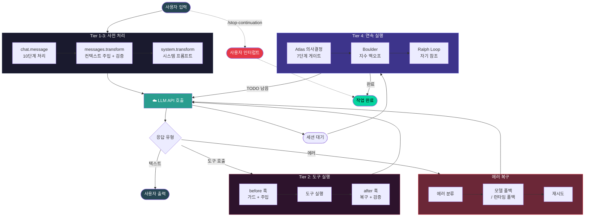

# OMO 실행 파이프라인 다이어그램

## 1. 전체 플러그인 초기화 흐름

## 2. 메시지 처리 파이프라인 (chat.message → API 호출 → 응답)

## 3. 도구 실행 파이프라인 (Before → Execute → After)

## 4. 에이전트 오케스트레이션 & 위임 체계

## 5. 모델 폴백 체인

## 6. Boulder 연속 실행 메커니즘 (todo-continuation-enforcer)

## 7. Atlas 마스터 오케스트레이터 의사결정 게이트

## 8. 백그라운드 태스크 병렬 실행

## 9. Ralph Loop (자기 참조 개발 루프)

## 10. 전체 End-to-End 파이프라인 요약

