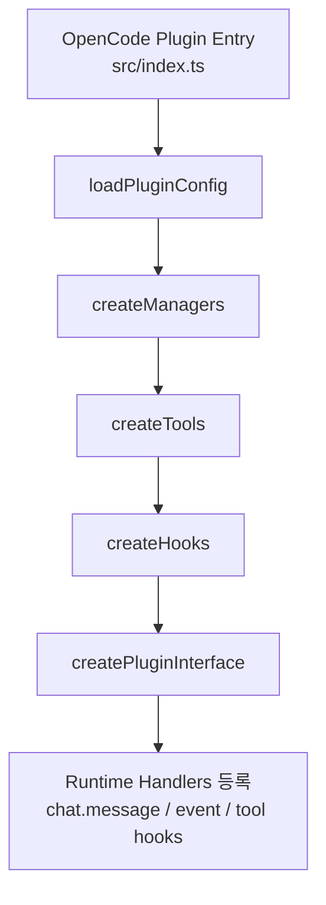
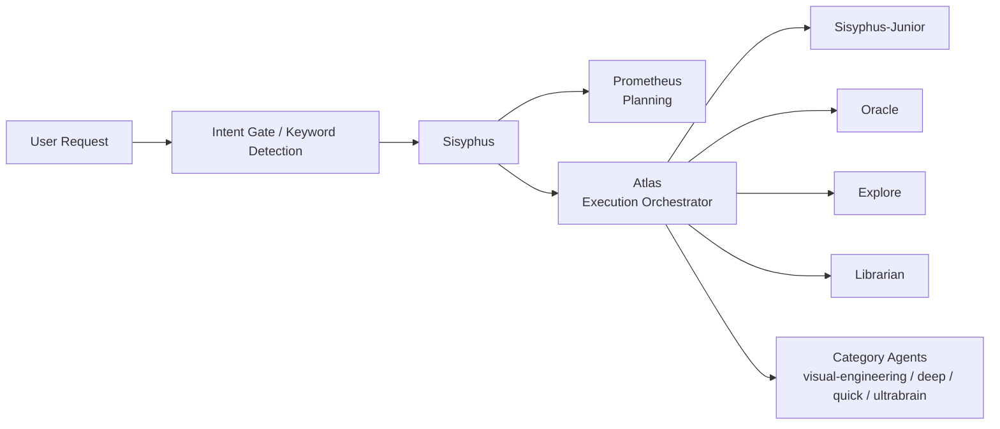
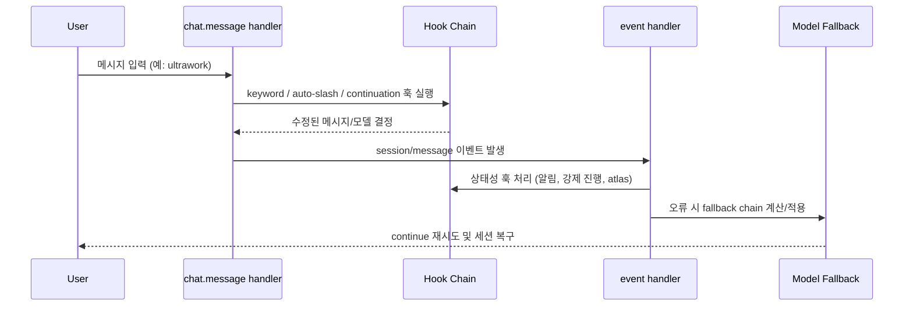

# Oh My OpenAgent 아키텍처 다이어그램

## 1) 플러그인 부트스트랩 구조

```mermaid
flowchart TD
    A[OpenCode Plugin Entry<br/>src/index.ts] --> B[loadPluginConfig]
    B --> C[createManagers]
    C --> D[createTools]
    D --> E[createHooks]
    E --> F[createPluginInterface]
    F --> G[Runtime Handlers 등록<br/>chat.message / event / tool hooks]
```

## 2) 오케스트레이션 레이어

```mermaid
flowchart LR
    U[User Request] --> I[Intent Gate / Keyword Detection]
    I --> S[Sisyphus]
    S --> P[Prometheus<br/>Planning]
    S --> A[Atlas<br/>Execution Orchestrator]
    A --> W1[Sisyphus-Junior]
    A --> W2[Oracle]
    A --> W3[Explore]
    A --> W4[Librarian]
    A --> W5[Category Agents<br/>visual-engineering / deep / quick / ultrabrain]
```

## 3) 런타임 이벤트/훅 처리 흐름

```mermaid
sequenceDiagram
    participant User
    participant Chat as chat.message handler
    participant Hooks as Hook Chain
    participant Event as event handler
    participant Fallback as Model Fallback

    User->>Chat: 메시지 입력 (예: ultrawork)
    Chat->>Hooks: keyword / auto-slash / continuation 훅 실행
    Hooks-->>Chat: 수정된 메시지/모델 결정
    Chat->>Event: session/message 이벤트 발생
    Event->>Hooks: 상태성 훅 처리 (알림, 강제 진행, atlas)
    Event->>Fallback: 오류 시 fallback chain 계산/적용
    Fallback-->>User: continue 재시도 및 세션 복구
```
