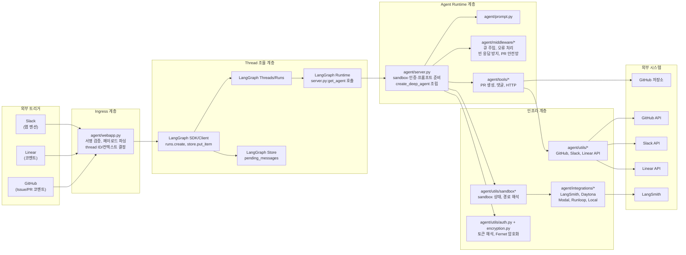
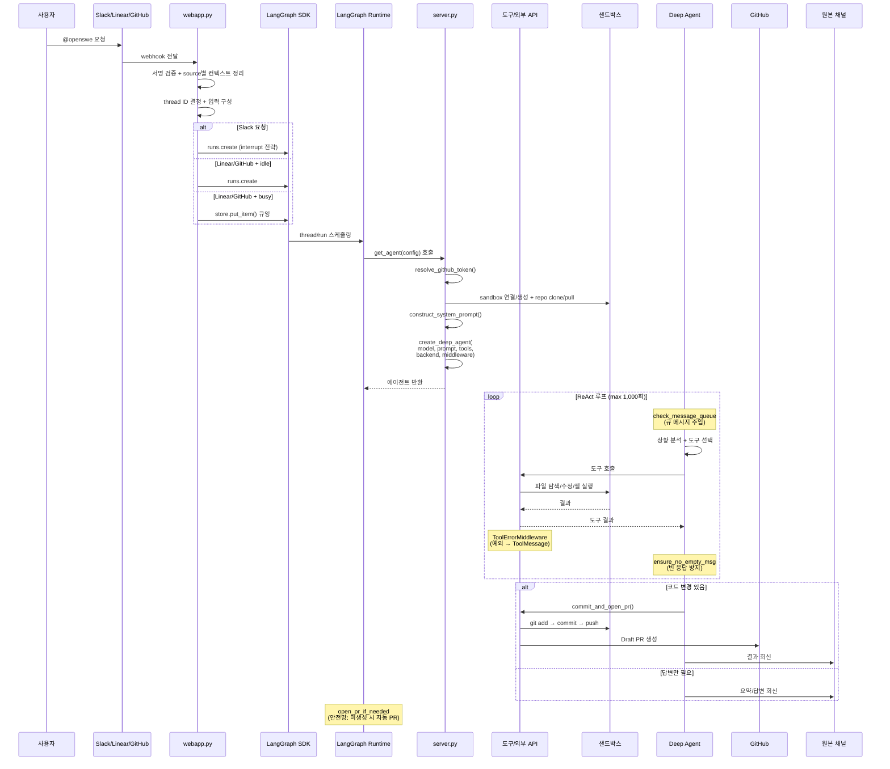
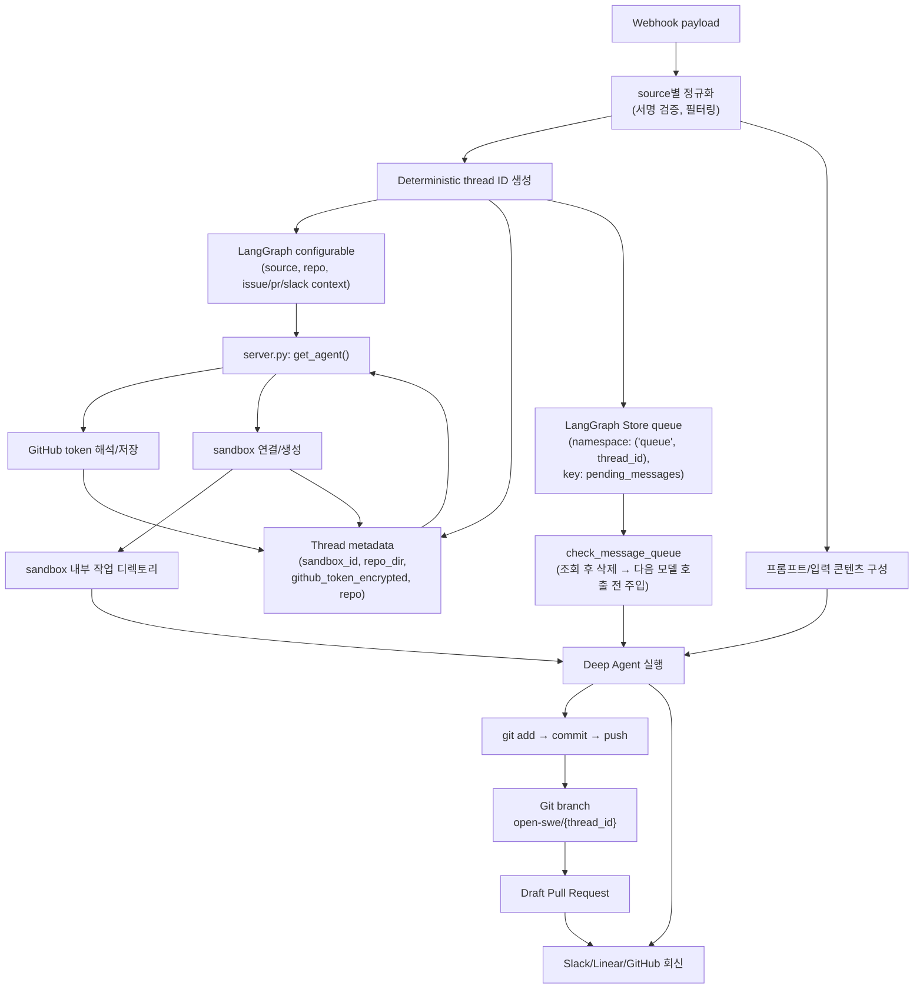
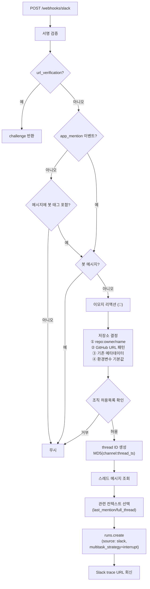
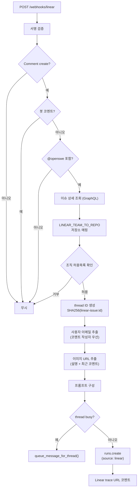
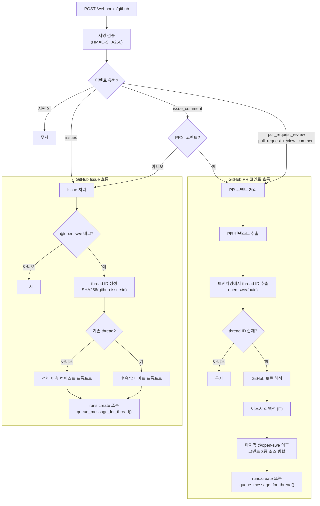
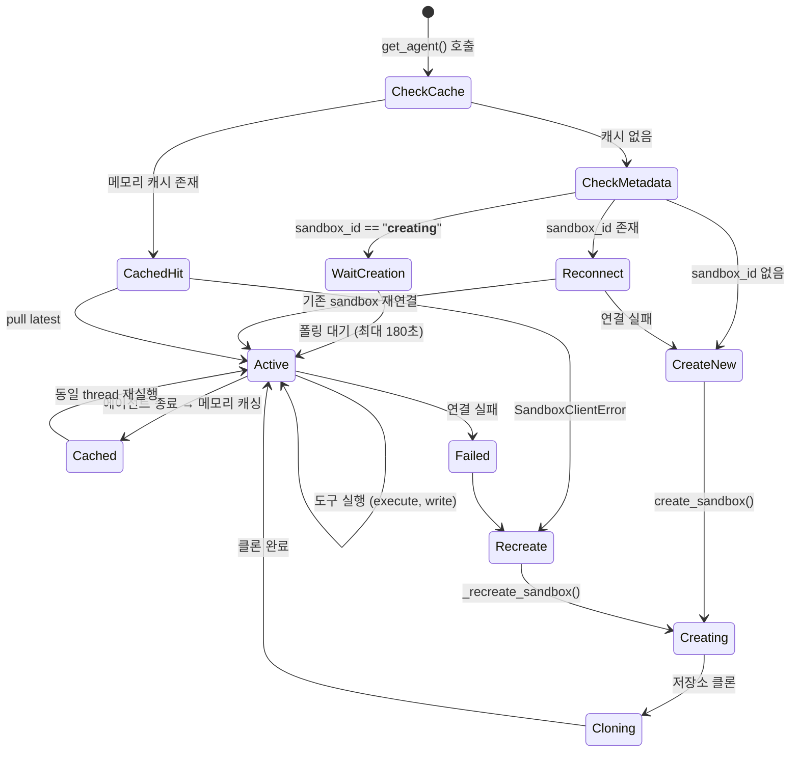
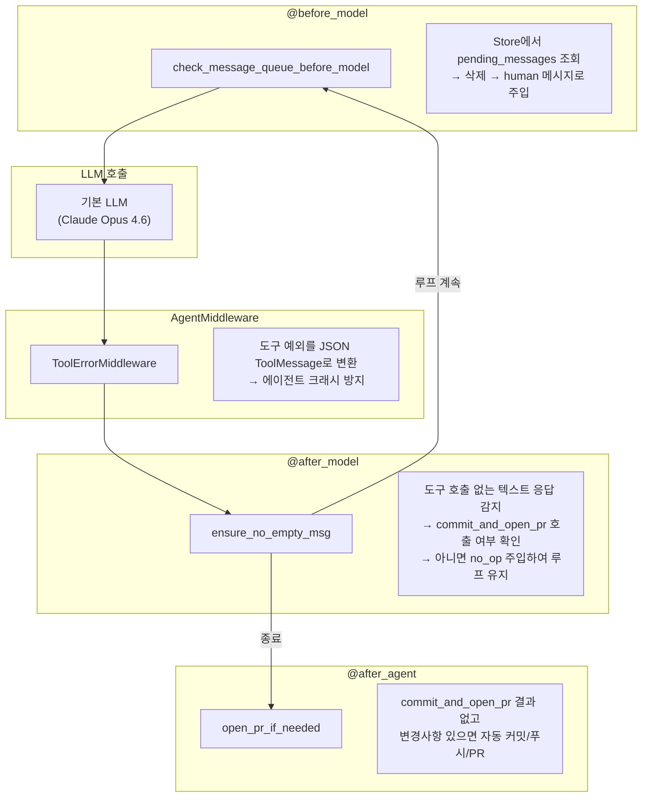
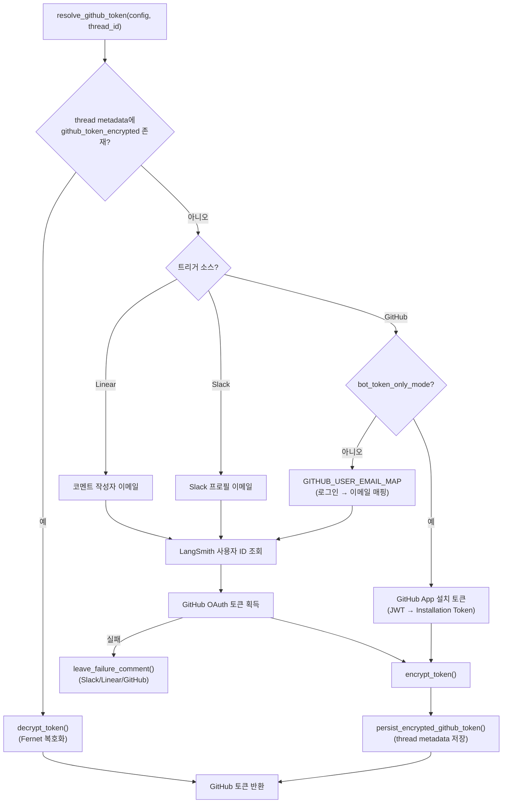

# Open SWE 아키텍처 다이어그램

## 1. 프로젝트 구조

## 2. 전체 실행 흐름

## 3. 데이터 흐름 및 상태 변화

## 4. 트리거별 처리 분기

### 4.1 Slack 멘션 처리

### 4.2 Linear 코멘트 처리

### 4.3 GitHub 이벤트 처리

## 5. 샌드박스 생명주기

## 6. 미들웨어 파이프라인

## 7. 인증 데이터 흐름

## 8. 계층 구조 요약

| 계층 | 역할 | 핵심 컴포넌트 |
|------|------|--------------|
| **Ingress** | 외부 webhook 수신, 서명 검증, 페이로드 파싱, thread 라우팅 | `webapp.py` |
| **Thread 조율** | 작업 상태 지속, 큐 메시지 관리, 메타데이터 보존 | LangGraph Thread, Store |
| **Agent Runtime** | sandbox·인증·프롬프트 준비, Deep Agent 조립 | `server.py`, `prompt.py`, `middleware/` |
| **Tool/Integration** | LLM이 호출하는 도구, 외부 API 연결, sandbox 상태/백엔드 연동 | `tools/`, `utils/`, `integrations/` |
| **External Systems** | GitHub API, Slack API, Linear API, LangSmith, sandbox provider | 외부 서비스 |

**의존 방향:**
- `webapp.py` → LangGraph SDK / utils (직접 `server.py` 호출 안함)
- LangGraph Runtime → `server.py:get_agent`
- `server.py` → prompt / middleware / tools / sandbox/auth utils
- tools / middleware → utils → 외부 API
- sandbox utils → integrations → sandbox provider
