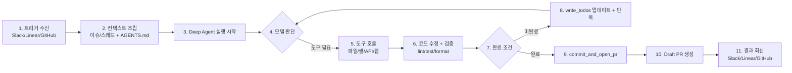

# Open SWE 아키텍처 다이어그램

## 1. 상위 아키텍처

```mermaid
flowchart TD
    USER([사용자: Slack/Linear/GitHub]) --> TRIGGER[Webhook Trigger Layer]
    TRIGGER --> ORCH[Open SWE Orchestrator<br/>agent/webapp.py]

    ORCH --> THREAD[Thread/Run 생성<br/>LangGraph Run]
    THREAD --> AGENT[create_deep_agent()<br/>agent/server.py]

    subgraph DEEP[Deep Agents Harness]
        PLAN[write_todos<br/>계획/진행 추적]
        FS[read_file/write_file/edit_file<br/>파일 컨텍스트 조작]
        EXEC[execute<br/>셸 명령 실행]
        SUB[task<br/>서브에이전트 위임]
        CTX[컨텍스트 자동 관리<br/>요약/대용량 출력 처리]
    end

    AGENT --> PLAN
    AGENT --> FS
    AGENT --> EXEC
    AGENT --> SUB
    AGENT --> CTX

    AGENT --> MW[Middleware Layer<br/>ToolError / message queue / open PR safety net]
    MW --> TOOLS[Custom Tools<br/>commit_and_open_pr / fetch_url / http_request / linear_comment / slack_thread_reply]

    TOOLS --> SB[Sandbox Backend<br/>LangSmith/Modal/Daytona/Runloop/Local]
    SB --> REPO[(Repo Clone in Sandbox)]
    REPO --> GH[(GitHub PR)]

    TRIGGER --> FEEDBACK[피드백 경로<br/>Slack thread / Linear comment / GitHub comment]
    GH --> FEEDBACK
```

## 2. 실행 워크플로우 (요청 → 코드 변경 → PR)



## 3. Deep Agents 결합 포인트

```mermaid
flowchart TD
    OPEN[Open SWE get_agent()] --> CDA[create_deep_agent(...)]
    CDA --> MODEL[모델 설정<br/>make_model(provider:model)]
    CDA --> PROMPT[시스템 프롬프트 구성<br/>construct_system_prompt]
    CDA --> TOOLSET[Open SWE 커스텀 도구 + Deep Agents 기본 도구]
    CDA --> BACKEND[샌드박스 백엔드 주입]
    CDA --> MIDDLEWARE[미들웨어 체인 주입]

    TOOLSET --> DA_CORE[Deep Agents 기본 기능]
    DA_CORE --> DA_SUB[task 기반 서브에이전트]
    DA_CORE --> DA_TODO[write_todos 기반 계획]
    DA_CORE --> DA_FS[파일/셸 중심 실행 루프]

    MIDDLEWARE --> SAFE[결정적 안전장치<br/>open_pr_if_needed 등]
```
