# OpenCode Worktree 아키텍처 다이어그램

## 1. 모듈 아키텍처 및 초기화

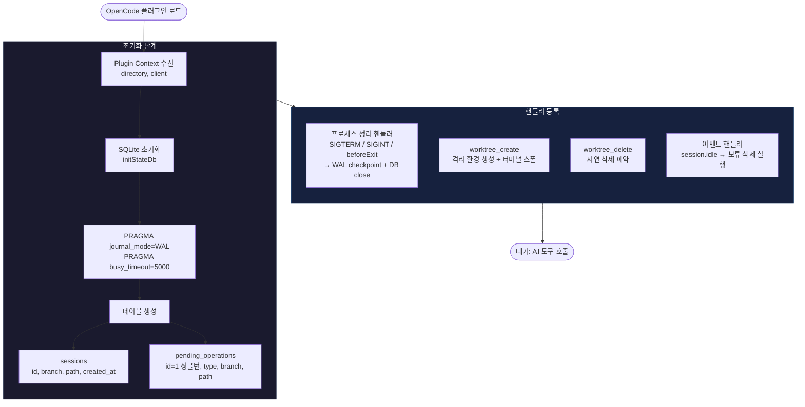

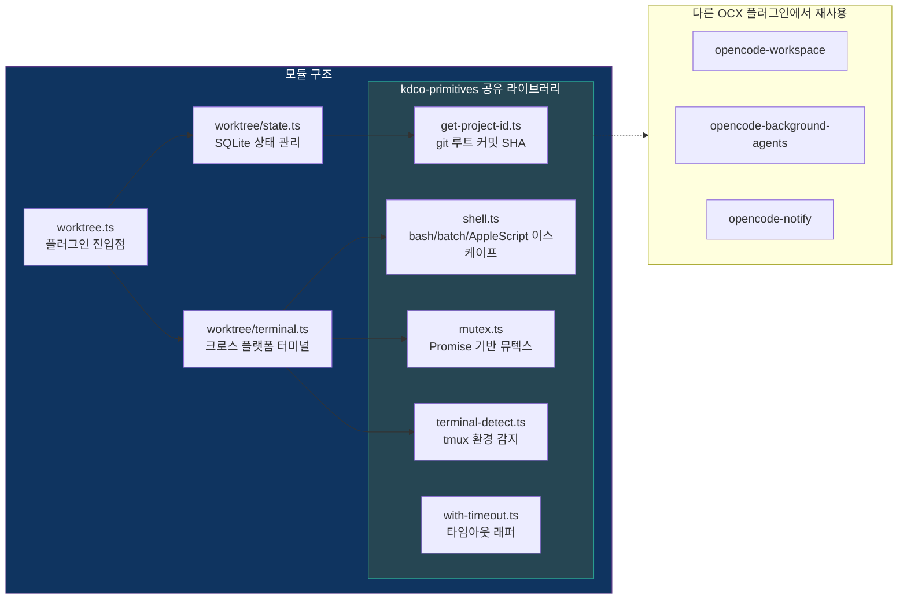

## 2. Worktree 생성 파이프라인

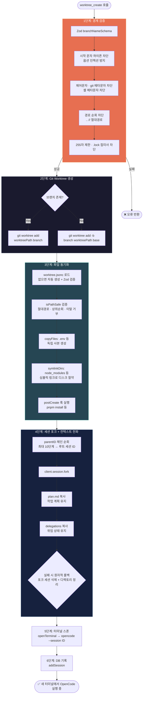

## 3. Worktree 삭제 및 지연 삭제 패턴

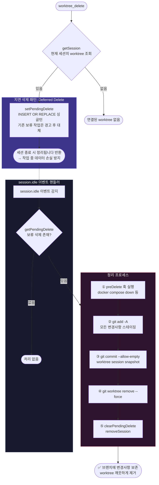

## 4. SQLite 상태 모델 및 생명주기

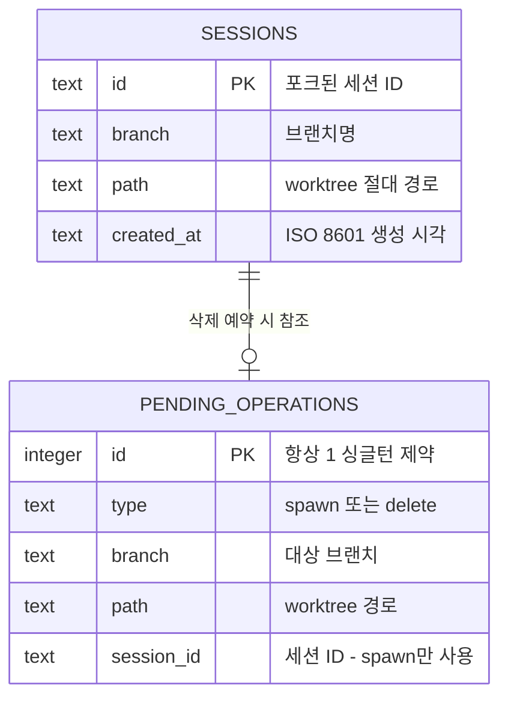

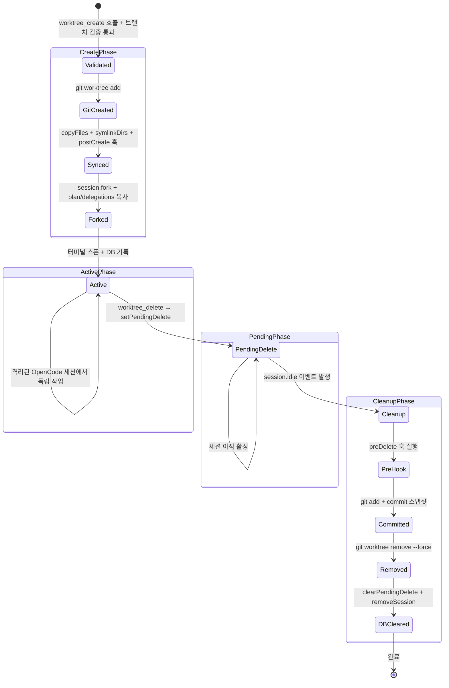

## 5. 크로스 플랫폼 터미널 감지

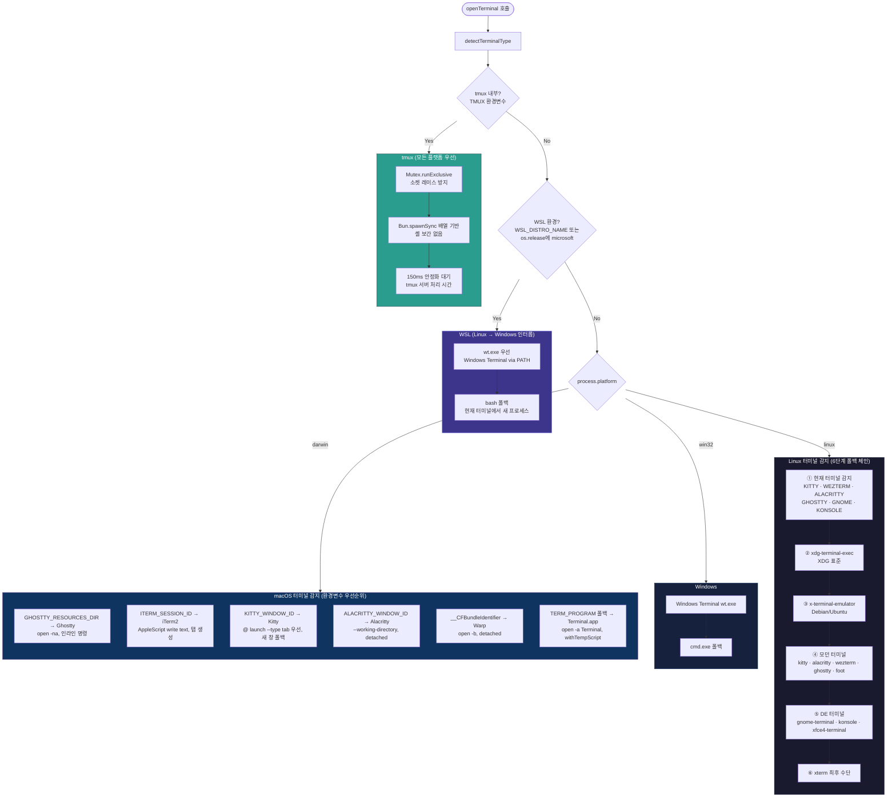

## 6. 임시 스크립트 생명주기

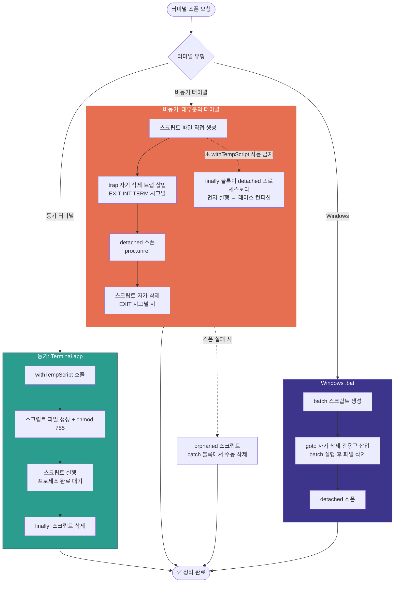

## 7. 파일 동기화 전략

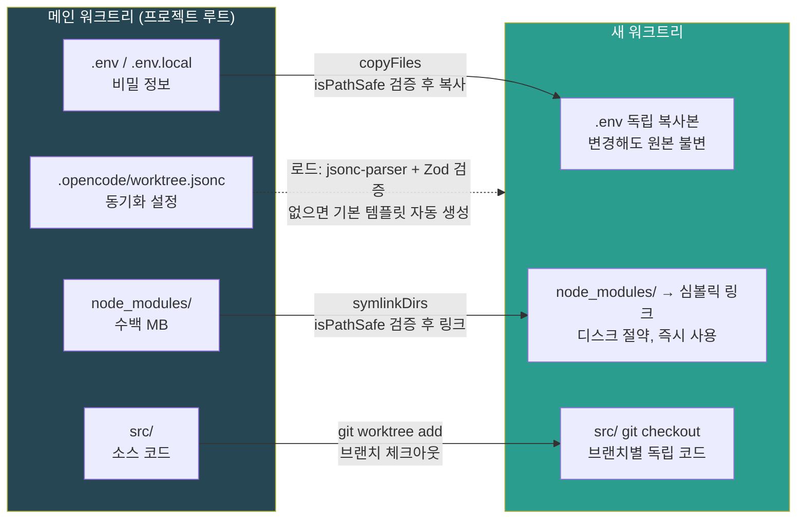

## 8. 보안 검증 체인

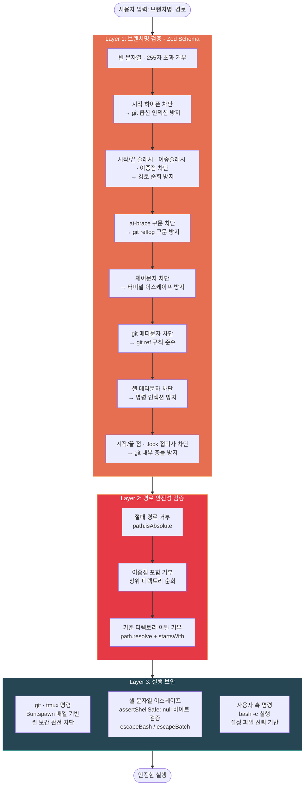

## 9. 프로젝트 ID 생성 및 캐싱

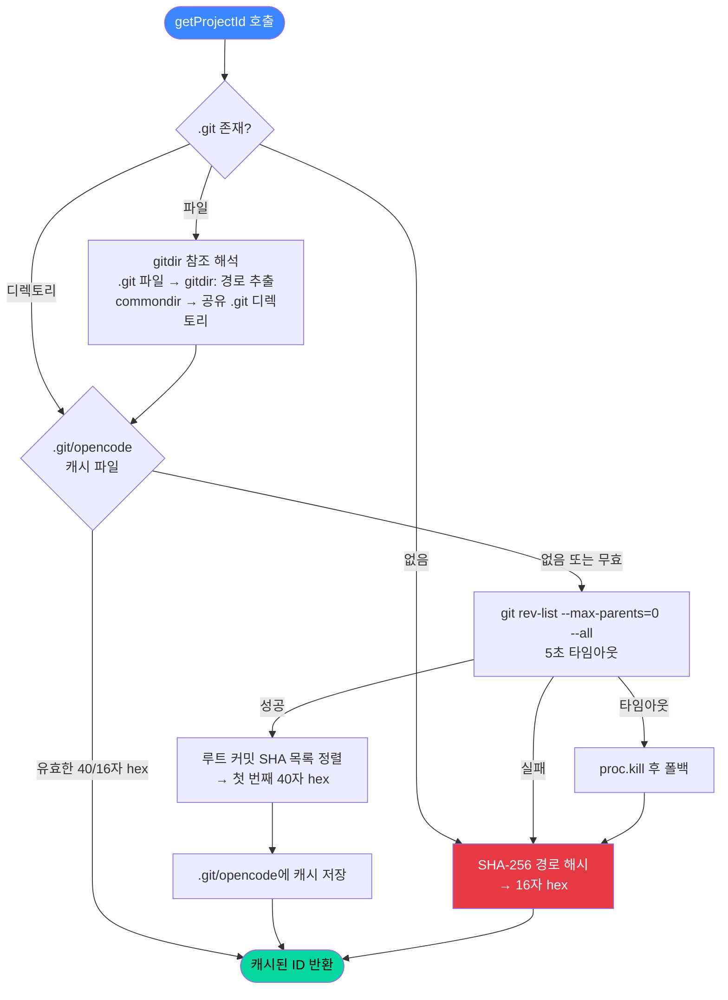

## 10. 데이터 경로 맵

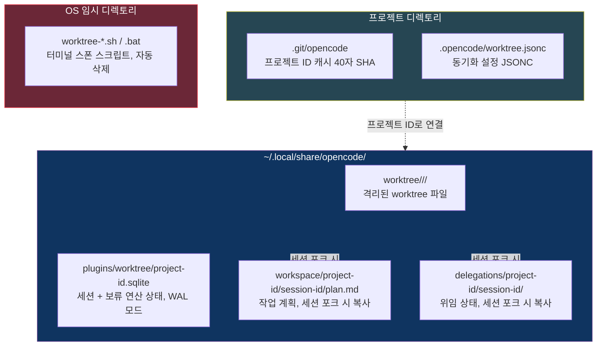

## 11. 전체 End-to-End 파이프라인

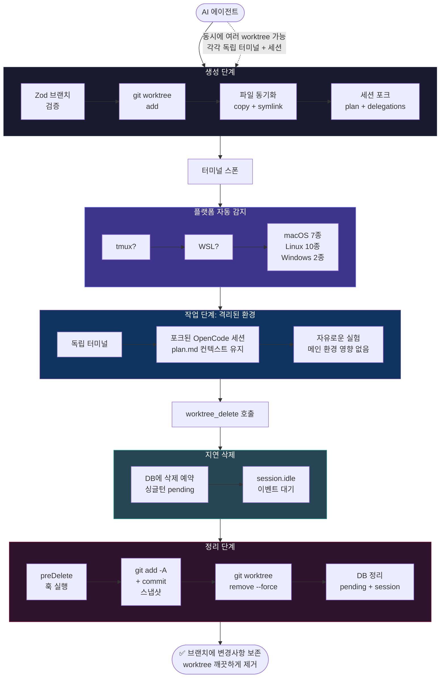
