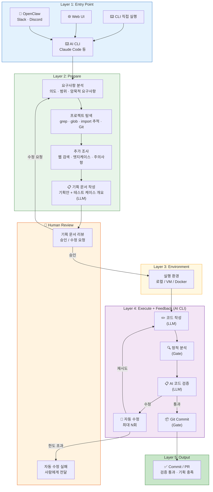
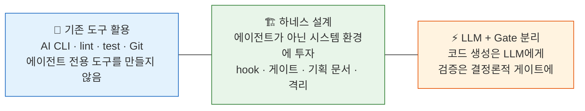

# 로컬 개발 자동화 에이전트 Diagram

## 아키텍처

```mermaid
graph TB
    subgraph L1["Layer 1: Entry Point"]
        EP1["⌨️ CLI 직접 실행"]
        EP2["🌐 Web UI"]
        EP3["💬 OpenClaw<br/>Slack · Discord"]
        AI["⌨️ AI CLI<br/>Claude Code 등"]
    end

    subgraph L2["Layer 2: Prepare"]
        CC1["요구사항 분석<br/>의도 · 범위 · 암묵적 요구사항"]
        CC2["프로젝트 탐색<br/>grep · glob · import 추적 · Git"]
        CC3["추가 조사<br/>웹 검색 · 엣지케이스 · 주의사항"]
        PLAN["📋 기획 문서 작성<br/>기획안 + 테스트 케이스 개요<br/>(LLM)"]
    end

    subgraph L3["Layer 3: Environment"]
        ENV["실행 환경<br/>로컬 / VM / Docker"]
    end

    subgraph LR["👤 Human Review"]
        HR1["기획 문서 리뷰<br/>승인 / 수정 요청"]
        HR2["자동 수정 실패<br/>사람에게 전달"]
    end

    subgraph L4["Layer 4: Execute + Feedback (AI CLI)"]
        WRITE["✏️ 코드 작성<br/>(LLM)"]
        LINT["🔍 정적 분석<br/>(Gate)"]
        REVIEW["📋 AI 코드 검증<br/>(LLM)"]
        RETRY["🔄 자동 수정<br/>최대 N회"]
        GIT["📦 Git Commit<br/>(Gate)"]
    end

    subgraph L5["Layer 5: Output"]
        PR["✅ Commit / PR<br/>검증 통과 · 기획 충족"]
    end

    EP1 & EP2 & EP3 --> AI
    AI --> CC1 --> CC2 --> CC3
    CC3 --> PLAN
    PLAN --> HR1
    HR1 -->|" 수정 요청 "| CC1
    HR1 -->|" 승인 "| ENV
    ENV --> WRITE --> LINT --> REVIEW
    REVIEW -->|" 수정 "| RETRY -->|" 재시도 "| WRITE
    REVIEW -->|" 통과 "| GIT --> PR
    RETRY -->|" 한도 초과 "| HR2
    style L1 fill: #e3f2fd, stroke: #1565C0
    style L2 fill: #e8f5e9, stroke: #2E7D32
    style L3 fill: #fff8e1, stroke: #F9A825
    style LR fill: #fff3e0, stroke: #E65100
    style L4 fill: #f3e5f5, stroke: #6A1B9A
    style L5 fill: #c8e6c9, stroke: #2E7D32
```

## 설계 원칙

```mermaid
graph LR
    P1["🔧 기존 도구 활용<br/>AI CLI · lint · test · Git<br/>에이전트 전용 도구를 만들지 않음"]
    P2["🏗️ 하네스 설계<br/>에이전트가 아닌 시스템 환경에 투자<br/>hook · 게이트 · 기획 문서 · 격리"]
    P3["⚡ LLM + Gate 분리<br/>코드 생성은 LLM에게<br/>검증은 결정론적 게이트에"]
    P1 --- P2 --- P3
    style P1 fill: #e3f2fd, stroke: #1565C0
    style P2 fill: #e8f5e9, stroke: #2E7D32
    style P3 fill: #fff3e0, stroke: #E65100
```
