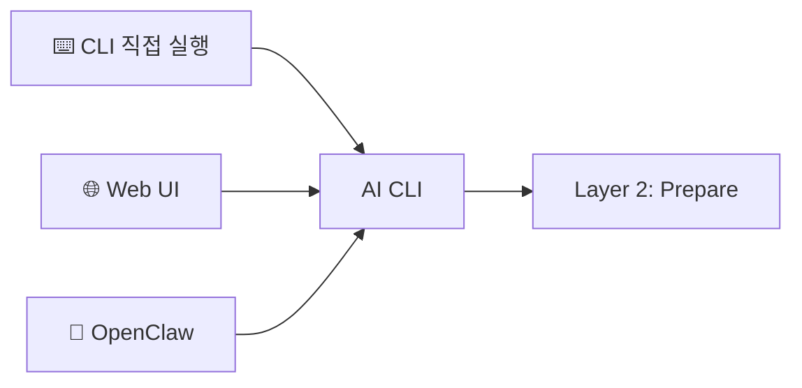
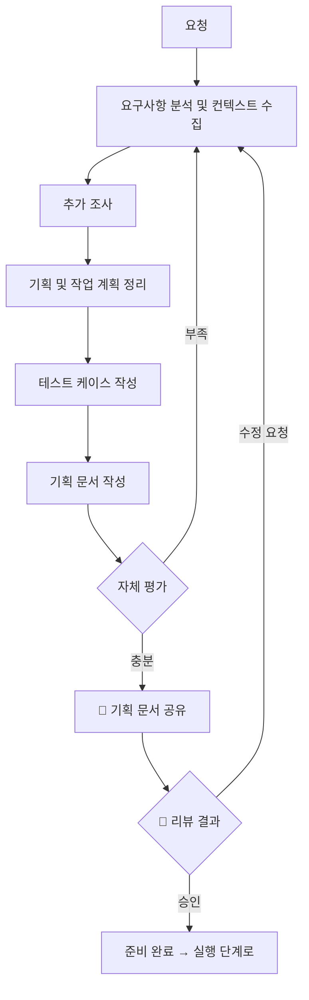
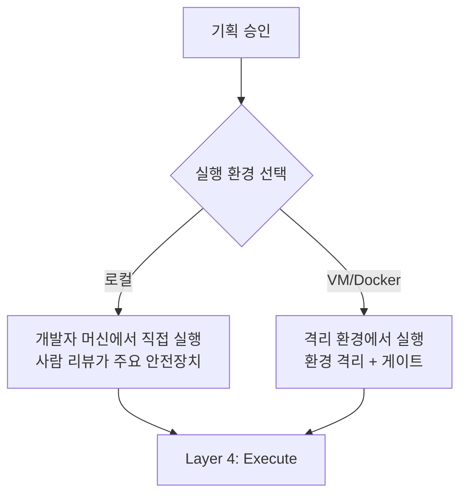
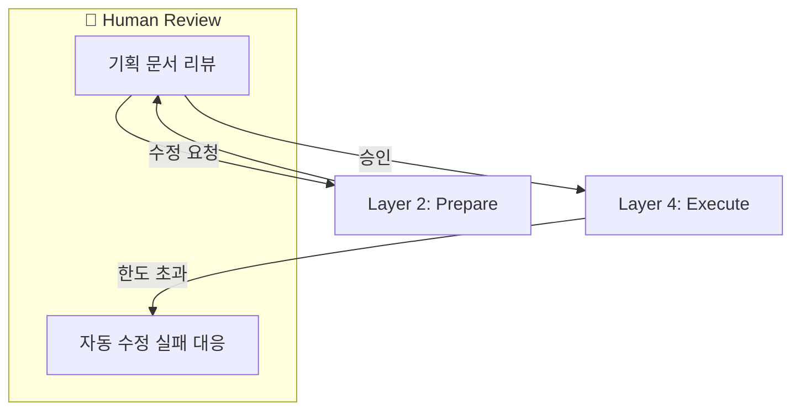
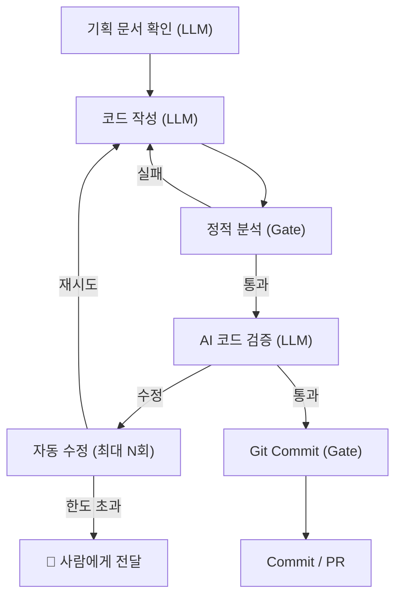

# 로컬 개발 자동화 에이전트 — 상세 문서

## 개요

Stripe Minions의 아키텍처를 로컬 환경에 맞게 변형한 개발 자동화 에이전트이다.
AI CLI(Claude Code 등)를 에이전트 코어로 활용하고, Minions의 One-Shot 방식 대신 **실행 전 사람의 리뷰를 한 번 거치는** 구조를 취한다.

### 핵심 공식

```text
AI CLI (기존 도구 활용) + 하네스 (hook · 게이트 · 기획 문서) + 사람 리뷰 = 로컬 개발 자동화
```

> Minions: "Not exotic — just great engineering"
> 로컬 에이전트: 에이전트를 만드는 것이 아니라, **에이전트가 동작하는 환경을 설계**한다.

---

## 아키텍처

[다이어그램 참조](00-diagram.md)

5계층 + Human Review로 구성된다.

| 레이어                         | 역할                            | Minions 대응                  |
|-----------------------------|-------------------------------|-----------------------------|
| Layer 1: Entry Point        | 작업 진입 (CLI, Web UI, OpenClaw) | Entry Points (Slack, CLI 등) |
| Layer 2: Prepare            | 컨텍스트 수집, 기획 문서 작성             | Context Hydration (MCP)     |
| Layer 3: Environment        | 실행 환경 선택 (로컬/VM/Docker)       | Devbox (Isolated VM)        |
| Layer 4: Execute + Feedback | 코드 작성, 검증, 자동 수정              | Agent Core + Feedback Loop  |
| Layer 5: Output             | Commit / PR 생성                | Output (PR)                 |
| Human Review                | 기획 리뷰, 자동 수정 실패 시 개입          | — (Minions에 없음)             |

---

## Layer 1: Entry Point



작업은 여러 경로로 AI CLI에 전달된다.

| 채널        | 설명                                                                   |
|-----------|----------------------------------------------------------------------|
| CLI 직접 실행 | 개발자가 터미널에서 AI CLI를 직접 실행                                             |
| Web UI    | 웹 인터페이스를 통해 요청 → 로컬 서버 → AI CLI에 전달                                  |
| OpenClaw  | Slack, Discord 등 메신저 봇을 통해 요청 → AI CLI에 전달. 메신저와 AI CLI를 연결하는 브릿지 역할 |

모든 경로는 최종적으로 AI CLI에 도달한다.
AI CLI가 에이전트 코어 역할을 하며, 이후의 모든 단계를 수행한다.

### Minions와의 비교

Minions는 4가지 Entry Point(Slack, CLI, Web UI, CI Auto-Ticket)에서 Orchestrator로 작업이 전달된다.
로컬 에이전트는 AI CLI가 Orchestrator 역할을 겸한다 — 별도의 오케스트레이터를 구축하지 않는다.

---

## Layer 2: Prepare (준비 단계)

에이전트가 요청을 받아 컨텍스트를 수집하고, 기획 문서를 작성하여 사람에게 공유한다.
기획의 완성도가 부족하면 AI가 판단하여 필요한 단계로 되돌아간다.

### 워크플로우



### 각 단계 설명

#### 요구사항 분석 및 컨텍스트 수집

요청을 분석하고 프로젝트 내부 정보를 파악한다.

- 요청의 의도와 범위 파악, 암묵적 요구사항 식별
- 관련 파일 식별 (grep, glob, import 추적)
- 프로젝트 구조와 기존 패턴 파악
- Git 이력에서 관련 변경 확인
- 컨텍스트 수집은 결정론적으로 수행 — LLM 판단이 아닌 도구 기반 탐색

Minions의 Context Hydration에서 가장 중요한 원칙은 **결정론적 pre-fetching**이다.
LLM이 "어떤 파일을 봐야 할까"를 판단하는 것이 아니라, 도구가 체계적으로 탐색한다.

| 수집 방안        | 방식                            | 장점                 | 한계                |
|--------------|-------------------------------|--------------------|-------------------|
| 정적 분석        | grep, glob, import 추적, Git 이력 | 결정론적, 빠름, 외부 의존 없음 | 의미적 관계 누락 가능      |
| Augment Code | 코드베이스 시맨틱 검색                  | 키워드 불일치해도 관련 코드 발견 | 인덱싱 필요, 외부 서비스 의존 |

정적 분석을 기본으로 하고, 시맨틱 검색을 선택적으로 조합한다.

#### 추가 조사

프로젝트 외부의 정보를 수집한다.
프로젝트 컨텍스트만으로는 파악하기 어려운 주의사항, 엣지케이스, 최신 변경 등을 보완한다.

- 유사한 작업의 주의사항, 엣지케이스 조사
- 관련 라이브러리/API의 최신 사용법 확인
- 알려진 문제점이나 함정 파악

| 조사 방안   | 방식                  | 장점               | 한계        |
|---------|---------------------|------------------|-----------|
| 웹 검색    | 일반 검색 엔진            | 최신 정보, 엣지케이스 발견  | 노이즈 많음    |
| 기술 커뮤니티 | GitHub Issues, SO 등 | 실제 사례 기반 주의사항 확인 | 검색 품질에 의존 |

#### 기획 및 작업 계획 정리

기획을 정리하면서 작업 계획을 함께 구체화한다.

- 변경 범위와 수정 방향 정의
- 어떤 파일을 어떻게 수정할지 계획
- 기획이 주, 작업 계획은 기획의 부산물

이 단계에서 자세하고 논리적인 기획안을 작성하는 것이 중요하다.
기획 문서는 실행 단계의 입력이 되므로, 기획의 품질이 구현의 품질을 결정한다.

#### 테스트 케이스 작성

기획 단계에서는 간단하게 작성한다.

- 구체적인 구현 전이므로 핵심 시나리오만 나열
- 정상 동작과 주요 실패 케이스 정도로 충분
- 개발에 필요한 수준의 검증 항목 — 상세한 테스트 코드는 실행 단계에서 작성

#### 기획 문서 작성

기획안과 테스트 케이스를 하나의 기획 문서로 정리한다.

- 실행 단계의 입력이 되는 문서 — 에이전트는 이 문서를 기준으로 구현
- 사람에게 공유하여 리뷰를 받는 용도도 겸함

**기획 문서에 포함되는 것:**

- **컨텍스트**: 식별된 관련 파일 목록
- **추가 조사 결과**: 주의사항, 엣지케이스
- **기획안**: 무엇을 왜 변경하는지에 대한 자세하고 논리적인 설명
- **작업 계획**: 어떤 파일을 어떻게 수정할지
- **테스트 케이스 개요**: 핵심 시나리오 수준의 간단한 검증 항목
- **애매한 판단**: 에이전트가 확신하지 못하는 부분 (사람의 결정 필요)

#### 자체 평가 및 루프

AI가 기획 문서의 완성도를 판단하고, 부족하면 필요한 단계로 되돌아간다.

- 요구사항이나 컨텍스트가 부족하면 → 요구사항 분석 및 컨텍스트 수집으로
- 외부 정보가 부족하면 → 추가 조사로
- 기획만 다듬으면 되면 → 기획 정리로
- 어떤 단계로 되돌아갈지는 AI가 판단

이 루프는 Evaluator-Optimizer 패턴을 적용한 것이다.
에이전트가 스스로 산출물의 품질을 평가하고, 기준에 미달하면 개선을 반복한다.

#### 기획 문서 공유 및 Human Review

기획 문서를 사람에게 공유한다.

- 사람이 승인하면 실행 단계로 진행
- 수정 요청이 있으면 요구사항 분석 단계로 돌아가 피드백을 반영하여 준비 단계를 재진행

이것이 Minions와의 핵심 차이이다.
Minions는 One-Shot으로 사람의 개입 없이 PR까지 완료하지만, 로컬 에이전트는 **실행 전 사람의 리뷰를 한 번 거친다**.
이 리뷰가 로컬 에이전트의 권한 모델이 된다 — **리뷰가 곧 권한**.

### Minions Layer 2 대응

Minions의 Context Hydration은 Toolshed MCP(400+ 도구 중 15개 큐레이션)를 사용하지만,
로컬 에이전트는 AI CLI의 내장 도구(파일 탐색, 웹 검색 등)로 대체한다.

| Minions                        | 로컬 에이전트       |
|--------------------------------|---------------|
| Toolshed MCP (400+ 도구)         | AI CLI 내장 도구  |
| 결정론적 pre-fetching              | 도구 기반 결정론적 탐색 |
| Link Resolver + Prompt Scanner | 요구사항 분석       |
| Context Builder                | 기획 문서 작성      |

---

## Layer 3: Environment (실행 환경)



실행 환경은 로컬과 VM/Docker 모두 지원한다.
환경은 프로젝트 설정 또는 실행 시 옵션으로 선택하며, 환경 선택에 따라 안전성 모델이 달라진다.

| 환경        | 격리 수준 | 안전성 모델              | 적합한 경우         |
|-----------|-------|---------------------|----------------|
| 로컬        | 없음    | 사람의 사전 검토 + 게이트     | 개인 프로젝트, 빠른 실행 |
| VM/Docker | 높음    | 환경 격리 + 사전 검토 + 게이트 | 팀 프로젝트, 높은 안전성 |

### 로컬 실행

- 개발자의 머신에서 직접 실행
- 기존 개발 환경을 그대로 활용
- 사람의 리뷰가 주요 안전장치
- Minions의 "Human Engineers = AI Agents" 원칙 — 에이전트도 개발자와 동일한 도구를 사용

### VM/Docker 실행

- 격리된 환경에서 실행 — Minions의 Devbox 개념 적용
- 실행 환경과 호스트를 분리하여 사이드 이펙트 방지
- 리뷰 없이 실행하는 `--auto` 모드와 조합 가능 (격리가 곧 권한)

### `--auto` 모드

VM/Docker 격리 환경과 조합하면, 사람의 리뷰 없이 One-Shot으로 실행할 수 있다.
이는 Minions의 원래 방식에 가깝다. 다만 안전성은 격리 자체가 아니라, 다음 전제 조건이 함께 적용될 때 확보된다.

- 프로덕션 자격증명 차단 — 실행 환경에 prod credential을 포함하지 않음
- 네트워크 격리 — 외부 egress 제한으로 데이터 유출 방지
- 임시 실행 환경 — ephemeral 환경으로 상태 오염 방지
- 준비 단계의 자체 평가 루프만으로 기획 품질을 확보
- 로컬 환경에서는 사용하지 않는 것을 권장 — 격리 없이 자율 실행은 위험

### Minions Devbox와의 비교

Minions의 Devbox는 **격리가 곧 권한**이다.
인터넷과 프로덕션 접근이 구조적으로 차단되어 있기 때문에, 사람의 승인 없이도 안전하게 실행할 수 있다.

로컬 에이전트에서 VM/Docker 격리를 사용하면 유사한 안전성을 확보할 수 있다:

| Minions Devbox             | 로컬 VM/Docker             |
|----------------------------|--------------------------|
| Pre-loaded Code + Services | 프로젝트 코드 마운트/복사           |
| No Internet                | 네트워크 격리 설정 가능            |
| No Prod Access             | 환경 변수/설정으로 프로덕션 접근 차단    |
| 10초 스핀업 (Pre-warmed Pool)  | Docker 이미지 사전 빌드로 최적화 가능 |

---

## Human Review



사람의 개입이 필요한 두 가지 시점이 있다.

### 기획 문서 리뷰

준비 단계가 완료된 후, 실행 전에 사람이 기획 문서를 검토한다.

- 기획안의 방향과 범위가 적절한지 확인
- 테스트 케이스 개요가 핵심 시나리오를 커버하는지 확인
- 애매한 판단 항목에 대해 결정
- 승인 시 실행 단계로 진행, 수정 요청 시 준비 단계로 되돌아감

이 리뷰는 Human-in-the-Loop 패턴의 적용이다.
에이전트 실행의 특정 체크포인트에서 일시 정지하고, 사람의 판단을 받은 후 진행한다.

### 자동 수정 실패 시 에스컬레이션

실행 단계에서 자동 수정이 한도를 초과하면 사람에게 전달한다.

- Minions의 원칙: "Can't fix in 2 tries? Surface it to the human — no wasted tokens"
- 무한 재시도로 토큰을 낭비하지 않는다
- 사람이 문제를 해결하거나, 기획을 수정하여 다시 시도

---

## Layer 4: Execute + Feedback (실행 단계)

사람이 기획 문서를 승인하면, 에이전트가 기획 문서를 기준으로 자율적으로 구현한다.
Minions의 파이프라인 설계를 참고하여, LLM 창의 단계와 결정론적 게이트를 분리한다.

### 워크플로우



### 각 단계 설명

#### 기획 문서 확인 (LLM)

준비 단계에서 작성된 기획 문서를 읽고 구현을 시작한다.

- 기획안, 작업 계획, 테스트 케이스 개요를 기준으로 코드 작성

#### 코드 작성 (LLM)

기획 문서를 기반으로 코드를 생성·수정한다.
이 단계는 LLM의 창의적 판단에 의존하는 단계이다.

#### 정적 분석 (Gate)

`make check` 등의 hook으로 자동 실행되는 결정론적 게이트이다.
hook은 게이트의 구현 방식이며, 게이트는 LLM이 우회할 수 없는 검증 단계를 의미한다.

- lint, type check, test 등 결정론적 검증
- LLM이 우회할 수 없는 하드코딩된 게이트
- 실패 시 에이전트가 즉시 코드를 수정하고 재실행

Minions는 Linter, Git Commit, Tests를 각각 별도의 게이트로 분리하지만,
로컬 에이전트는 이를 하나의 정적 분석 게이트(`make check` 등)로 통합한다.
프로젝트의 기존 검증 도구를 그대로 활용하기 위함이다.

Minions의 핵심 원칙: 게이트는 프롬프트가 아닌 **구조**로 강제한다.
"린터를 실행하세요"라고 프롬프트하는 것이 아니라, 린터 게이트를 파이프라인에 하드코딩한다.

#### AI 코드 검증 (LLM)

정적 분석 통과 후, 에이전트가 변경 내용을 스스로 검토한다.

- diff를 기반으로 실제 변경 내용을 파악
- 기획 문서의 기획안과 실제 구현을 비교하여 요구사항 누락, 범위 이탈 확인
- 추가 조사 단계에서 파악한 주의사항·엣지케이스가 반영되었는지 점검
- 정적 분석으로 잡을 수 없는 논리 오류, 경계 조건, 사이드 이펙트 검토
- 준비 단계에서 작성한 테스트 케이스 개요가 커버되는지 확인

이 단계는 Review-Critique 패턴의 적용이다.
코드 작성(Generator)과 AI 코드 검증(Critic)이 분리되어,
독립적인 관점에서 산출물을 평가한다.

#### 자동 수정 (최대 N회)

AI 코드 검증에서 문제가 발견되면, 코드 작성으로 되돌아가 수정한다.

- 자동 수정 횟수를 제한한다 — 무한 루프 방지
- 한도를 초과하면 사람에게 에스컬레이션

#### Git Commit / PR (Gate)

검증을 통과한 변경 사항을 커밋하고 PR을 생성한다.

- 커밋과 PR 생성도 결정론적 게이트 — 검증 없이 커밋할 수 없다
- Auto Improve Loop의 Git 기반 안전 롤백 메커니즘 적용 가능

### Minions Agent Core + Feedback Loop 대응

Minions는 Agent Core(LLM+Gate 파이프라인)와 Feedback Loop(3-Tier 검증)를 별도 레이어로 분리하지만,
로컬 에이전트는 이를 하나의 실행 레이어로 통합한다.

| 구분      | Minions                                          | 로컬 에이전트                |
|---------|--------------------------------------------------|------------------------|
| LLM 단계  | Think (LLM) → Write (LLM)                        | 기획 문서 확인 → 코드 작성 (LLM) |
| Gate 단계 | Linter (Gate) → Git Commit (Gate) → Tests (Gate) | 정적 분석 (Gate) — 하나로 통합  |
| LLM 검증  | Review (LLM)                                     | AI 코드 검증 (LLM)         |
| 자동 수정   | Agent Self-Fix (max 2)                           | 자동 수정 (최대 N회)          |

### LLM 단계와 Gate 단계의 분리

Minions의 핵심 인사이트: **"Creativity of an LLM + reliability of deterministic code"**

| 유형   | 단계              | 특성                  |
|------|-----------------|---------------------|
| LLM  | 기획 문서 확인, 코드 작성 | 창의적 판단, 유연한 문제 해결   |
| Gate | 정적 분석           | 결정론적, 항상 실행, 우회 불가  |
| LLM  | AI 코드 검증        | 기획 대조, 논리 검증, 맥락 이해 |
| Gate | Git Commit / PR | 결정론적, 검증 통과 후에만 실행  |

---

## Layer 5: Output (산출물)

모든 레이어를 통과한 결과물은 Commit 또는 PR이다.

### 산출물 완성 기준

- 정적 분석(lint, type, test) 통과
- AI 코드 검증에서 기획 충족 확인
- 기획 문서의 테스트 케이스 개요 충족
- Git Commit 완료

### PR 산출물에 포함되는 것

- 변경 사항 요약 — 기획 문서의 기획안을 기반으로 작성
- 기획 문서 참조 — 원본 기획 문서에 대한 링크 또는 인용
- 테스트 결과 — 정적 분석 및 AI 코드 검증 통과 여부
- 요청자에게 완료 알림 (Entry Point 채널에 따라 CLI 출력, Web UI 알림, 메신저 알림)

---

## 설계 원칙

### 하네스를 설계하라

> "Design the harness, not the agent"

에이전트(AI CLI) 자체를 개선하는 것이 아니라, 에이전트가 동작하는 시스템 환경에 투자한다.
hook, 게이트, 기획 문서 구조, 실행 환경 격리 등이 하네스에 해당한다.

### LLM 창의성 + 결정론적 신뢰성

코드 생성은 LLM에게, 검증은 하드코딩된 게이트에 맡긴다.
게이트는 프롬프트가 아닌 구조로 강제한다 — LLM이 우회할 수 없다.

### 기존 도구 활용

에이전트 전용 도구를 만들지 않는다.
개발자가 이미 사용하는 AI CLI, lint, test, Git을 그대로 활용한다.

Minions의 원칙: "Human Engineers = AI Agents" — 에이전트도 사람과 동일한 도구를 사용한다.

### 결정론적 컨텍스트 수집

LLM의 판단에 의존하지 않는 사전 수집으로 일관된 품질을 확보한다.
grep, glob, import 추적, Git 이력 등 도구 기반 탐색을 우선한다.

### 제한된 재시도

자동 수정 횟수를 제한한다. 해결할 수 없으면 사람에게 전달한다.
무한 재시도로 토큰을 낭비하지 않는다.

Minions: "Can't fix in 2 tries? Surface it to the human — no wasted tokens"

### 안전한 롤백

Auto Improve Loop의 Git 기반 롤백 메커니즘을 적용할 수 있다.
개선된 변경만 유지하고, 실패한 시도는 안전하게 폐기한다.

---

## 적용된 설계 패턴

이 워크플로우에 적용된 에이전틱 AI 설계 패턴들이다.

| 패턴                   | 적용 위치             | 설명                                   |
|----------------------|-------------------|--------------------------------------|
| Prompt Chaining      | 준비 단계 전체          | 순차적 분해: 요구사항 분석 → 조사 → 기획 → 테스트 → 문서 |
| Evaluator-Optimizer  | 준비 단계 자체 평가 루프    | 기획 문서의 품질을 평가하고 기준 미달 시 개선 반복        |
| Review-Critique      | 실행 단계 AI 코드 검증    | 코드 작성(Generator)과 검증(Critic) 분리      |
| Human-in-the-Loop    | 기획 리뷰, 자동 수정 실패 시 | 체크포인트에서 사람의 판단을 받고 진행                |
| Iterative Refinement | 실행 단계 자동 수정 루프    | 코드 → 검증 → 수정을 반복하여 품질 개선             |

---

## Minions와의 전체 비교

|             | Stripe Minions                      | 로컬 에이전트                            |
|-------------|-------------------------------------|------------------------------------|
| 실행 방식       | One-Shot (PR까지 자율 완료)               | 기획 리뷰 후 실행                         |
| 사람 개입       | 없음 (PR 리뷰만)                         | 실행 전 1회 리뷰 + 실패 시 에스컬레이션           |
| 안전성 모델      | VM 격리 (격리가 곧 권한)                    | 사람의 사전 검토 + 게이트 (리뷰가 곧 권한)         |
| 에이전트 코어     | Goose Fork (커스텀)                    | AI CLI (기존 도구 활용)                  |
| 컨텍스트 수집     | Toolshed MCP (400+ → 15개)           | AI CLI 내장 도구 (grep, glob, Git)     |
| 실행 환경       | Devbox (VM only)                    | 로컬 / VM / Docker (선택)              |
| 피드백 루프      | 3-Tier (Lint → CI → Self-Fix max 2) | 정적 분석(hook) → AI 검증 → 자동 수정(max N) |
| 규모          | 대규모 모노레포 (주당 1,000+ PR)             | 개인/소규모 프로젝트                        |
| Entry Point | Slack, CLI, Web UI, CI Auto-Ticket  | CLI, Web UI, OpenClaw              |

---

## 검토 사항

- 기획 문서 형식과 제공 방식은? (터미널 출력, 마크다운 파일, IDE)
- 리뷰 없이 바로 실행하는 옵션(`--auto`)이 필요한가? VM/Docker 격리와 조합하면 가능
- VM/Docker 실행 시 환경 구성은? (Dockerfile, docker-compose)
- Git 브랜치 분리 vs Worktree?
- 자동 수정 최대 횟수는? (Minions는 2회)
- 어떤 AI CLI를 기본으로 지원할 것인가?
- One-Shot 모드 지원 여부 — VM/Docker 격리 환경에서 리뷰 없이 실행

---

## 참고 자료

- [Stripe Minions 개요](/docs/examples/minions/01-stripe-minions.md)
- [Stripe Minions 시스템 설계](/docs/examples/minions/02-stripe-minions-part2.md)
- [Auto Improve Loop](/docs/auto-improve/01-auto-improve-loop.md)
- [에이전틱 AI 설계 패턴 (Anthropic)](/docs/effective-agents/README.md)
- [Prompt Chaining 패턴](/docs/effective-agents/01-prompt-chaining.md)
- [Evaluator-Optimizer 패턴](/docs/effective-agents/05-evaluator-optimizer.md)
- [에이전트 디자인 패턴 (Google Cloud)](/docs/design-pattern/README.md)
- [Human-in-the-Loop 패턴](/docs/design-pattern/11-human-in-the-loop.md)
- [Iterative Refinement 패턴](/docs/design-pattern/06-iterative-refinement.md)
- [Review-Critique 패턴](/docs/design-pattern/05-review-critique.md)
