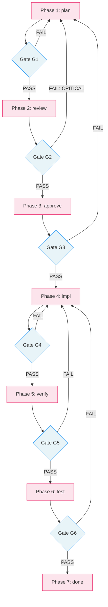
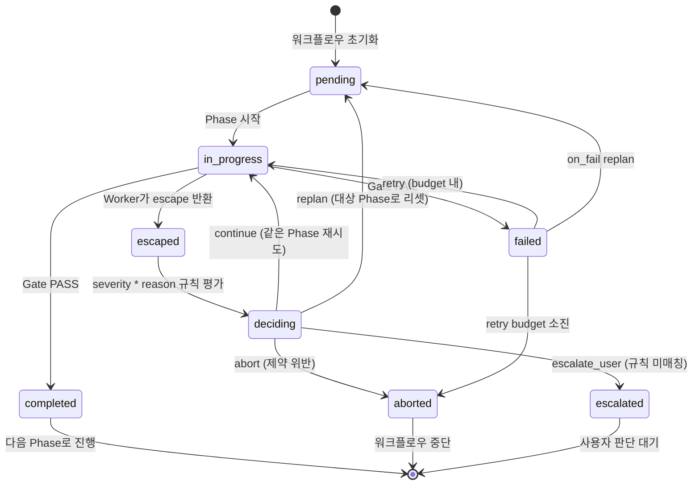
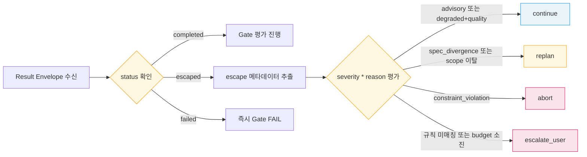
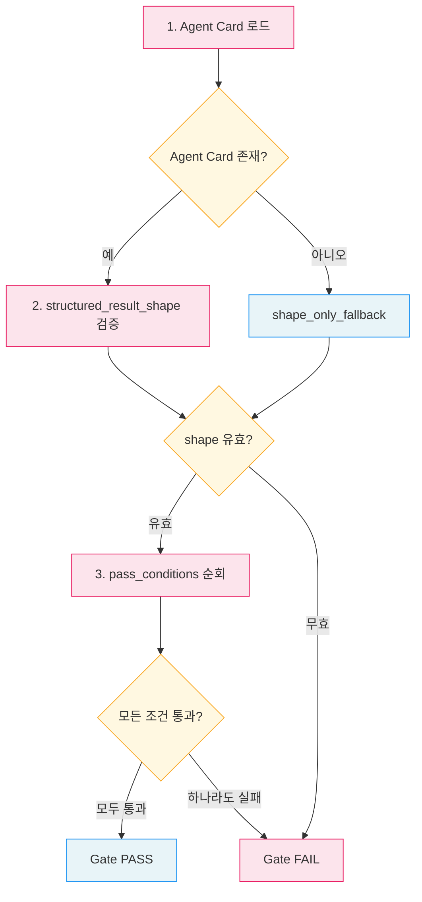

# 게이트 기반 워크플로우 다이어그램

게이트 기반 워크플로우의 구조와 흐름을 시각화한 다이어그램입니다.

---

## 1. Phase 파이프라인 (Gate 포함)

7개 Phase가 정방향으로 진행되며, 각 Phase 사이에 Gate가 존재합니다.
Gate FAIL 시 on_fail 라우팅에 따라 retry 또는 replan으로 분기합니다.

**범례**:
- 분홍색: Phase (실행 단계)
- 파란색: Gate (통과 조건 평가)

---

## 2. Phase 상태 머신

하나의 Phase가 거치는 상태 전이입니다.

### 상태 정의

| 상태 | 설명 | 전이 조건 |
|------|------|----------|
| `pending` | 실행 대기 | 초기화 또는 replan 리셋 |
| `in_progress` | 실행 중 | Phase 시작 |
| `completed` | 정상 완료 | Gate PASS |
| `escaped` | Worker가 완료 불가 보고 | Result Envelope status=escaped |
| `failed` | Gate 실패 | Gate FAIL |
| `deciding` | 자동 규칙 평가 중 | escape 후 severity*reason 매칭 |
| `aborted` | 워크플로우 중단 | 제약 위반 또는 retry budget 소진 |
| `escalated` | 사람에게 위임 | 규칙 미매칭 또는 replan budget 소진 |

---

## 3. Closed-Loop 의사결정 트리

Result Envelope 수신 후 자동 판정 규칙을 적용하는 흐름입니다.

---

## 4. Gate 평가 흐름

Agent Card를 기반으로 Gate 통과 여부를 판정하는 절차입니다.

---

## 참고 자료

- [검토-비평 패턴](/design-pattern/05-review-critique.md) — 생성기 + 비평가의 검증 루프
- [루프 패턴](/design-pattern/04-loop.md) — 종료 조건까지 반복 실행
