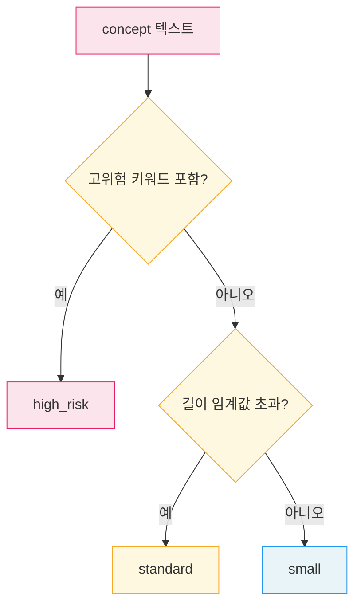
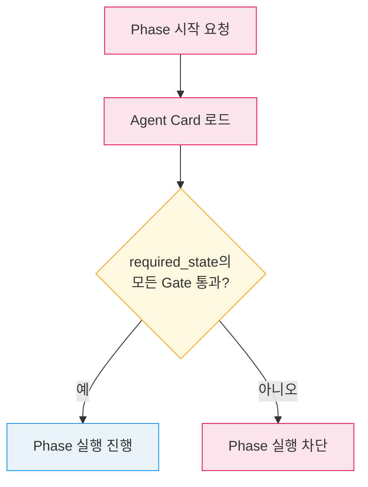

# Risk-Based Routing과 Human-in-the-Loop

변경 등급 감지, 위험 비례 투자, Human-in-the-Loop(HIL), 전제조건 검증, Replan 방향 제약입니다.

---

## 1. 변경 등급 감지 (Change Class Detection)

워크플로우 초기화 시 concept 텍스트를 분석하여 변경 등급(change class)을 자동으로 판별합니다.
이 등급은 이후 파이프라인 전체의 검증 깊이와 승인 경로를 결정합니다.

### 등급 분류

| 등급 | 조건 |
|------|------|
| `small` | 고위험 키워드 없음 + 텍스트 길이 임계값 이하 |
| `standard` | 고위험 키워드 없음 + 텍스트 길이 임계값 초과 |
| `high_risk` | 고위험 키워드 포함 |

### 감지 흐름



---

## 2. 위험 비례 투자 (C5)

변경 등급에 따라 리뷰 깊이, 승인 경로, Gate 범위를 차등 적용합니다.

### 핵심 원칙

- 모든 작업에 동일한 파이프라인을 적용하지 않습니다.
- Policy에 의해 phase가 skip될 수 있습니다.
- Skip된 phase는 downstream precondition을 보장하도록 equivalent gate satisfaction을 남깁니다.

### 등급별 투자 매트릭스

| 영역 | small | standard | high_risk |
|------|-------|----------|-----------|
| review 깊이 | 최소 | AI 리뷰 | 심층 다중 관점 리뷰 |
| 승인 경로 | 자동 가능 | 조건부 자동 | 사람 승인 필수 |
| Gate 범위 | 변경 파일만 | 변경 파일 + 전체 | 전체 프로젝트 |
| verify 엄격도 | scope 검증 | scope + compliance | scope + compliance + 아키텍처 |
| test 범위 | 관련 테스트 | 회귀 + 수락 | 회귀 + 수락 + 수동 검증 |

### 위험 등급별 리스크 매트릭스

| 위험 요소 | small | standard | high_risk |
|----------|-------|----------|-----------|
| 결함 전파 확률 | 낮음 | 중간 | 높음 |
| 복구 비용 | 낮음 | 중간 | 매우 높음 |
| 검증 투자 | 최소 | 표준 | 최대 |
| Phase skip 허용 | review, approve | approve (조건부) | 불가 |
| 예상 파이프라인 시간 | 짧음 | 중간 | 길음 |

---

## 3. Human-in-the-Loop (HIL)

HIL 여부는 phase의 고정 속성이 아니라, **policy 또는 change class에 의해 결정**됩니다.

### 불변식

- Agent Card의 `hil` 필드가 `true`인 phase는 사람의 판단 없이 완료할 수 없습니다.
- HIL phase를 자동으로 실행하려 하면 경고가 발생합니다.

### HIL과 변경 등급

| 등급 | approve HIL | done HIL | 설명 |
|------|------------|----------|------|
| small | 자동 가능 | 자동 가능 | 저위험 변경은 자동 승인 허용 |
| standard | 조건부 자동 | 자동 가능 | 중위험 변경은 조건부 자동 승인 |
| high_risk | 필수 | 필수 | 고위험 변경은 반드시 사람이 승인 |

### HIL Phase 식별

```json
{
  "phase": "approve",
  "hil": true,
  "hil_policy": {
    "small": false,
    "standard": "conditional",
    "high_risk": true
  }
}
```

---

## 4. 전제조건 검증 (Precondition Validation)

Phase를 시작하기 전에 선행 Gate가 통과했는지 확인합니다.

### 불변식

- Agent Card의 `input.required_state`에 정의된 Gate 상태를 검증합니다.
- 전제조건이 충족되지 않으면 Phase를 시작할 수 없습니다.
- Phase 순서 우회를 방지하고, 워크플로우의 무결성을 보장합니다.

### 검증 흐름



### Phase별 전제조건

| Phase | required_state |
|-------|----------------|
| plan | (없음) |
| review | G1 passed |
| approve | G1 passed, G2 passed |
| impl | G1 passed, G2 passed, G3 passed |
| verify | G1~G4 passed |
| test | G1~G5 passed |
| done | G1~G6 passed |

---

## 5. Replan 방향 제약

### 불변식

- Replan은 현재 Phase와 같거나 이전 Phase로만 가능합니다. 앞 방향 replan은 허용하지 않습니다.
- Replan 실행 시 대상 Phase부터 끝까지의 모든 Phase와 Gate가 리셋됩니다.
- Replan budget이 소진되면 `escalate_user`로 전환됩니다.

### 방향 규칙

| 규칙 | 설명 |
|------|------|
| `target_index <= current_index` | replan 대상은 현재 이하만 허용 |
| `target_index > current_index` | ValueError 발생, 앞 방향 차단 |
| 같은 Phase로 replan | Phase 리셋 (retry와 달리 Gate도 리셋) |

### Replan 리셋 범위

replan(target=review) 실행 시:
- review, approve, impl, verify, test, done의 상태가 pending으로 리셋됩니다.
- G2, G3, G4, G5, G6이 초기화됩니다.
- plan과 G1은 유지됩니다.

---

## 6. 안전장치 종합

워크플로우 파이프라인에 적용되는 모든 안전장치입니다.

| 안전장치 | 범위 | 소진/위반 시 동작 |
|---------|------|-----------------|
| 실행 카운터 (MAX=30) | 워크플로우 전체 | RuntimeError로 중단 |
| Retry budget | Phase별 | Phase abort |
| Replan budget | 워크플로우 전체 | escalate_user |
| HIL 강제 | hil=true Phase | 자동 실행 차단 + 경고 |
| 전제조건 검증 | Phase 시작 전 | Phase 실행 차단 |
| Replan 방향 제약 | replan 시 | ValueError |

### 안전장치 적용 순서

1. 총 실행 횟수 한도 확인
2. 선행 Gate 통과 여부 검증
3. HIL 확인
4. Phase 실행
5. Result Envelope 평가
6. Gate 평가 (retry budget 확인)
7. on_fail 라우팅 (replan 방향 + budget 확인)

---

## 참고 자료

- [인간 참여형 패턴](/design-pattern/11-human-in-the-loop.md) — 워크플로에 인간 개입 체크포인트 통합
- [맞춤 로직 패턴](/design-pattern/12-custom-logic.md) — 코드 기반 조건 분기로 복잡한 워크플로 구현
