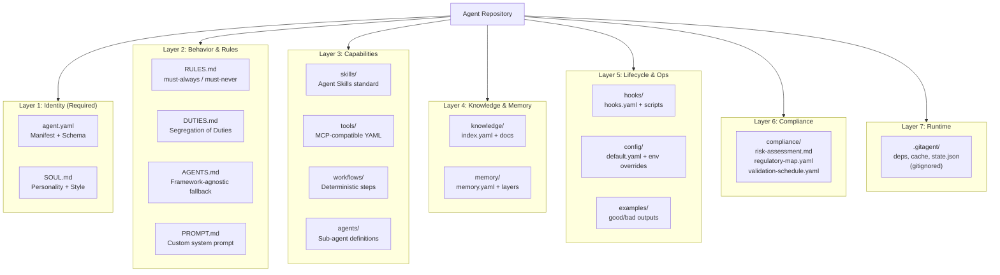
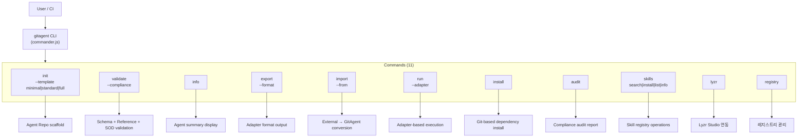
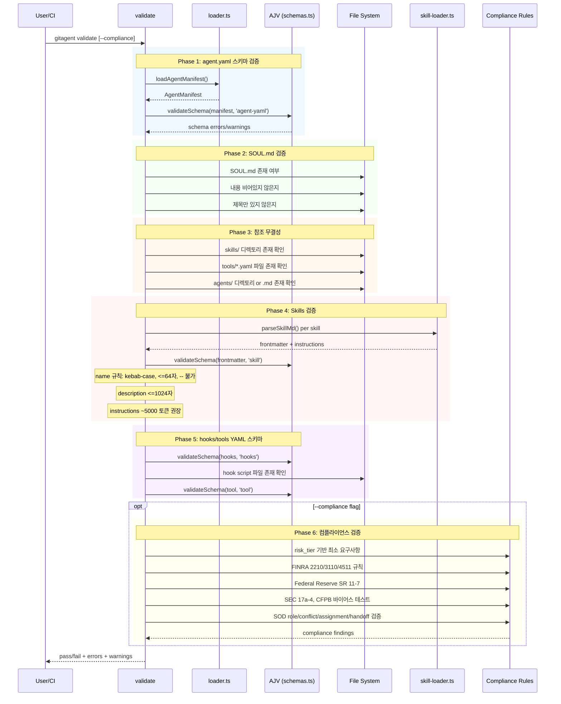
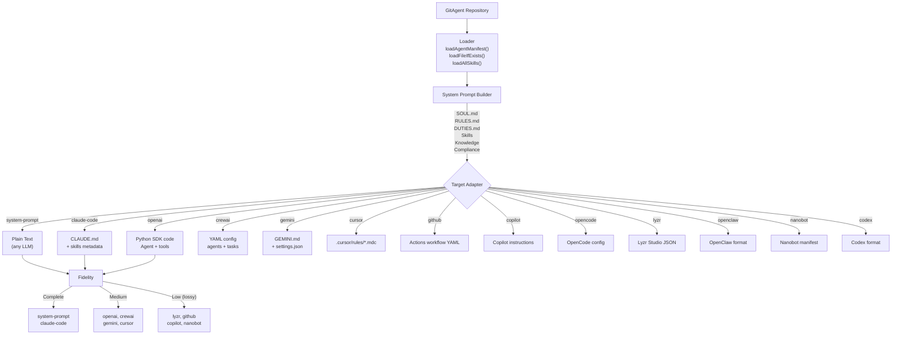
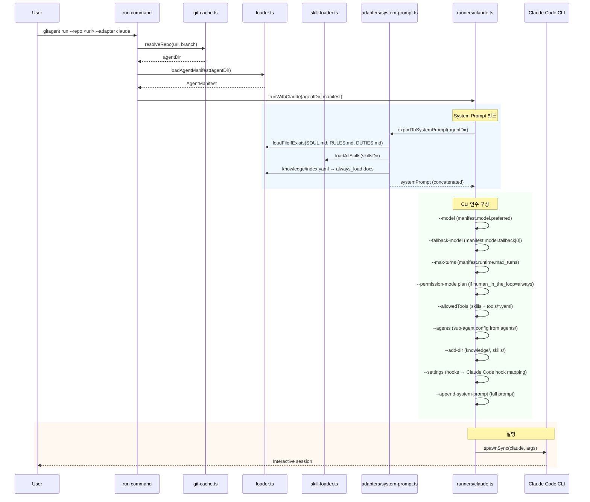
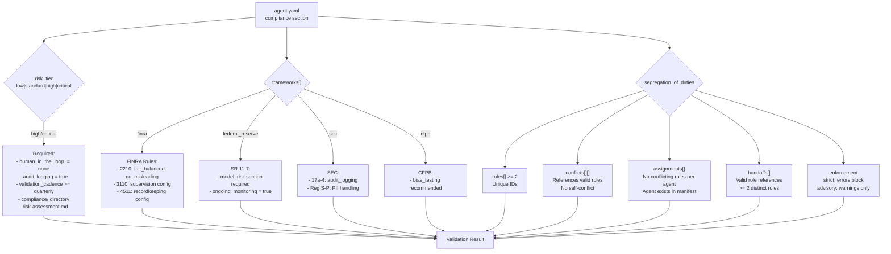
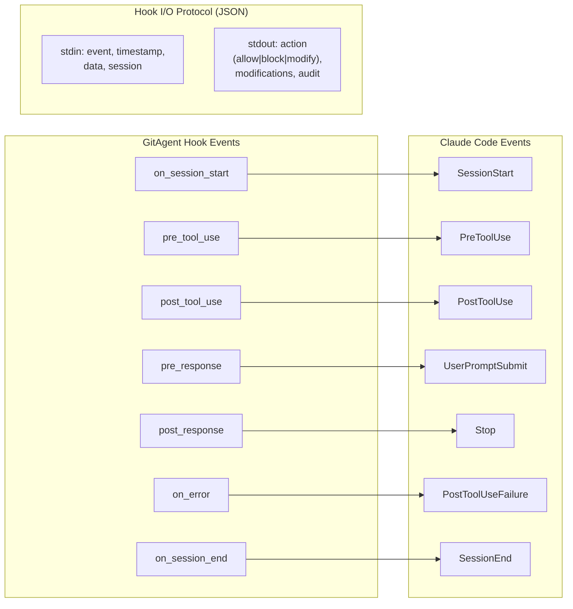
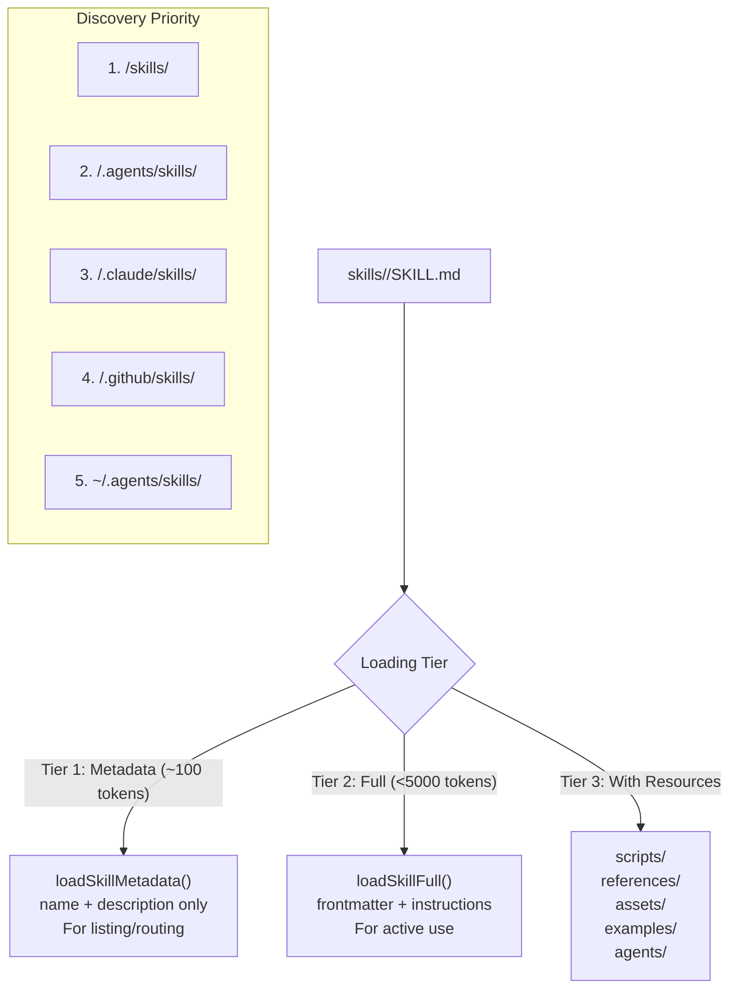
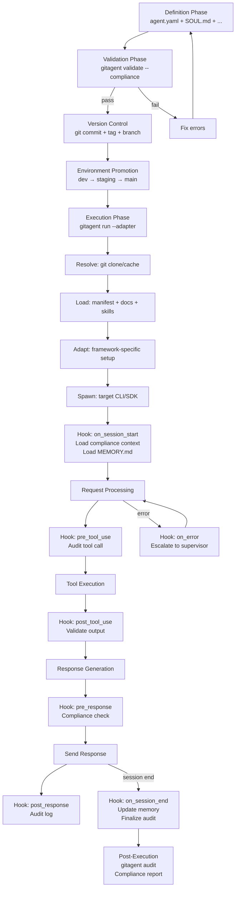

# GitAgent 아키텍처 다이어그램

## 1. 7-Layer 표준 디렉토리 구조

## 2. CLI 명령 체계

## 3. validate 검증 파이프라인

## 4. Export 어댑터 변환 흐름

## 5. Run 실행 흐름 (Claude Code 어댑터)

## 6. 컴플라이언스 SOD 검증 모델

## 7. Hook 라이프사이클 이벤트 맵핑

## 8. Skill Progressive Disclosure

## 9. 전체 실행 라이프사이클

