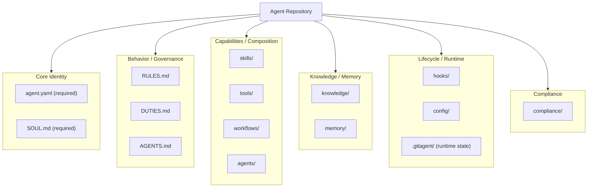
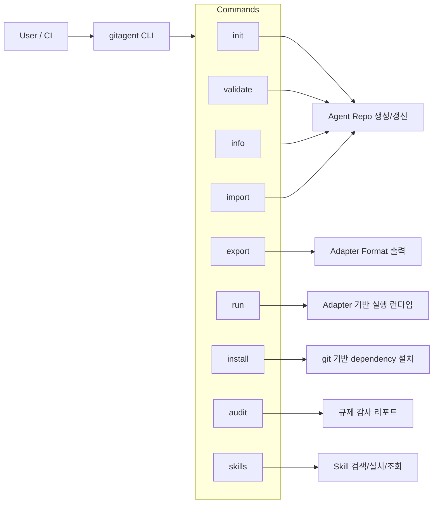
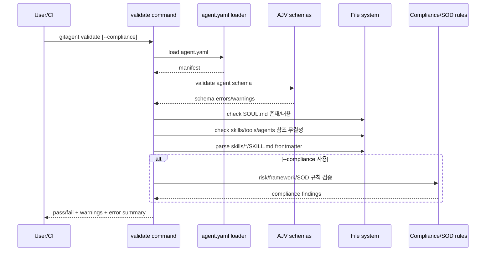
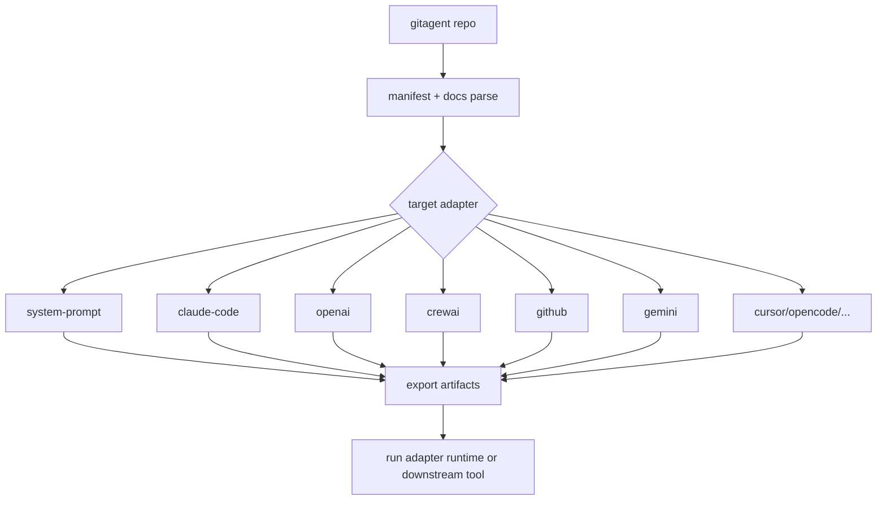
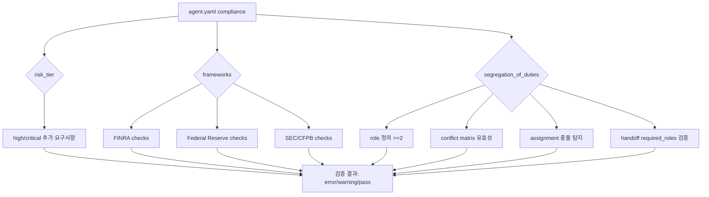

# GitAgent 아키텍처 다이어그램

## 1. 표준 디렉토리 구조

```mermaid
flowchart TD
    ROOT["Agent Repository"] --> CORE
    ROOT --> POLICY
    ROOT --> CAP
    ROOT --> KNOW
    ROOT --> OPS
    ROOT --> COMP

    subgraph CORE["Core Identity"]
        A["agent.yaml (required)"]
        S["SOUL.md (required)"]
    end

    subgraph POLICY["Behavior / Governance"]
        R["RULES.md"]
        D["DUTIES.md"]
        AG["AGENTS.md"]
    end

    subgraph CAP["Capabilities / Composition"]
        SK["skills/"]
        TL["tools/"]
        WF["workflows/"]
        SUB["agents/"]
    end

    subgraph KNOW["Knowledge / Memory"]
        K["knowledge/"]
        M["memory/"]
    end

    subgraph OPS["Lifecycle / Runtime"]
        H["hooks/"]
        C["config/"]
        RT[".gitagent/ (runtime state)"]
    end

    subgraph COMP["Compliance"]
        CP["compliance/"]
    end
```

## 2. CLI 명령 실행 흐름

```mermaid
flowchart LR
    USER["User / CI"] --> CLI["gitagent CLI"]

    subgraph COMMANDS["Commands"]
        INIT["init"]
        VAL["validate"]
        INFO["info"]
        EXP["export"]
        IMP["import"]
        RUN["run"]
        INS["install"]
        AUD["audit"]
        SKILL["skills"]
    end

    CLI --> COMMANDS

    INIT --> REPO["Agent Repo 생성/갱신"]
    VAL --> REPO
    INFO --> REPO
    EXP --> OUT["Adapter Format 출력"]
    IMP --> REPO
    RUN --> RUNTIME["Adapter 기반 실행 런타임"]
    INS --> DEP["git 기반 dependency 설치"]
    AUD --> REPORT["규제 감사 리포트"]
    SKILL --> SKREG["Skill 검색/설치/조회"]
```

## 3. validate 내부 파이프라인

```mermaid
sequenceDiagram
    participant U as User/CI
    participant V as validate command
    participant Y as agent.yaml loader
    participant A as AJV schemas
    participant F as File system
    participant C as Compliance/SOD rules

    U->>V: gitagent validate [--compliance]
    V->>Y: load agent.yaml
    Y-->>V: manifest
    V->>A: validate agent schema
    A-->>V: schema errors/warnings

    V->>F: check SOUL.md 존재/내용
    V->>F: check skills/tools/agents 참조 무결성
    V->>F: parse skills/*/SKILL.md frontmatter

    alt --compliance 사용
        V->>C: risk/framework/SOD 규칙 검증
        C-->>V: compliance findings
    end

    V-->>U: pass/fail + warnings + error summary
```

## 4. Export/Run 어댑터 흐름

```mermaid
flowchart TD
    SRC["gitagent repo"] --> PARSE["manifest + docs parse"]
    PARSE --> ADAPTER{"target adapter"}

    ADAPTER --> SYS["system-prompt"]
    ADAPTER --> CLAUDE["claude-code"]
    ADAPTER --> OPENAI["openai"]
    ADAPTER --> CREW["crewai"]
    ADAPTER --> GHA["github"]
    ADAPTER --> GEMINI["gemini"]
    ADAPTER --> OTHERS["cursor/opencode/... "]

    SYS --> OUT["export artifacts"]
    CLAUDE --> OUT
    OPENAI --> OUT
    CREW --> OUT
    GHA --> OUT
    GEMINI --> OUT
    OTHERS --> OUT

    OUT --> EXEC["run adapter runtime or downstream tool"]
```

## 5. 컴플라이언스/SOD 검증 모델

```mermaid
flowchart TD
    CFG["agent.yaml compliance"] --> RISK{"risk_tier"}
    CFG --> FW{"frameworks"}
    CFG --> SOD{"segregation_of_duties"}

    RISK --> HR["high/critical 추가 요구사항"]
    FW --> F1["FINRA checks"]
    FW --> F2["Federal Reserve checks"]
    FW --> F3["SEC/CFPB checks"]

    SOD --> ROLE["role 정의 >=2"]
    SOD --> CONFLICT["conflict matrix 유효성"]
    SOD --> ASSIGN["assignment 충돌 탐지"]
    SOD --> HANDOFF["handoff required_roles 검증"]

    HR --> RESULT
    F1 --> RESULT
    F2 --> RESULT
    F3 --> RESULT
    ROLE --> RESULT
    CONFLICT --> RESULT
    ASSIGN --> RESULT
    HANDOFF --> RESULT

    RESULT["검증 결과: error/warning/pass"]
```
