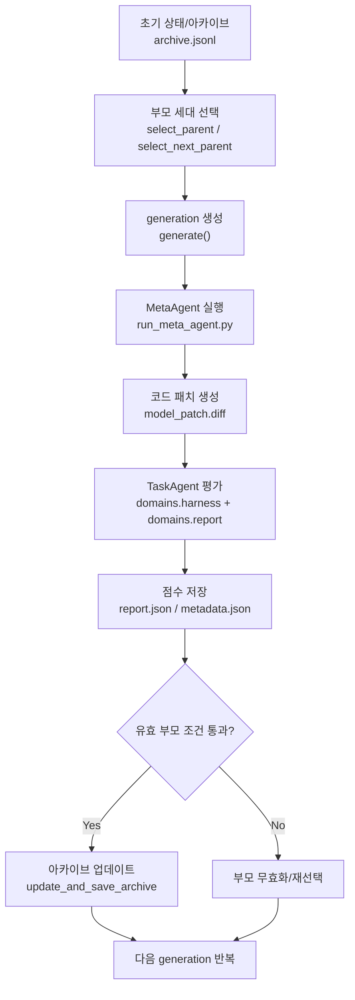
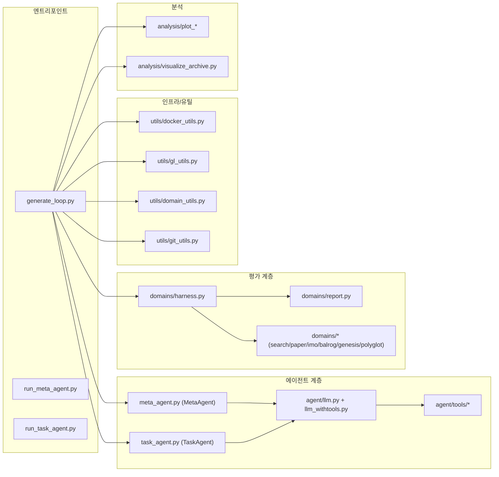
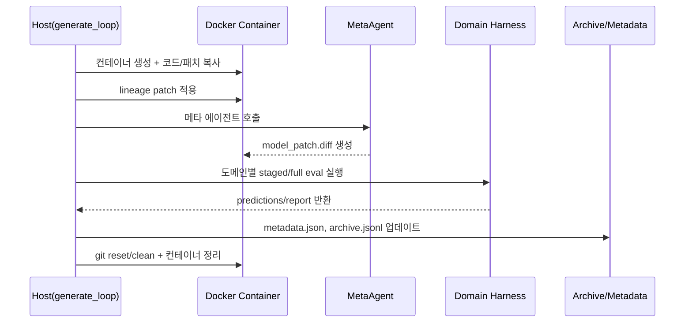

# HyperAgents 아키텍처 다이어그램

## 1. 핵심 실행 루프 (Generation Loop)

```mermaid
flowchart TD
    A["초기 상태/아카이브<br/>archive.jsonl"] --> B["부모 세대 선택<br/>select_parent / select_next_parent"]
    B --> C["generation 생성<br/>generate()"]
    C --> D["MetaAgent 실행<br/>run_meta_agent.py"]
    D --> E["코드 패치 생성<br/>model_patch.diff"]
    E --> F["TaskAgent 평가<br/>domains.harness + domains.report"]
    F --> G["점수 저장<br/>report.json / metadata.json"]
    G --> H{"유효 부모 조건 통과?"}
    H -->|Yes| I["아카이브 업데이트<br/>update_and_save_archive"]
    H -->|No| J["부모 무효화/재선택"]
    I --> K["다음 generation 반복"]
    J --> K
```

## 2. 모듈 계층 구조

```mermaid
flowchart LR
    subgraph Entry["엔트리포인트"]
        GL["generate_loop.py"]
        RM["run_meta_agent.py"]
        RT["run_task_agent.py"]
    end

    subgraph Agents["에이전트 계층"]
        MA["meta_agent.py (MetaAgent)"]
        TA["task_agent.py (TaskAgent)"]
        LLM["agent/llm.py + llm_withtools.py"]
        TOOLS["agent/tools/*"]
    end

    subgraph Eval["평가 계층"]
        HAR["domains/harness.py"]
        REP["domains/report.py"]
        DOM["domains/* (search/paper/imo/balrog/genesis/polyglot)"]
    end

    subgraph Infra["인프라/유틸"]
        DOCKER["utils/docker_utils.py"]
        GLU["utils/gl_utils.py"]
        DUTIL["utils/domain_utils.py"]
        GIT["utils/git_utils.py"]
    end

    subgraph Analysis["분석"]
        PLOT["analysis/plot_*"]
        VIZ["analysis/visualize_archive.py"]
    end

    GL --> MA
    GL --> TA
    MA --> LLM
    TA --> LLM
    LLM --> TOOLS
    GL --> HAR
    HAR --> DOM
    HAR --> REP
    GL --> DOCKER
    GL --> GLU
    GL --> DUTIL
    GL --> GIT
    GL --> PLOT
    GL --> VIZ
```

## 3. Docker 기반 생성-평가 플로우

```mermaid
sequenceDiagram
    participant Host as Host(generate_loop)
    participant Cont as Docker Container
    participant MA as MetaAgent
    participant Eval as Domain Harness
    participant Arch as Archive/Metadata

    Host->>Cont: 컨테이너 생성 + 코드/패치 복사
    Host->>Cont: lineage patch 적용
    Host->>MA: 메타 에이전트 호출
    MA-->>Cont: model_patch.diff 생성
    Host->>Eval: 도메인별 staged/full eval 실행
    Eval-->>Host: predictions/report 반환
    Host->>Arch: metadata.json, archive.jsonl 업데이트
    Host->>Cont: git reset/clean + 컨테이너 정리
```
