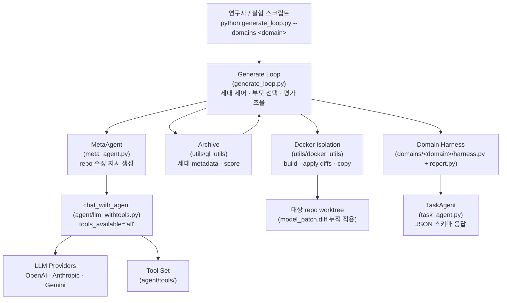
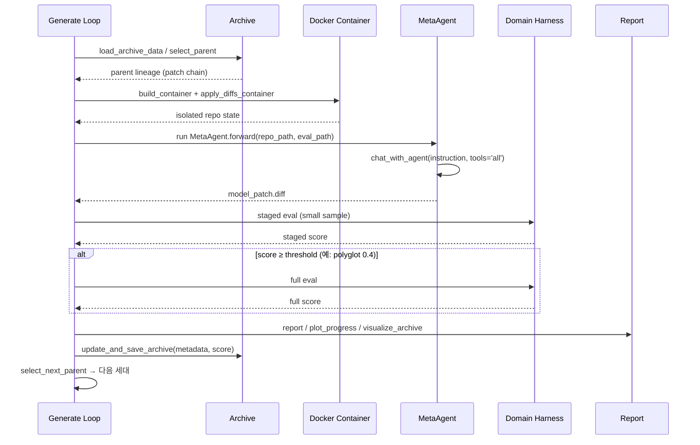
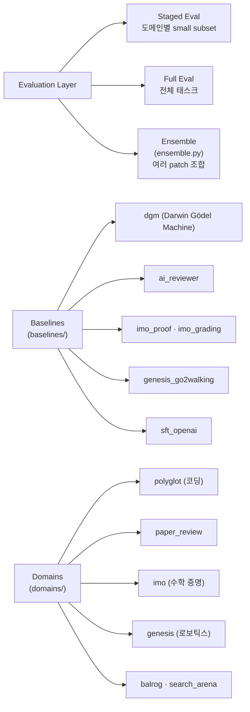

# HyperAgents 아키텍처 다이어그램

## 1. 전체 계층 구조

```mermaid
flowchart TD
    U["연구자 / 실험 스크립트<br/>python generate_loop.py --domains &lt;domain&gt;"] --> GL

    GL["Generate Loop<br/>(generate_loop.py)<br/>세대 제어 · 부모 선택 · 평가 조율"]

    GL --> MA["MetaAgent<br/>(meta_agent.py)<br/>repo 수정 지시 생성"]
    GL --> ARCH["Archive<br/>(utils/gl_utils)<br/>세대 metadata · score"]

    MA --> CHAT["chat_with_agent<br/>(agent/llm_withtools.py)<br/>tools_available='all'"]
    CHAT --> LLM["LLM Providers<br/>OpenAI · Anthropic · Gemini"]
    CHAT --> TOOLS["Tool Set<br/>(agent/tools/)"]

    GL --> DOCK["Docker Isolation<br/>(utils/docker_utils)<br/>build · apply diffs · copy"]
    DOCK --> REPO["대상 repo worktree<br/>(model_patch.diff 누적 적용)"]

    GL --> DOM["Domain Harness<br/>(domains/&lt;domain&gt;/harness.py + report.py)"]
    DOM --> TA["TaskAgent<br/>(task_agent.py)<br/>JSON 스키마 응답"]

    ARCH --> GL
```

## 2. 세대 실행 시퀀스

```mermaid
sequenceDiagram
    participant GL as Generate Loop
    participant AR as Archive
    participant DO as Docker Container
    participant MA as MetaAgent
    participant HA as Domain Harness
    participant RP as Report

    GL->>AR: load_archive_data / select_parent
    AR-->>GL: parent lineage (patch chain)
    GL->>DO: build_container + apply_diffs_container
    DO-->>GL: isolated repo state
    GL->>MA: run MetaAgent.forward(repo_path, eval_path)
    MA->>MA: chat_with_agent(instruction, tools='all')
    MA-->>GL: model_patch.diff
    GL->>HA: staged eval (small sample)
    HA-->>GL: staged score
    alt score ≥ threshold (예: polyglot 0.4)
        GL->>HA: full eval
        HA-->>GL: full score
    end
    GL->>RP: report / plot_progress / visualize_archive
    GL->>AR: update_and_save_archive(metadata, score)
    GL->>GL: select_next_parent → 다음 세대
```

## 3. 평가·베이스라인 계층

```mermaid
flowchart LR
    E["Evaluation Layer"] --> SE["Staged Eval<br/>도메인별 small subset"]
    E --> FE["Full Eval<br/>전체 태스크"]
    E --> EN["Ensemble<br/>(ensemble.py)<br/>여러 patch 조합"]

    B["Baselines<br/>(baselines/)"] --> B1["dgm (Darwin Gödel Machine)"]
    B --> B2["ai_reviewer"]
    B --> B3["imo_proof · imo_grading"]
    B --> B4["genesis_go2walking"]
    B --> B5["sft_openai"]

    D["Domains<br/>(domains/)"] --> D1["polyglot (코딩)"]
    D --> D2["paper_review"]
    D --> D3["imo (수학 증명)"]
    D --> D4["genesis (로보틱스)"]
    D --> D5["balrog · search_arena"]
```
