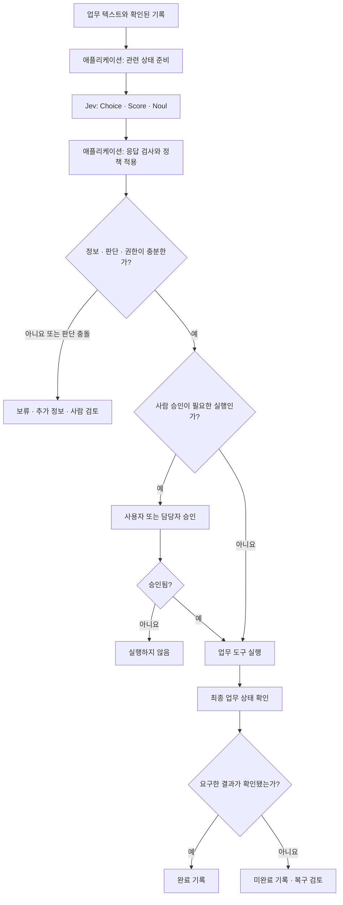
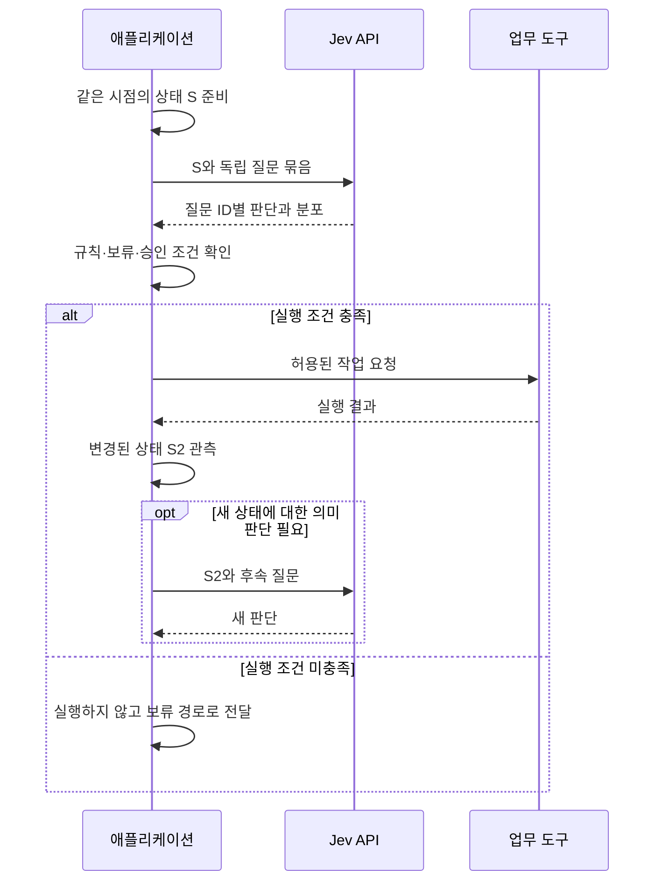
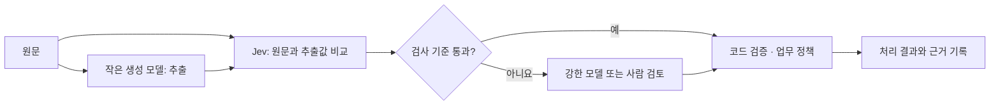

# Jev 실행 흐름과 책임 경계

이 문서는 공개 API를 바탕으로 구성한 애플리케이션 설계 예시입니다. Jev의 비공개 모델 구조나 실제 운영 구현을 재현한 그림은 아닙니다. 계약은 [공식 소개](https://docs.typesafe.ai/introduction), [API](https://docs.typesafe.ai/api), [Fan-out](https://docs.typesafe.ai/patterns/fan-out)을 기준으로 합니다.

## 1. 판단과 실행을 분리하기

높은 확률은 실행 권한이 아닙니다. 보류·승인·복구 정책은 애플리케이션이 정하며, 예외 없이 자동 실행해도 된다는 공급자 보장으로 읽지 않습니다. [환불 사례](02-api-and-integration.md)의 판단도 취소 실행이 아니라 처리 경로 선택에 사용합니다.

## 2. 묶을 수 있는 질문과 다시 관측해야 하는 상태

같은 입력의 의도·긴급성은 함께 물을 수 있지만, 실행 뒤 나타나는 사실은 미리 알 수 없습니다. 묶음 요청의 성능과 전체 업무 지연을 구분해야 하는 이유입니다.

## 3. 생성 결과 검사와 상위 모델 전환

[SDE cascade](https://docs.typesafe.ai/cookbooks/sde_cascade)의 역할 분리를 일반화한 그림입니다. 강한 모델로 넘어갔다고 정답이 보장되지는 않습니다. 검사 모델의 오답 통과율과 불필요한 전환율을 함께 평가합니다.
