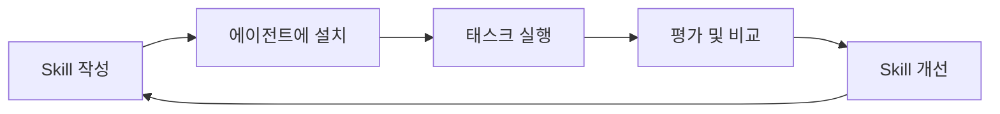

# LangChain Skills

LangChain Skills를 활용한 코딩 에이전트 성능 향상 사례를 정리한 문서입니다.

> **Skill**: 코딩 에이전트의 성능을 향상시키는 큐레이션된 지침, 스크립트, 리소스 모음. SKILL.md 파일과 선택적 헬퍼 스크립트로 구성되며, 에이전트가 필요할 때 동적으로 로드한다.

---

## 문서 구성

| 문서                                                            | 내용                                      |
|---------------------------------------------------------------|-----------------------------------------|
| [LangChain Skills](/langchain/01-langchain-skills.md)         | Skill의 개념, 구조, 설치 방법, 동작 원리             |
| [LangSmith CLI Skills](/langchain/02-langsmith-cli-skills.md) | LangSmith CLI와 Skills를 활용한 에이전트 개발 워크플로 |
| [Skills 평가](/langchain/03-evaluating-skills.md)               | Skills 평가 방법론, 벤치마크, 개선 사이클             |

---

## Skill 기반 개발 흐름

---

## 참고 자료

- [LangChain Skills](https://blog.langchain.com/langchain-skills/)
- [LangSmith CLI & Skills](https://blog.langchain.com/langsmith-cli-skills/)
- [Evaluating Skills](https://blog.langchain.com/evaluating-skills/)
- [LangGraph Documentation](https://langchain-ai.github.io/langgraph/)
- [LangSmith Documentation](https://docs.smith.langchain.com/)
- [langchain-ai/langchain-skills (GitHub)](https://github.com/langchain-ai/langchain-skills)
- [langchain-ai/langsmith-skills (GitHub)](https://github.com/langchain-ai/langsmith-skills)
