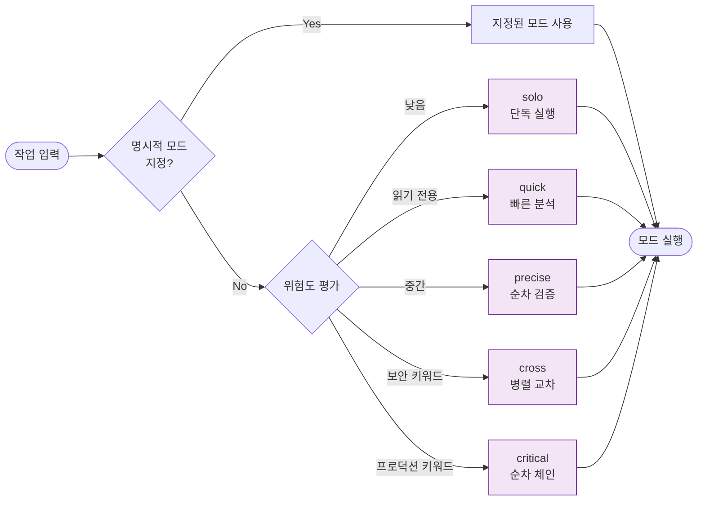
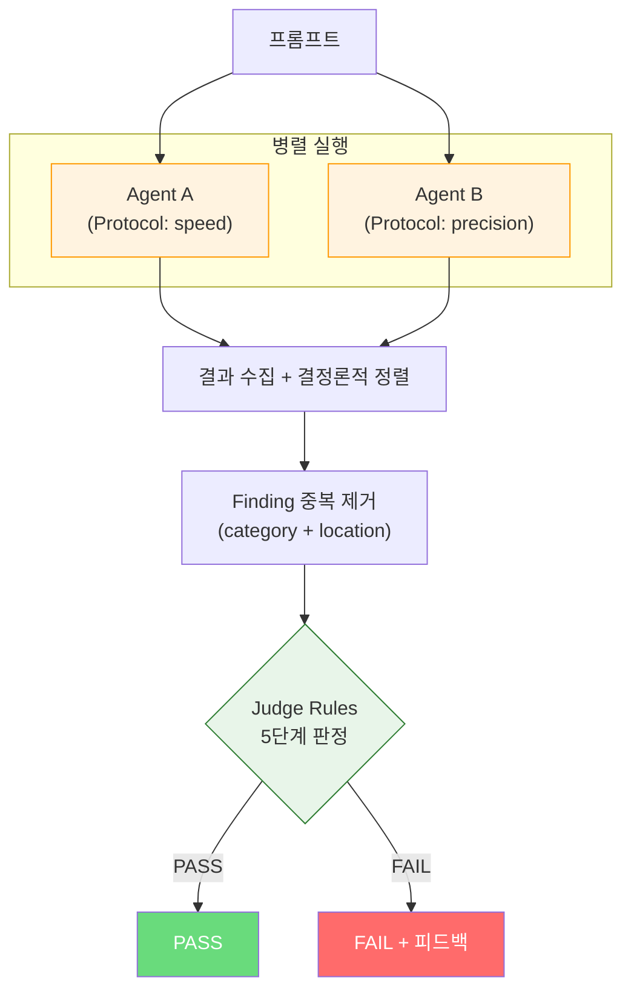
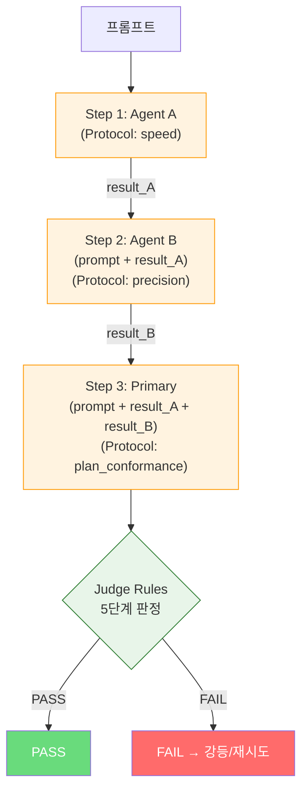
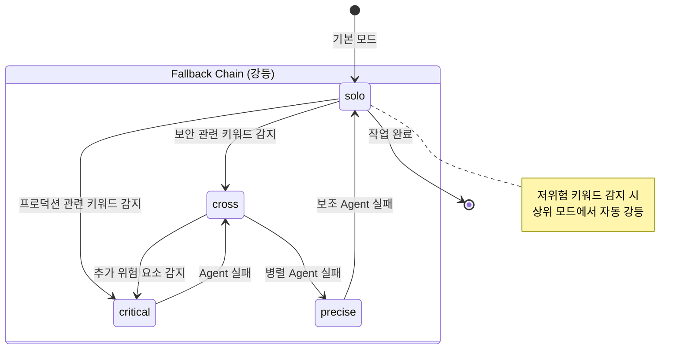

# 다중 에이전트 오케스트레이션 다이어그램

---

## 1. 5-Mode 실행 의사결정

입력된 작업의 위험도와 명시적 지정에 따라 실행 모드를 결정합니다.

---

## 2. Cross Mode -- 병렬 실행 흐름

두 에이전트가 독립적으로 병렬 분석하고, Judge가 결과를 종합 판정합니다.

---

## 3. Critical Mode -- 순차 체인 흐름

각 단계의 결과가 다음 단계의 입력에 누적되는 순차 실행입니다. 가장 높은 신뢰도를 제공합니다.

---

## 4. 자동 승격/강등 상태

Policy 기반으로 승격(escalation)하고, 에이전트 실패 시 강등(de-escalation)합니다.

---

## 참고 자료

- [개념 개요](/multi-agent-orchestration/01-overview.md) -- 5가지 실행 모드 상세
- [Judge Rules](/multi-agent-orchestration/02-judge-rules.md) -- 결정론적 판정 로직
- [Provider Routing](/multi-agent-orchestration/03-provider-routing.md) -- Fallback 체인, Timeout Budget
