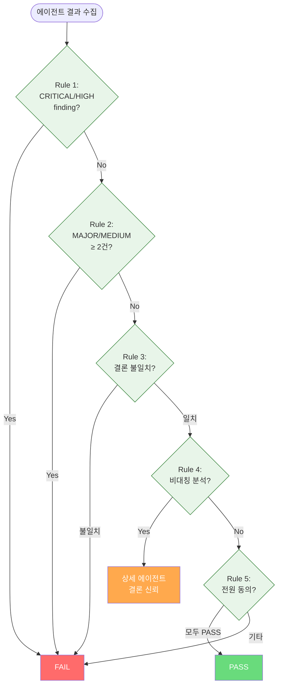

# 다중 에이전트 Judge Rules -- 판정 로직

에이전트 결과를 종합하여 최종 판정(PASS/FAIL)을 내리는 결정론적 규칙 체계입니다.

---

## 1. 결정론적 Judge Rules

5개 규칙을 순서대로 적용합니다. 먼저 매칭되는 규칙이 최종 판정을 결정합니다.

### Rule 우선순위 테이블

| 순서 | 규칙 | 판정 | 근거 |
|------|------|------|------|
| 1 | CRITICAL 또는 HIGH finding 존재 | **FAIL** | 심각한 이슈는 무조건 차단합니다 |
| 2 | MAJOR/MEDIUM finding 합산 2건 이상 (중복 제거 후) | **FAIL** | 중간 이슈도 복수 존재 시 위험합니다 |
| 3 | 에이전트 간 결론 불일치 (PASS vs FAIL) | **FAIL** | 의견 충돌 시 보수적으로 판단합니다 |
| 4 | 한쪽만 상세 분석, 다른 쪽 빈 결과 | **상세 에이전트 신뢰** | 빈 결과는 분석 실패로 간주합니다 |
| 5 | 모든 에이전트 동의 | **PASS** | 전원 합의 시에만 통과합니다 |

---

## 2. Finding Severity 계층

| Severity | Judge 영향 | 설명 |
|----------|-----------|------|
| CRITICAL | 단독으로 FAIL (Rule 1) | 즉각적 위험 |
| HIGH | 단독으로 FAIL (Rule 1) | 심각한 품질 문제 |
| MAJOR / MEDIUM | 2건 이상 FAIL (Rule 2) | 중요하지만 단독으로는 차단하지 않음 |
| LOW | 영향 없음 | 개선 권장 사항 |

---

## 3. Cross Mode 결과 정렬

병렬 실행된 에이전트의 결과는 결정론적 순서로 정렬합니다. 동일 입력에 대해 항상 동일한 판정을 보장합니다.

### 정렬 기준

1. **severity** 내림차순 (CRITICAL > HIGH > MAJOR > MEDIUM > LOW)
2. **category** 알파벳 오름차순
3. **location** 알파벳 오름차순

### Finding 중복 제거

- 동일 `category + location` 조합의 finding은 중복으로 판정합니다
- 중복 시 더 높은 severity의 finding을 유지합니다
- 중복 제거는 Rule 2 적용 전에 수행하여 이중 집계를 방지합니다

---

## 4. 신뢰도 기반 Tie-Breaking

Rule 3(결론 불일치)의 기본 동작은 FAIL입니다. 선택적으로 신뢰도(confidence)를 활용하여 tie-breaking을 수행할 수 있습니다.

### 적용 조건

- 설정에서 명시적으로 활성화한 경우에만 동작합니다
- CRITICAL/HIGH finding이 없는 경우에만 적용 가능합니다
- Confidence 차이가 임계값(기본: 0.3) 이상일 때만 적용합니다

### 판정 로직

1. 두 에이전트의 confidence 값을 비교합니다
2. 차이가 임계값 이상이면, 높은 confidence 에이전트의 결론을 채택합니다
3. 차이가 임계값 미만이면, 기본 동작(FAIL)을 유지합니다

---

## 5. 비대칭 분석 처리 (Rule 4)

한 에이전트가 상세 분석을 제공하고 다른 에이전트가 빈 결과를 반환하는 경우, 상세 분석 에이전트의 결론을 신뢰합니다.

- 빈 결과 에이전트는 무시하고, 상세 분석 에이전트의 conclusion을 따릅니다
- 상세 에이전트가 FAIL이면 FAIL, PASS이면 PASS입니다

---

## 6. Judge 적용 모드별 차이

| 항목 | cross | critical | precise |
|------|-------|----------|---------|
| Judge 적용 | 필수 | 필수 | 선택적 |
| 중복 제거 | 적용 | 적용 | 적용 |
| FAIL 시 동작 | 피드백 → 재시도/강등 | 피드백 → 강등 | 피드백 → solo 강등 |

---

## 7. 장단점

| 항목 | 장점 | 단점 |
|------|------|------|
| 결정론적 규칙 | 동일 입력 → 동일 판정, 디버깅 용이 | 미묘한 상황의 유연한 판단 어려움 |
| 보수적 기본값 (FAIL) | 위험한 변경이 통과할 가능성 최소화 | 거짓 양성(false positive) 증가 가능 |
| Severity 계층화 | 이슈 심각도에 비례한 판정 | Severity 분류 기준의 주관성 |
| 중복 제거 | 이중 집계 방지, 정확한 카운트 | 유사하지만 다른 이슈의 오탈락 가능 |
| Tie-Breaking | 높은 신뢰도 에이전트 활용 가능 | 임계값 튜닝 필요 |

---

## 참고 자료

- [아키텍처 다이어그램](/multi-agent-orchestration/00-diagram.md) -- Cross/Critical 흐름도
- [개념 개요](/multi-agent-orchestration/01-overview.md) -- 5가지 실행 모드 상세
- [Provider Routing](/multi-agent-orchestration/03-provider-routing.md) -- FAIL 시 Fallback 동작
