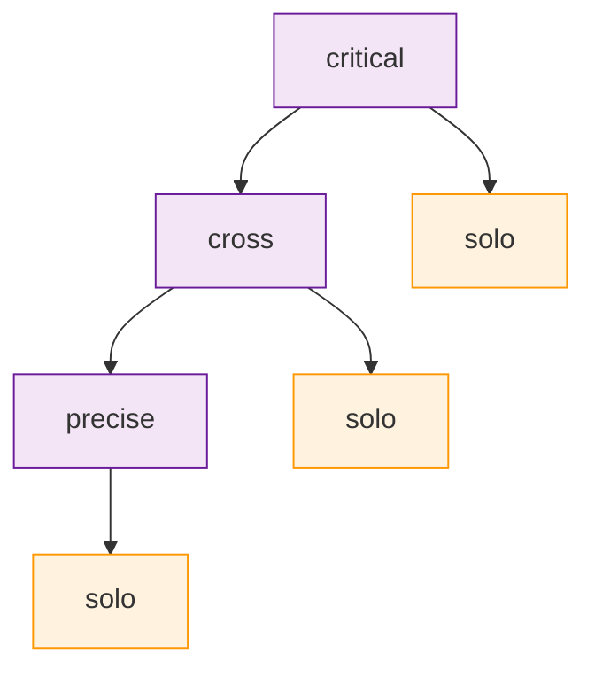

# Provider Routing & Synthesis Patterns

Fallback 체인, Timeout Budget, Synthesis 패턴, Finding 피드백 루프를 다룹니다.

---

## 1. Escalation Fallback Chain

고급 모드 실행 실패 시 하위 모드로 단계적으로 강등합니다. 어떤 상황에서든 작업 완료를 보장합니다.

### Fallback 경로



### 원칙

- Fallback chain은 항상 solo에서 종료합니다 (순환 없음)
- 각 모드는 자신보다 하위 모드의 리스트를 가집니다
- solo는 최종 모드이며, 실패 시 오류를 반환합니다

### Fallback 경로 테이블

| 실패 모드 | 1차 강등 | 2차 강등 | 최종 |
|----------|---------|---------|------|
| critical | cross | precise | solo |
| cross | precise | solo | -- |
| precise | solo | -- | -- |
| solo | (오류 반환) | -- | -- |

---

## 2. Timeout Budget Inheritance

순차 모드(precise, critical)에서는 이전 단계의 소요 시간이 이후 단계의 가용 시간에 영향을 줍니다. 누적 방식으로 추적합니다.

### 원칙

- 전체 예산(budget)을 설정하고, 각 단계가 소비한 시간을 차감합니다
- 잔여 budget이 다음 단계 최소 시간 미만이면 남은 단계를 건너뛰거나 fallback합니다
- 전체 budget 소진 시 즉시 Fallback 모드로 강등합니다

### Budget 초과 시 동작

| 상황 | 동작 |
|------|------|
| 단계별 타임아웃 초과 | 해당 단계 중단, 부분 결과 전달 |
| 전체 budget 잔여 < 최소 시간 | 남은 단계 건너뛰고 현재까지 결과로 Judge 실행 |
| 전체 budget 소진 | 즉시 Fallback 모드로 강등 |

### 누적 추적 예시

```text
critical mode (전체 budget: 120s)
  Step 1 (Agent A):  소비 35s → 잔여 85s
  Step 2 (Agent B):  소비 40s → 잔여 45s
  Step 3 (Primary):  최소 30s 필요 → 실행 가능
  Judge:             소비 10s → 잔여 5s
```

---

## 3. Cost Estimation

모드별 상대 비용을 사전에 추정하여, 불필요한 고비용 모드 사용을 방지합니다.

| 모드 | 상대 비용 | 에이전트 호출 수 | 비고 |
|------|----------|----------------|------|
| solo | 1.0x | 1 | 기준 비용 |
| quick | 0.5x | 1 (경량) | Secondary만 사용, 최저 비용 |
| precise | 2.0x | 2 | 순차 실행 |
| cross | 2.0x | 2 + Judge | 병렬 실행으로 지연 시간은 1x |
| critical | 3.0x | 3 + Judge | 최고 비용, 최고 신뢰도 |

---

## 4. Protocol Cache

프로토콜 파일의 반복 로드를 방지하기 위해 TTL 기반 캐싱을 적용합니다.

### 캐시 정책

- **기본 TTL**: 5분
- **무효화 조건**: 파일 변경 감지 시 즉시 무효화
- **캐시 키**: 프로토콜 이름 + 파일 경로
- **메모리 제한**: 최대 20개 프로토콜

### 캐시 히트 시 동작

1. TTL 내 동일 프로토콜 요청 → 캐시에서 반환합니다
2. TTL 만료 → 파일 재로드 후 캐시 갱신합니다
3. 파일 변경 감지 → 즉시 재로드합니다

---

## 5. Synthesis Patterns

멀티에이전트 결과를 워크플로우에 통합하는 3가지 패턴입니다. 작업 유형에 따라 적절한 패턴을 선택합니다.

### parallel_evaluate (리뷰/검증)

두 에이전트가 동일 대상을 독립적으로 평가하고, 결과를 병합합니다.

- **실행 방식**: 병렬
- **Judge 적용**: 필수
- **피드백 루프**: FAIL 시 finding 이력에 기록 → 재실행 시 이전 finding 참조
- **적용 대상**: 코드 리뷰, 보안 검증, 품질 평가

### generate_then_validate (계획/테스트)

Primary가 결과를 생성하고, Secondary가 사전 검증합니다. 검증 실패 시 피드백 루프를 형성합니다.

- **실행 방식**: 순차 (생성 → 검증 → 피드백)
- **Judge 적용**: 선택적
- **피드백 루프**: 검증 실패 → finding 생성 → Primary에 피드백 → 재생성
- **적용 대상**: 계획 수립, 테스트 생성

### implement_then_review (구현)

Primary가 구현하고, Secondary가 사후 리뷰합니다. 리뷰 결과에 따라 수정 루프를 형성합니다.

- **실행 방식**: 순차 (구현 → 리뷰 → 수정)
- **Judge 적용**: 리뷰 결과에 적용
- **피드백 루프**: CRITICAL/HIGH finding → 이력 기록 → 수정 지시 → Primary 재구현
- **적용 대상**: 코드 구현, 설정 변경

---

## 6. 단계별 패턴 선택

작업 단계(phase)에 따라 권장 패턴이 달라집니다.

| 단계 | 권장 패턴 | 대응 모드 | 근거 |
|------|----------|----------|------|
| 요구사항 분석 | parallel_evaluate | cross | 독립적 다중 관점으로 요구사항 검증 |
| 설계/계획 | generate_then_validate | precise | 계획 생성 후 즉시 검증 |
| 구현 | implement_then_review | precise | 구현 후 코드 리뷰 |
| 보안 검증 | parallel_evaluate | cross / critical | 독립적 보안 분석 병합 |
| 배포 검증 | parallel_evaluate | critical | 최고 신뢰도로 최종 검증 |
| 테스트 생성 | generate_then_validate | precise | 테스트 생성 후 커버리지 검증 |

---

## 7. Finding Feedback Loop

CRITICAL/HIGH finding이 발견되면 이력에 기록하고, 피드백을 생성합니다.

### 원칙

- CRITICAL과 HIGH severity finding만 이력에 기록합니다
- 피드백은 재실행, 무시, 모드 변경 중 하나로 연결됩니다
- 이력은 재실행 시 이전 finding 참조에 활용됩니다

### 피드백 동작

| Finding Severity | 동작 | 이력 기록 |
|-----------------|------|----------|
| CRITICAL | 즉시 FAIL, 재실행 또는 강등 | 기록 |
| HIGH | FAIL, 피드백 후 재실행 | 기록 |
| MAJOR / MEDIUM | 건수에 따라 판정 | 미기록 |
| LOW | 영향 없음 | 미기록 |

---

## 참고 자료

- [아키텍처 다이어그램](/multi-agent-orchestration/00-diagram.md) -- Fallback 상태 다이어그램
- [개념 개요](/multi-agent-orchestration/01-overview.md) -- 모드별 실행 방식
- [Judge Rules](/multi-agent-orchestration/02-judge-rules.md) -- FAIL 판정 상세 규칙
- [에이전틱 AI 시스템 설계 패턴](/design-pattern/) -- 검토-비평, 반복 개선 패턴
