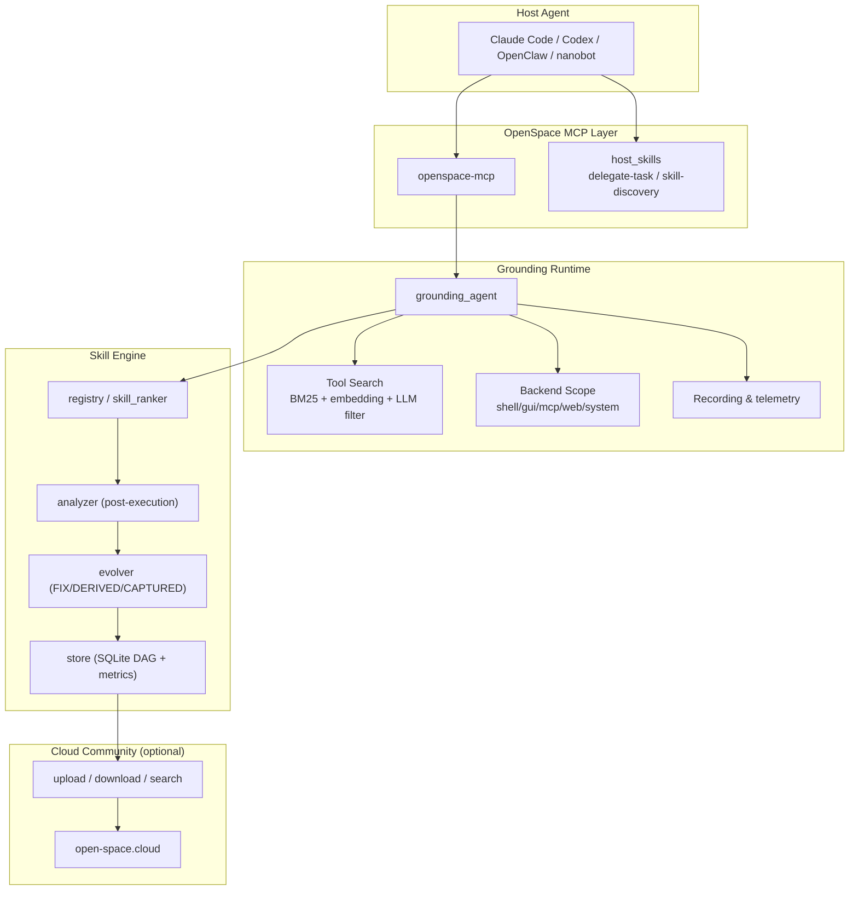
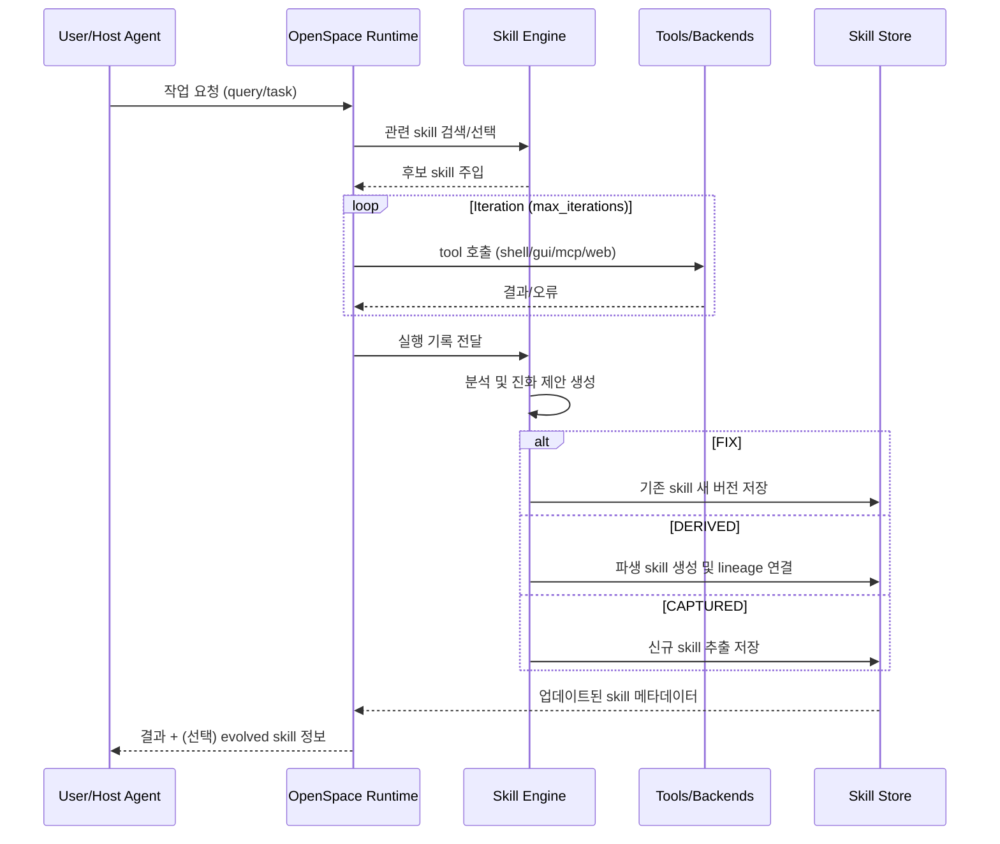
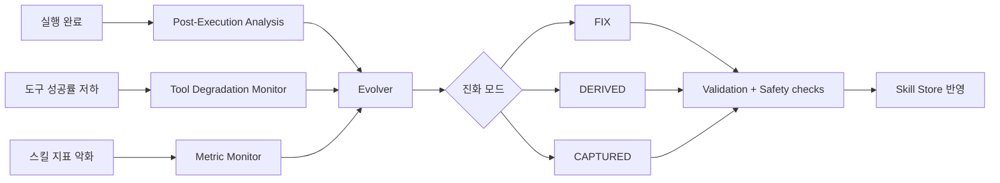
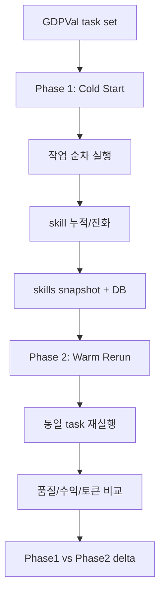

# OpenSpace 아키텍처 다이어그램

## 1. 계층 구조

```mermaid
flowchart TD
    subgraph Host["Host Agent"]
        A1["Claude Code / Codex / OpenClaw / nanobot"]
    end

    subgraph MCP["OpenSpace MCP Layer"]
        B1["openspace-mcp"]
        B2["host_skills<br/>delegate-task / skill-discovery"]
    end

    subgraph Runtime["Grounding Runtime"]
        C1["grounding_agent"]
        C2["Tool Search<br/>BM25 + embedding + LLM filter"]
        C3["Backend Scope<br/>shell/gui/mcp/web/system"]
        C4["Recording & telemetry"]
    end

    subgraph Skill["Skill Engine"]
        D1["registry / skill_ranker"]
        D2["analyzer (post-execution)"]
        D3["evolver (FIX/DERIVED/CAPTURED)"]
        D4["store (SQLite DAG + metrics)"]
    end

    subgraph Cloud["Cloud Community (optional)"]
        E1["upload / download / search"]
        E2["open-space.cloud"]
    end

    A1 --> B1
    A1 --> B2
    B1 --> C1
    C1 --> C2
    C1 --> C3
    C1 --> C4
    C1 --> D1
    D1 --> D2
    D2 --> D3
    D3 --> D4
    D4 --> E1
    E1 --> E2
```

## 2. 실행 및 진화 루프

```mermaid
sequenceDiagram
    participant U as User/Host Agent
    participant O as OpenSpace Runtime
    participant S as Skill Engine
    participant T as Tools/Backends
    participant DB as Skill Store

    U->>O: 작업 요청 (query/task)
    O->>S: 관련 skill 검색/선택
    S-->>O: 후보 skill 주입

    loop Iteration (max_iterations)
        O->>T: tool 호출 (shell/gui/mcp/web)
        T-->>O: 결과/오류
    end

    O->>S: 실행 기록 전달
    S->>S: 분석 및 진화 제안 생성

    alt FIX
        S->>DB: 기존 skill 새 버전 저장
    else DERIVED
        S->>DB: 파생 skill 생성 및 lineage 연결
    else CAPTURED
        S->>DB: 신규 skill 추출 저장
    end

    DB-->>O: 업데이트된 skill 메타데이터
    O-->>U: 결과 + (선택) evolved skill 정보
```

## 3. 진화 트리거 경로

```mermaid
flowchart LR
    A["실행 완료"] --> B["Post-Execution Analysis"]
    C["도구 성공률 저하"] --> D["Tool Degradation Monitor"]
    E["스킬 지표 악화"] --> F["Metric Monitor"]

    B --> G["Evolver"]
    D --> G
    F --> G

    G --> H{"진화 모드"}
    H --> I["FIX"]
    H --> J["DERIVED"]
    H --> K["CAPTURED"]

    I --> L["Validation + Safety checks"]
    J --> L
    K --> L
    L --> M["Skill Store 반영"]
```

## 4. GDPVal 2단계 평가 흐름

```mermaid
flowchart TD
    T["GDPVal task set"] --> P1["Phase 1: Cold Start"]
    P1 --> A1["작업 순차 실행"]
    A1 --> A2["skill 누적/진화"]
    A2 --> SNAP["skills snapshot + DB"]

    SNAP --> P2["Phase 2: Warm Rerun"]
    P2 --> B1["동일 task 재실행"]
    B1 --> B2["품질/수익/토큰 비교"]
    B2 --> R["Phase1 vs Phase2 delta"]
```
