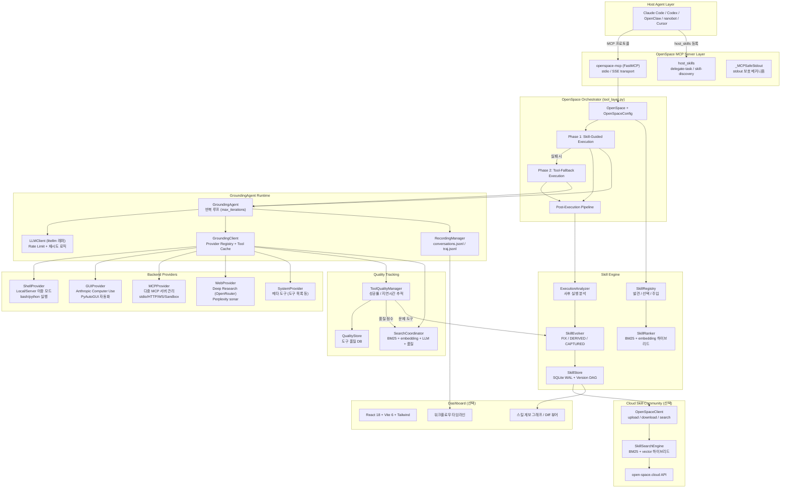
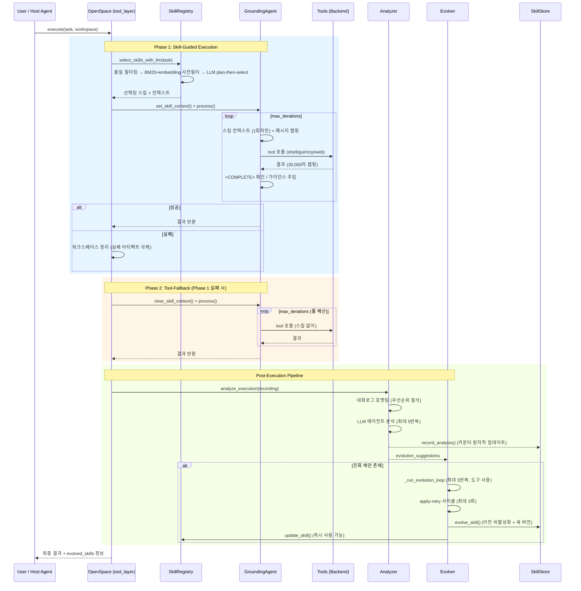
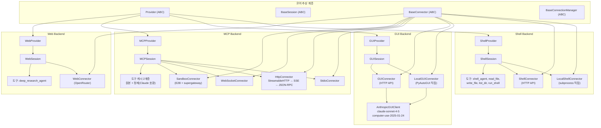
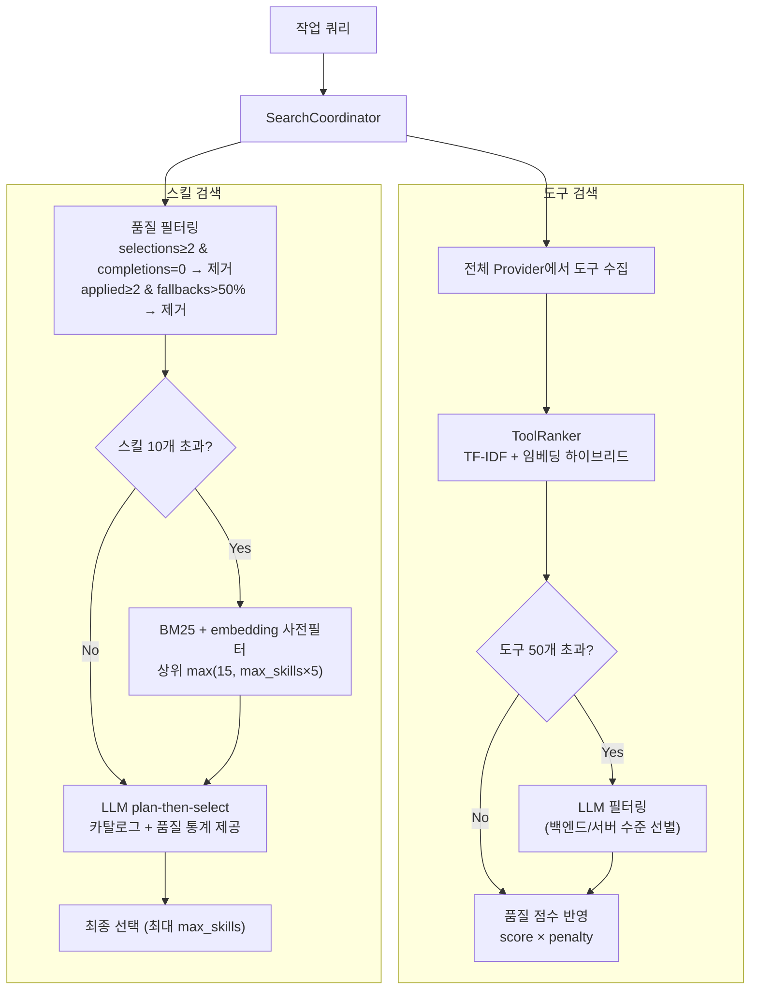
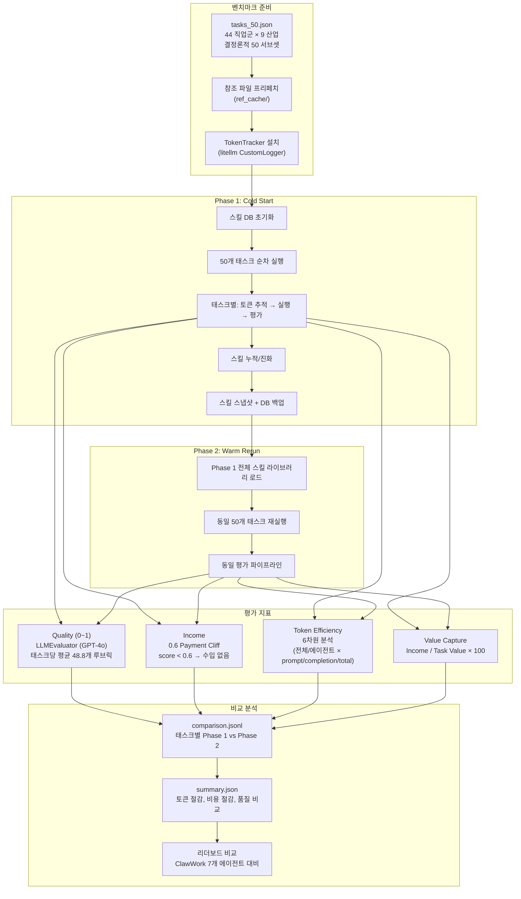
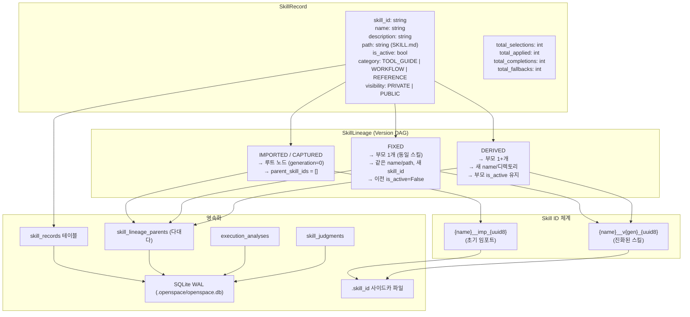
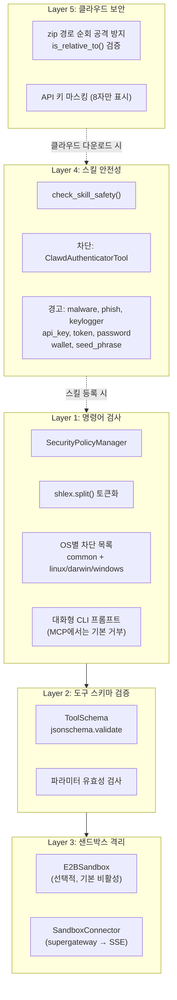

# OpenSpace 아키텍처 다이어그램

## 1. 전체 시스템 계층 구조

## 2. 2단계 실행 파이프라인

## 3. 3중 진화 트리거 시스템

```mermaid
flowchart LR
    subgraph Trigger1["Trigger 1: Post-Execution Analysis"]
        A1["작업 실행 완료"] --> A2["ExecutionAnalyzer"]
        A2 --> A3["LLM 에이전트 분석<br/>(대화로그 + traj.jsonl)"]
        A3 --> A4["EvolutionSuggestion 생성"]
    end

    subgraph Trigger2["Trigger 2: Tool Degradation"]
        B1["도구 성공률 하락"] --> B2["ToolQualityManager"]
        B2 --> B3["find_skills_by_tool()"]
        B3 --> B4["LLM 확인<br/>'이 스킬이 수정 필요한가?'"]
    end

    subgraph Trigger3["Trigger 3: Metric Monitor"]
        C1["주기적 스킬 건강 검사"] --> C2["_diagnose_skill_health()"]
        C2 --> C3{"진단 결과"}
        C3 -->|" fallback_rate > 0.4 "| C4["FIX 후보"]
        C3 -->|" applied + completion < 0.35 "| C5["FIX 후보"]
        C3 -->|" effective_rate < 0.55 "| C6["DERIVED 후보"]
        C4 & C5 & C6 --> C7["LLM 확인"]
    end

    A4 & B4 & C7 --> D["SkillEvolver"]
    D --> E{"진화 모드"}
    E -->|기존 스킬 수정| F["FIX<br/>in-place 업데이트<br/>새 skill_id, 같은 경로"]
    E -->|파생 스킬 생성| G["DERIVED<br/>새 디렉토리<br/>부모 is_active 유지"]
    E -->|새 패턴 포착| H["CAPTURED<br/>완전히 새로운 스킬<br/>부모 없음"]
    F & G & H --> I["에이전트 루프 (최대 5반복)"]
    I --> J["apply-retry (최대 3회)"]
    J --> K["validate_skill_dir()"]
    K --> L["SkillStore.evolve_skill()"]
    L --> M["SkillRegistry 즉시 업데이트"]

    subgraph Safety["안전장치"]
        S1["Semaphore (max_concurrent=3)"]
        S2["<EVOLUTION_FAILED> 자기 거부"]
        S3["min_selections (5) 데이터 부족 보호"]
        S4["addressed_degradations 반복 방지"]
        S5["모호한 LLM 응답 → 기본 스킵"]
    end
```

## 4. Provider-Session-Connector 아키텍처

## 5. 하이브리드 도구/스킬 검색 파이프라인

## 6. GDPVal 벤치마크 평가 흐름

## 7. 스킬 데이터 모델 및 리니지 DAG

## 8. 보안 계층 구조

