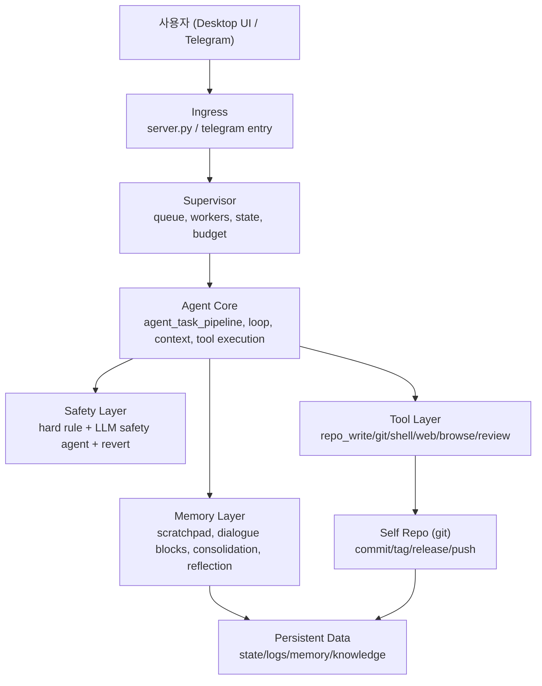
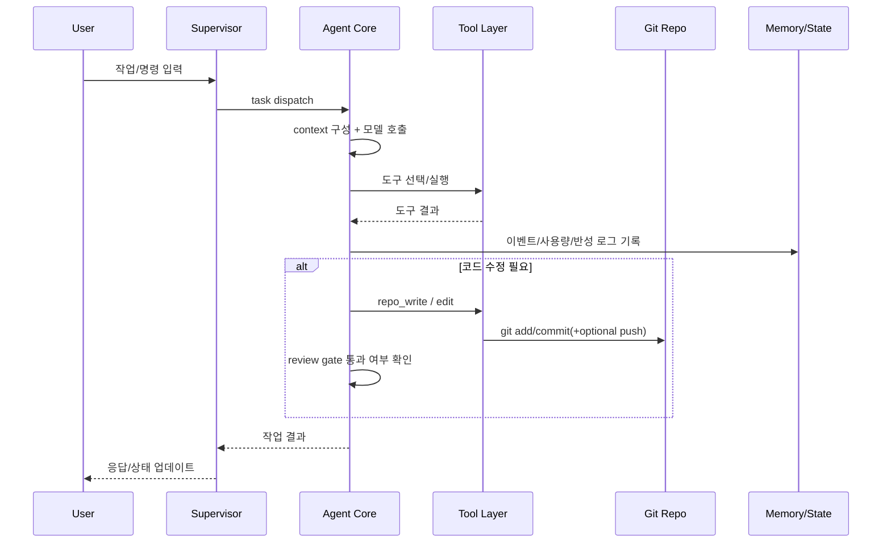
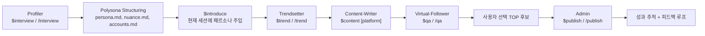
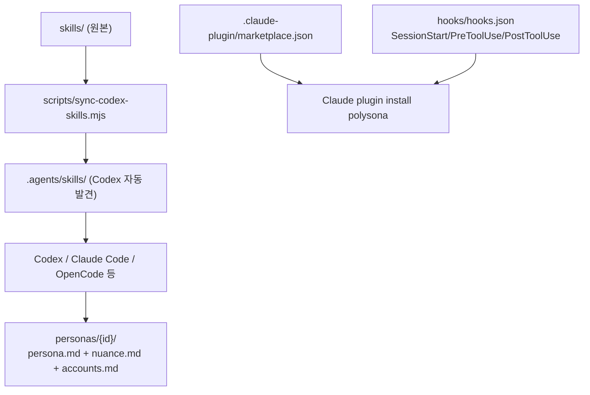

# Ouroboros 아키텍처 다이어그램

## 1. Ouroboros 하네스 계층 구조

```mermaid
flowchart TD
    User["사용자 (Desktop UI / Telegram)"] --> Ingress["Ingress\nserver.py / telegram entry"]
    Ingress --> Supervisor["Supervisor\nqueue, workers, state, budget"]
    Supervisor --> AgentCore["Agent Core\nagent_task_pipeline, loop, context, tool execution"]
    AgentCore --> Safety["Safety Layer\nhard rule + LLM safety agent + revert"]
    AgentCore --> Memory["Memory Layer\nscratchpad, dialogue blocks, consolidation, reflection"]
    AgentCore --> Tools["Tool Layer\nrepo_write/git/shell/web/browse/review"]
    Tools --> Repo["Self Repo (git)\ncommit/tag/release/push"]
    Memory --> Data["Persistent Data\nstate/logs/memory/knowledge"]
    Repo --> Data
```

## 2. Ouroboros 태스크 실행 및 자기개선 루프

```mermaid
sequenceDiagram
    participant U as User
    participant S as Supervisor
    participant A as Agent Core
    participant T as Tool Layer
    participant R as Git Repo
    participant M as Memory/State

    U->>S: 작업/명령 입력
    S->>A: task dispatch
    A->>A: context 구성 + 모델 호출
    A->>T: 도구 선택/실행
    T-->>A: 도구 결과
    A->>M: 이벤트/사용량/반성 로그 기록
    alt 코드 수정 필요
        A->>T: repo_write / edit
        T->>R: git add/commit(+optional push)
        A->>A: review gate 통과 여부 확인
    end
    A-->>S: 작업 결과
    S-->>U: 응답/상태 업데이트
```

## 3. Polysona 실행 플로우

```mermaid
flowchart LR
    Interview["Profiler\n$interview / /interview"] --> Structure["Polysona Structuring\npersona.md, nuance.md, accounts.md"]
    Structure --> Introduce["$introduce\n현재 세션에 페르소나 주입"]
    Introduce --> Trend["Trendsetter\n$trend / /trend"]
    Trend --> Content["Content-Writer\n$content [platform]"]
    Content --> QA["Virtual-Follower\n$qa / /qa"]
    QA --> Pick["사용자 선택 TOP 후보"]
    Pick --> Publish["Admin\n$publish / /publish"]
    Publish --> Track["성과 추적 + 피드백 루프"]
```

## 4. Polysona의 멀티 런타임 연결

```mermaid
flowchart TD
    Skills["skills/ (원본)"] --> Sync["scripts/sync-codex-skills.mjs"]
    Sync --> CodexMirror[".agents/skills/ (Codex 자동 발견)"]
    Plugin[".claude-plugin/marketplace.json"] --> Claude["Claude plugin install polysona"]
    Hooks["hooks/hooks.json\nSessionStart/PreToolUse/PostToolUse"] --> Claude
    CodexMirror --> Runtime["Codex / Claude Code / OpenCode 등"]
    Runtime --> PersonaData["personas/{id}/\npersona.md + nuance.md + accounts.md"]
```
