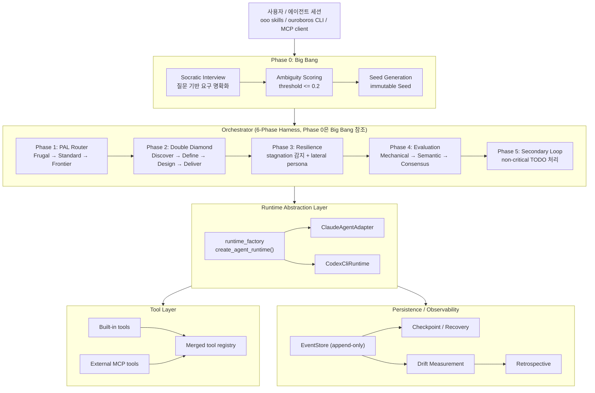
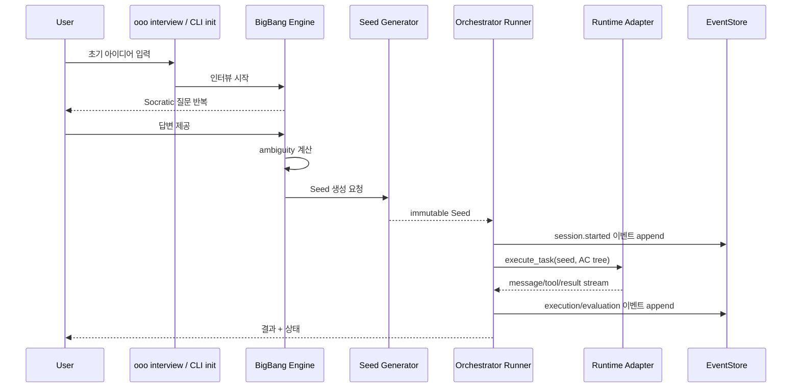
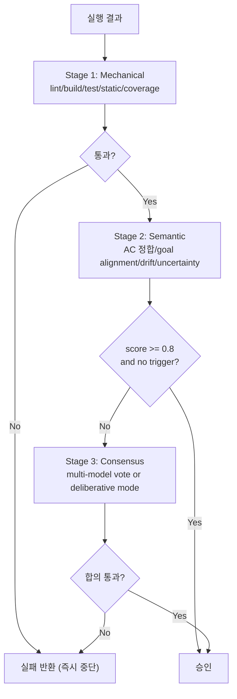
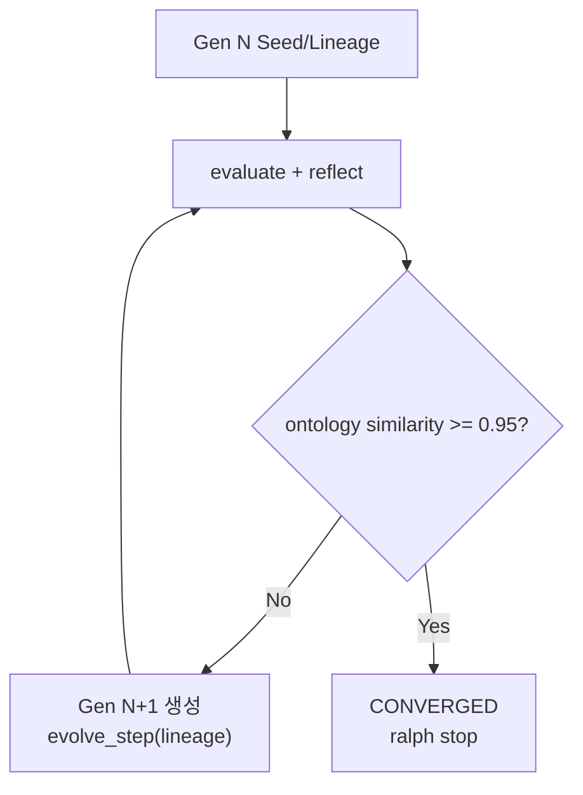
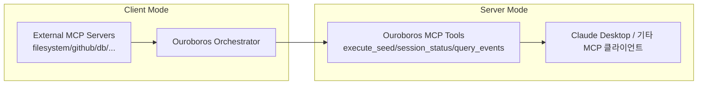

# Ouroboros 아키텍처 다이어그램

## 1. 전체 계층 구조

```mermaid
flowchart TD
    U["사용자 / 에이전트 세션<br/>ooo skills / ouroboros CLI / MCP client"] --> BB

    subgraph BB["Phase 0: Big Bang"]
        BB1["Socratic Interview<br/>질문 기반 요구 명확화"]
        BB2["Ambiguity Scoring<br/>threshold <= 0.2"]
        BB3["Seed Generation<br/>immutable Seed"]
        BB1 --> BB2 --> BB3
    end

    BB --> ORCH

    subgraph ORCH["Orchestrator (6-Phase Harness, Phase 0은 Big Bang 참조)"]
        P1["Phase 1: PAL Router<br/>Frugal → Standard → Frontier"]
        P2["Phase 2: Double Diamond<br/>Discover → Define → Design → Deliver"]
        P3["Phase 3: Resilience<br/>stagnation 감지 + lateral persona"]
        P4["Phase 4: Evaluation<br/>Mechanical → Semantic → Consensus"]
        P5["Phase 5: Secondary Loop<br/>non-critical TODO 처리"]
        P1 --> P2 --> P3 --> P4 --> P5
    end

    ORCH --> RT

    subgraph RT["Runtime Abstraction Layer"]
        RTF["runtime_factory<br/>create_agent_runtime()"]
        CLA["ClaudeAgentAdapter"]
        COD["CodexCliRuntime"]
        RTF --> CLA
        RTF --> COD
    end

    RT --> TOOLS

    subgraph TOOLS["Tool Layer"]
        T1["Built-in tools"]
        T2["External MCP tools"]
        T3["Merged tool registry"]
        T1 --> T3
        T2 --> T3
    end

    RT --> STATE

    subgraph STATE["Persistence / Observability"]
        S1["EventStore (append-only)"]
        S2["Checkpoint / Recovery"]
        S3["Drift Measurement"]
        S4["Retrospective"]
        S1 --> S2
        S1 --> S3
        S3 --> S4
    end
```

## 2. 인터뷰-실행 진입 흐름

```mermaid
sequenceDiagram
    participant User as User
    participant Skill as ooo interview / CLI init
    participant BB as BigBang Engine
    participant Seed as Seed Generator
    participant Run as Orchestrator Runner
    participant RT as Runtime Adapter
    participant ES as EventStore

    User->>Skill: 초기 아이디어 입력
    Skill->>BB: 인터뷰 시작
    BB-->>User: Socratic 질문 반복
    User->>BB: 답변 제공
    BB->>BB: ambiguity 계산
    BB->>Seed: Seed 생성 요청
    Seed-->>Run: immutable Seed
    Run->>ES: session.started 이벤트 append
    Run->>RT: execute_task(seed, AC tree)
    RT-->>Run: message/tool/result stream
    Run->>ES: execution/evaluation 이벤트 append
    Run-->>User: 결과 + 상태
```

## 3. 평가 게이트 (3 Stage)

```mermaid
flowchart TD
    A["실행 결과"] --> M["Stage 1: Mechanical<br/>lint/build/test/static/coverage"]
    M --> MOK{"통과?"}
    MOK -->|No| FAIL["실패 반환 (즉시 중단)"]
    MOK -->|Yes| S["Stage 2: Semantic<br/>AC 정합/goal alignment/drift/uncertainty"]
    S --> SOK{"score >= 0.8<br/>and no trigger?"}
    SOK -->|Yes| PASS["승인"]
    SOK -->|No| C["Stage 3: Consensus<br/>multi-model vote or deliberative mode"]
    C --> COK{"합의 통과?"}
    COK -->|Yes| PASS
    COK -->|No| FAIL
```

## 4. Ralph 진화 루프

```mermaid
flowchart TD
    G0["Gen N Seed/Lineage"] --> EV["evaluate + reflect"]
    EV --> SIM{"ontology similarity >= 0.95?"}
    SIM -->|No| NEXT["Gen N+1 생성<br/>evolve_step(lineage)"]
    NEXT --> EV
    SIM -->|Yes| DONE["CONVERGED<br/>ralph stop"]
```

## 5. MCP 양방향 허브

```mermaid
flowchart LR
    subgraph ClientMode["Client Mode"]
        EXT["External MCP Servers<br/>filesystem/github/db/..."] --> ORC["Ouroboros Orchestrator"]
    end

    subgraph ServerMode["Server Mode"]
        ORC --> TOOLS["Ouroboros MCP Tools<br/>execute_seed/session_status/query_events"]
        TOOLS --> APP["Claude Desktop / 기타 MCP 클라이언트"]
    end
```
