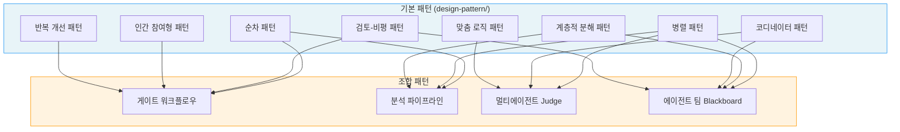
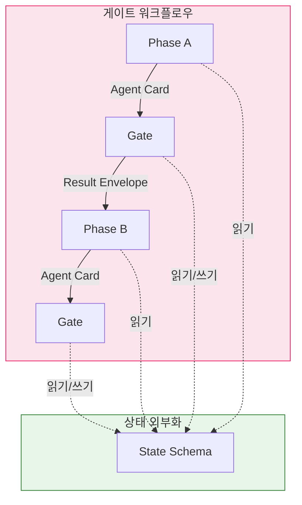

# 패턴 조합 다이어그램

---

## 기본 패턴 → 조합 패턴 매핑

어떤 base 패턴이 결합되어 조합 패턴을 형성하는지 보여줍니다.

---

## 계약이 연결하는 인터페이스

조합된 패턴 사이를 연결하는 3가지 런타임 계약입니다.

| 계약 | 역할 | 이 계약이 없으면 |
|------|------|----------------|
| Agent Card | Phase의 입출력, Gate 조건, 재시도 예산 정의 | Phase 간 전이 실패, 재시도 무한 반복 |
| Result Envelope | 정상/비정상 결과를 하나의 스키마로 전달 | 비정상 경로 데이터 유실 |
| State Schema | 파이프라인 진행 상태를 LLM 외부에 기록 | 상태 손상, Provider 교체 시 상태 유지 어려움 |
| [Provider Contract](/pattern-composition/04-provider-contract.md) | Host와 LLM 공급자의 경계, Tier/capability/오류 분류 표준화 | 공급자 락인, 부적절한 재시도, Over-provisioning |

---

## 실패 유형 분포

단일 시스템 감사에서 발견한 26건(중복 제거)의 실패를 12개 유형으로 분류한 결과입니다.

| 유형 | 건수 | 비율 |
|------|------|------|
| Stale State Reuse | 6 | 23% |
| Silent Data Loss | 6 | 23% |
| Ghost Decision | 4 | 15% |
| Infinite/Unbounded | 2 | 8% |
| State Corruption | 1 | 4% |
| Invalid Transition | 1 | 4% |
| Incomplete Recovery | 1 | 4% |
| Timeout Starvation | 1 | 4% |
| Non-Deterministic | 1 | 4% |
| Over-provisioning | 1 | 4% |
| Resource Leak | 1 | 4% |
| Vague Error | 1 | 4% |

상위 3개 유형(Stale State Reuse, Silent Data Loss, Ghost Decision)이 전체의 62%를 차지합니다.

---

## 참고 자료

- [에이전틱 AI 시스템 설계 패턴](/design-pattern/README.md)
- [조합 계약 상세](/pattern-composition/02-contracts.md)
- [Provider Contract](/pattern-composition/04-provider-contract.md)
- [실패 분류 상세](/pattern-composition/03-failure-taxonomy.md)
