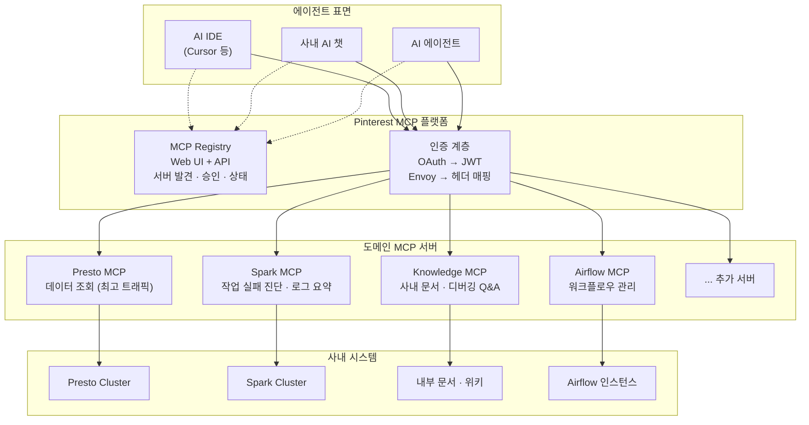
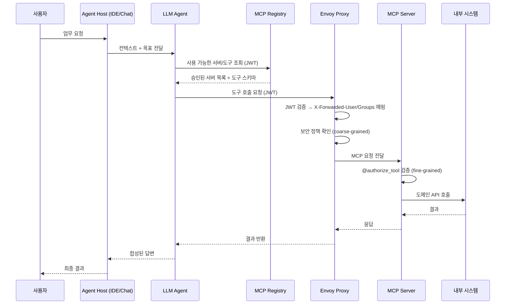
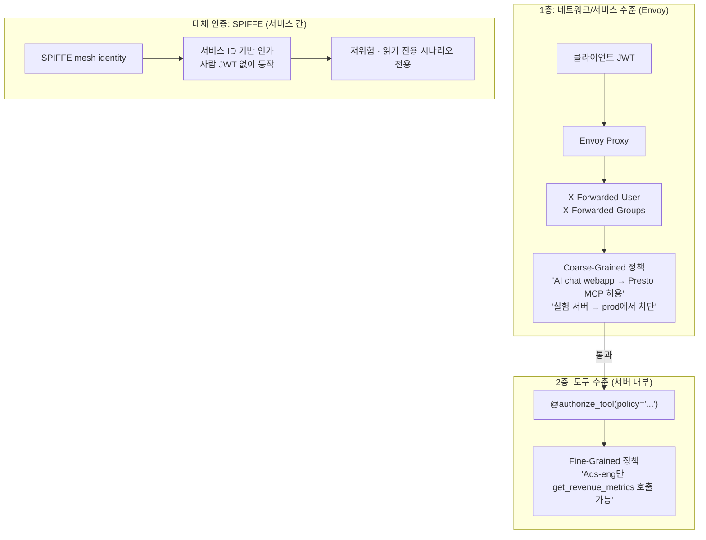
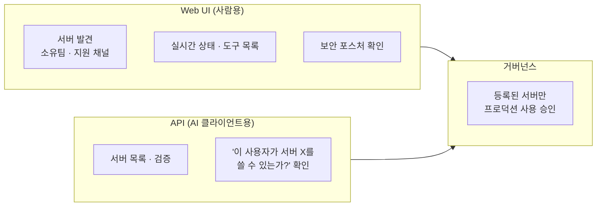
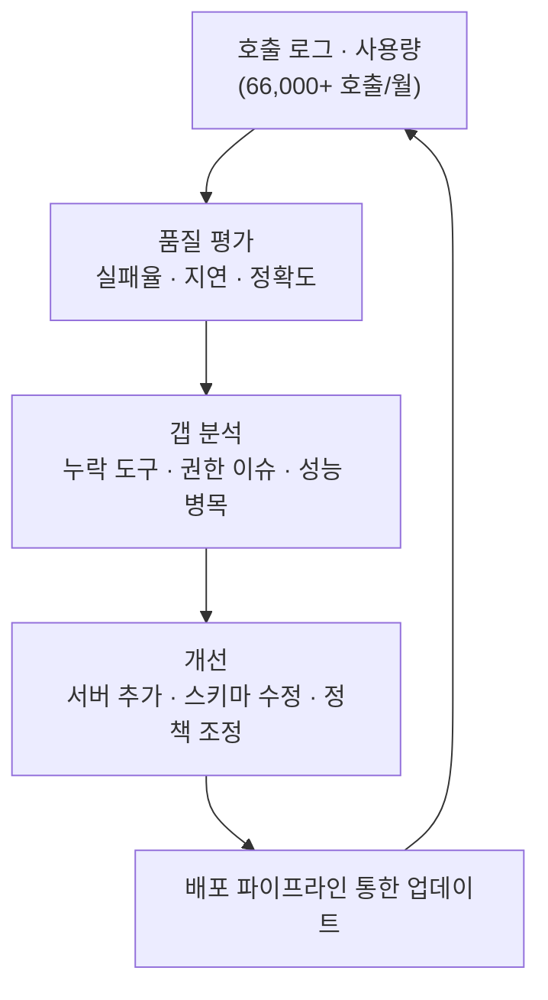

# Pinterest MCP 아키텍처 다이어그램

## 1. MCP 생태계 전체 구조

```mermaid
flowchart TD
    subgraph Surfaces["에이전트 표면"]
        IDE["AI IDE<br/>(Cursor 등)"]
        Chat["사내 AI 챗"]
        Agents["AI 에이전트"]
    end

    subgraph Platform["Pinterest MCP 플랫폼"]
        Registry["MCP Registry<br/>Web UI + API<br/>서버 발견 · 승인 · 상태"]
        Auth["인증 계층<br/>OAuth → JWT<br/>Envoy → 헤더 매핑"]
    end

    subgraph Servers["도메인 MCP 서버"]
        Presto["Presto MCP<br/>데이터 조회 (최고 트래픽)"]
        Spark["Spark MCP<br/>작업 실패 진단 · 로그 요약"]
        Knowledge["Knowledge MCP<br/>사내 문서 · 디버깅 Q&A"]
        Airflow["Airflow MCP<br/>워크플로우 관리"]
        More["... 추가 서버"]
    end

    subgraph Internal["사내 시스템"]
        PrestoCluster["Presto Cluster"]
        SparkCluster["Spark Cluster"]
        Docs["내부 문서 · 위키"]
        AirflowSys["Airflow 인스턴스"]
    end

    IDE --> Auth
    Chat --> Auth
    Agents --> Auth
    IDE -.-> Registry
    Chat -.-> Registry
    Agents -.-> Registry

    Auth --> Presto
    Auth --> Spark
    Auth --> Knowledge
    Auth --> Airflow
    Auth --> More

    Presto --> PrestoCluster
    Spark --> SparkCluster
    Knowledge --> Docs
    Airflow --> AirflowSys
```

## 2. 요청 처리 흐름

```mermaid
sequenceDiagram
    participant U as 사용자
    participant Host as Agent Host (IDE/Chat)
    participant Agent as LLM Agent
    participant Registry as MCP Registry
    participant Envoy as Envoy Proxy
    participant Server as MCP Server
    participant System as 내부 시스템

    U->>Host: 업무 요청
    Host->>Agent: 컨텍스트 + 목표 전달
    Agent->>Registry: 사용 가능한 서버/도구 조회 (JWT)
    Registry-->>Agent: 승인된 서버 목록 + 도구 스키마

    Agent->>Envoy: 도구 호출 요청 (JWT)
    Envoy->>Envoy: JWT 검증 → X-Forwarded-User/Groups 매핑
    Envoy->>Envoy: 보안 정책 확인 (coarse-grained)
    Envoy->>Server: MCP 요청 전달
    Server->>Server: @authorize_tool 검증 (fine-grained)
    Server->>System: 도메인 API 호출
    System-->>Server: 결과
    Server-->>Envoy: 응답
    Envoy-->>Agent: 결과 반환
    Agent-->>Host: 합성된 답변
    Host-->>U: 최종 결과
```

## 3. 2층 보안 모델

```mermaid
flowchart TD
    subgraph Layer1["1층: 네트워크/서비스 수준 (Envoy)"]
        JWT["클라이언트 JWT"]
        Envoy["Envoy Proxy"]
        Headers["X-Forwarded-User<br/>X-Forwarded-Groups"]
        CoarsePolicy["Coarse-Grained 정책<br/>'AI chat webapp → Presto MCP 허용'<br/>'실험 서버 → prod에서 차단'"]
    end

    subgraph Layer2["2층: 도구 수준 (서버 내부)"]
        Decorator["@authorize_tool(policy='...')"]
        FinePolicy["Fine-Grained 정책<br/>'Ads-eng만 get_revenue_metrics 호출 가능'"]
    end

    subgraph AltAuth["대체 인증: SPIFFE (서비스 간)"]
        MeshID["SPIFFE mesh identity"]
        ServiceAuth["서비스 ID 기반 인가<br/>사람 JWT 없이 동작"]
        LowRisk["저위험 · 읽기 전용 시나리오 전용"]
    end

    JWT --> Envoy
    Envoy --> Headers
    Headers --> CoarsePolicy
    CoarsePolicy -->|통과| Decorator
    Decorator --> FinePolicy

    MeshID --> ServiceAuth
    ServiceAuth --> LowRisk
```

## 4. MCP Registry 구조

```mermaid
flowchart LR
    subgraph WebUI["Web UI (사람용)"]
        Discover["서버 발견<br/>소유팀 · 지원 채널"]
        Status["실시간 상태 · 도구 목록"]
        Security["보안 포스처 확인"]
    end

    subgraph API["API (AI 클라이언트용)"]
        ServerList["서버 목록 · 검증"]
        AccessCheck["'이 사용자가 서버 X를<br/>쓸 수 있는가?' 확인"]
    end

    subgraph Governance["거버넌스"]
        Approved["등록된 서버만<br/>프로덕션 사용 승인"]
    end

    WebUI --> Governance
    API --> Governance
```

## 5. 배포 파이프라인

```mermaid
flowchart LR
    A["도메인 팀<br/>도구 로직 작성"] --> B["통합 배포 파이프라인<br/>인프라 자동 처리"]
    B --> C["MCP 서버 배포<br/>스케일링 · 모니터링"]
    C --> D["MCP Registry 등록"]
    D --> E["에이전트 표면에서<br/>즉시 사용 가능"]
```

## 6. 운영 피드백 루프

```mermaid
flowchart TD
    Usage["호출 로그 · 사용량<br/>(66,000+ 호출/월)"] --> Eval["품질 평가<br/>실패율 · 지연 · 정확도"]
    Eval --> Gap["갭 분석<br/>누락 도구 · 권한 이슈 · 성능 병목"]
    Gap --> Improve["개선<br/>서버 추가 · 스키마 수정 · 정책 조정"]
    Improve --> Deploy["배포 파이프라인 통한 업데이트"]
    Deploy --> Usage
```
