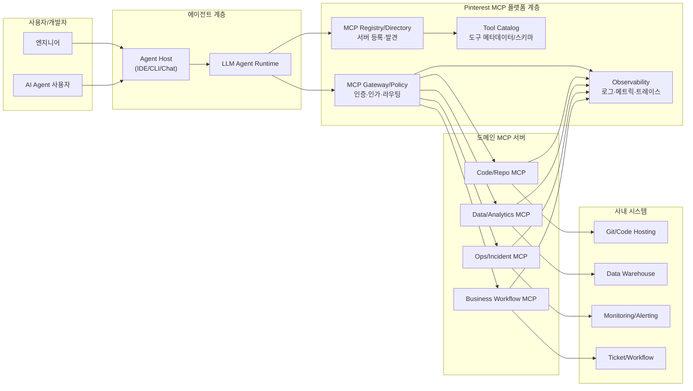
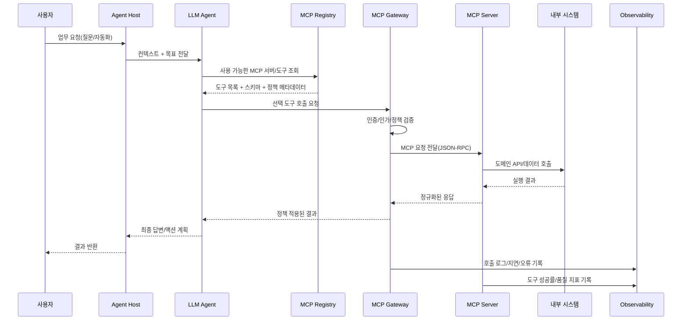
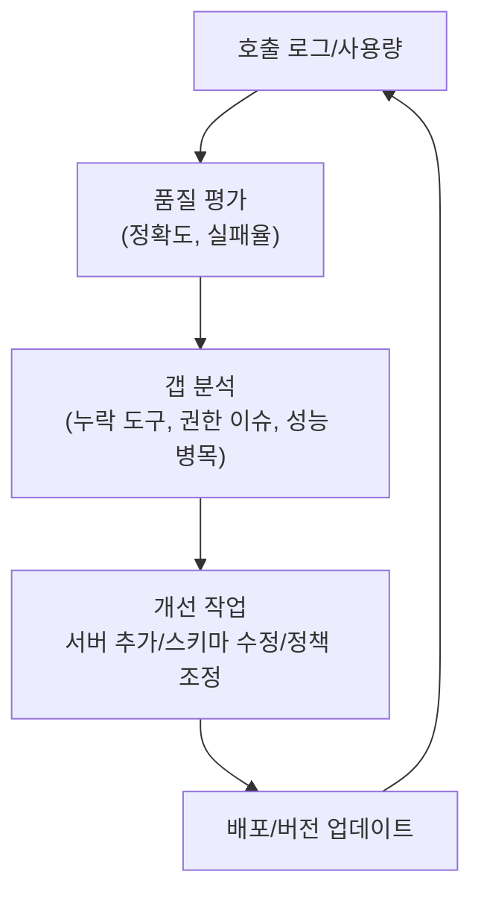

# Pinterest MCP 아키텍처 다이어그램

## 1. MCP 생태계 구성(개념도)

```mermaid
flowchart LR
    subgraph Users["사용자/개발자"]
        Dev["엔지니어"]
        AIUser["AI Agent 사용자"]
    end

    subgraph AgentLayer["에이전트 계층"]
        Host["Agent Host<br/>(IDE/CLI/Chat)"]
        Agent["LLM Agent Runtime"]
    end

    subgraph MCPPlatform["Pinterest MCP 플랫폼 계층"]
        Registry["MCP Registry/Directory<br/>서버 등록·발견"]
        Gateway["MCP Gateway/Policy<br/>인증·인가·라우팅"]
        Catalog["Tool Catalog<br/>도구 메타데이터/스키마"]
        Obs["Observability<br/>로그·메트릭·트레이스"]
    end

    subgraph MCPServers["도메인 MCP 서버"]
        Code["Code/Repo MCP"]
        Data["Data/Analytics MCP"]
        Ops["Ops/Incident MCP"]
        Biz["Business Workflow MCP"]
    end

    subgraph Systems["사내 시스템"]
        Git["Git/Code Hosting"]
        Warehouse["Data Warehouse"]
        Monitor["Monitoring/Alerting"]
        Workflow["Ticket/Workflow"]
    end

    Dev --> Host
    AIUser --> Host
    Host --> Agent
    Agent --> Registry
    Agent --> Gateway
    Registry --> Catalog
    Gateway --> Code
    Gateway --> Data
    Gateway --> Ops
    Gateway --> Biz

    Code --> Git
    Data --> Warehouse
    Ops --> Monitor
    Biz --> Workflow

    Gateway --> Obs
    Code --> Obs
    Data --> Obs
    Ops --> Obs
    Biz --> Obs
```

## 2. MCP 요청 처리 워크플로우

```mermaid
sequenceDiagram
    participant U as 사용자
    participant H as Agent Host
    participant A as LLM Agent
    participant R as MCP Registry
    participant G as MCP Gateway
    participant S as MCP Server
    participant T as 내부 시스템
    participant O as Observability

    U->>H: 업무 요청(질문/자동화)
    H->>A: 컨텍스트 + 목표 전달
    A->>R: 사용 가능한 MCP 서버/도구 조회
    R-->>A: 도구 목록 + 스키마 + 정책 메타데이터
    A->>G: 선택 도구 호출 요청
    G->>G: 인증/인가/정책 검증
    G->>S: MCP 요청 전달(JSON-RPC)
    S->>T: 도메인 API/데이터 호출
    T-->>S: 실행 결과
    S-->>G: 정규화된 응답
    G-->>A: 정책 적용된 결과
    A-->>H: 최종 답변/액션 계획
    H-->>U: 결과 반환

    G->>O: 호출 로그/지연/오류 기록
    S->>O: 도구 성공률/품질 지표 기록
```

## 3. 운영 피드백 루프

```mermaid
flowchart TD
    Usage["호출 로그/사용량"] --> Eval["품질 평가<br/>(정확도, 실패율)"]
    Eval --> Gap["갭 분석<br/>(누락 도구, 권한 이슈, 성능 병목)"]
    Gap --> Improve["개선 작업<br/>서버 추가/스키마 수정/정책 조정"]
    Improve --> Release["배포/버전 업데이트"]
    Release --> Usage
```
