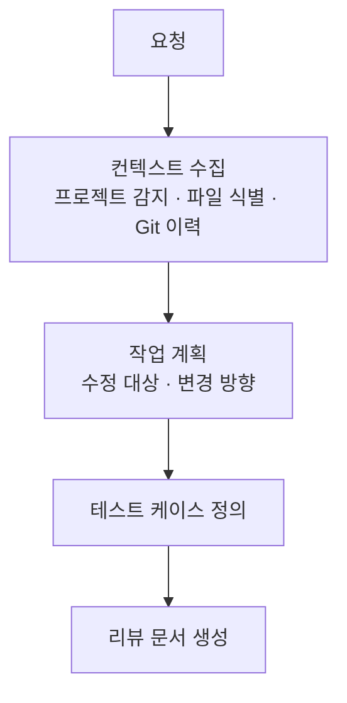
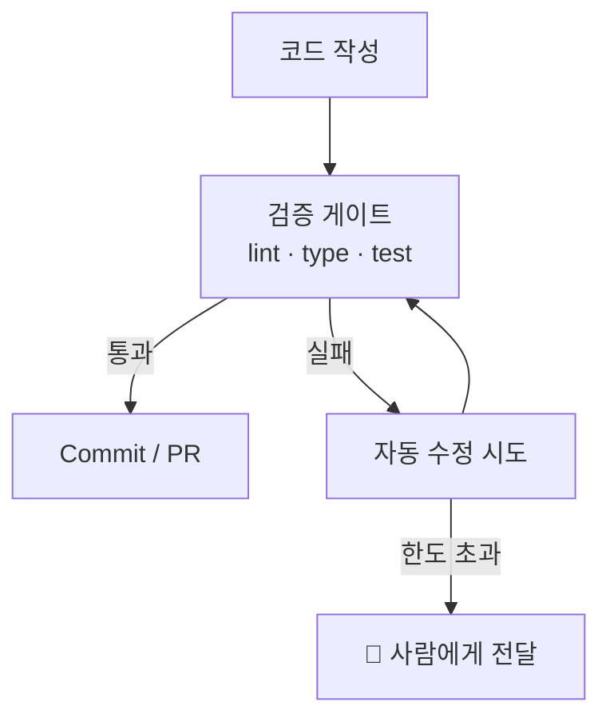

# 상세

## 워크플로우

### 준비 단계

에이전트가 요청을 받아 실행에 필요한 정보를 수집하고, 사람에게 리뷰 문서를 제출한다.

리뷰 문서에 포함되는 것:

- **컨텍스트**: 식별된 관련 파일 목록
- **계획**: 어떤 파일을 어떻게 수정할지
- **테스트**: 변경을 검증할 테스트 케이스
- **애매한 판단**: 에이전트가 확신하지 못하는 부분 (사람의 결정 필요)

### 실행 단계

사람이 리뷰를 승인하면, 에이전트가 자율적으로 구현한다.

Minions의 원칙을 적용한다:

- 게이트(lint/test)는 파이프라인에 하드코딩 — LLM이 우회 불가
- 자동 수정 횟수 제한 — 실패 시 사람에게 에스컬레이션

---

## 컨텍스트 수집 방안

| 방안           | 방식                            | 장점                 | 한계                |
|--------------|-------------------------------|--------------------|-------------------|
| 정적 분석        | grep, glob, import 추적, Git 이력 | 결정론적, 빠름, 외부 의존 없음 | 의미적 관계 누락 가능      |
| Augment Code | 코드베이스 시맨틱 검색                  | 키워드 불일치해도 관련 코드 발견 | 인덱싱 필요, 외부 서비스 의존 |
| Context7 MCP | 라이브러리 공식 문서 조회                | 올바른 API 사용 패턴 제공   | 외부 라이브러리에 한정      |

정적 분석을 기본으로 하고, Augment와 Context7을 선택적으로 조합하는 방식이 유연하다.

---

## 구현 옵션

| 옵션        | 설명                            | 장점       | 단점         |
|-----------|-------------------------------|----------|------------|
| 독립 CLI    | 별도 도구 개발                      | 완전한 제어   | 개발 비용 큼    |
| 기존 도구 래퍼  | Claude Code slash command 등   | 개발 비용 낮음 | 도구 제약 내 동작 |
| Agent SDK | Claude Agent SDK, LangGraph 등 | 구조화된 설계  | 프레임워크 의존   |

---

## 검토 사항

- 리뷰 문서 형식과 제공 방식은? (터미널 출력, 마크다운 파일, IDE)
- 리뷰 없이 바로 실행하는 옵션(`--auto`)이 필요한가?
- 격리 환경이 필요한가? (Git 브랜치 분리 vs Worktree)
- 기존 도구(Claude Code, Cursor)와의 관계는? (대체 vs 보완 vs 래퍼)
- 어떤 구현 옵션이 현실적인가?
