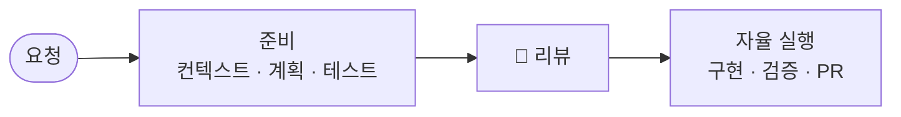

# 로컬 개발 자동화 에이전트

> 한 줄 요청 → 에이전트가 컨텍스트·계획·테스트를 준비 → 사람이 한 번 리뷰 → 자율 실행

## 컨셉

Stripe Minions의 One-Shot 방식을 로컬 환경에 맞게 변형한다.
완전 자율 대신, **실행 전 사람의 리뷰를 한 번 거치는** 구조를 취한다.

| 단계 | 주체   | 하는 일                                        |
|----|------|---------------------------------------------|
| 준비 | 에이전트 | 관련 파일 식별, 작업 계획, 테스트 케이스 정의, 리뷰 문서 생성       |
| 리뷰 | 사람   | 계획·범위·테스트 확인, 애매한 판단 결정, 승인 또는 수정 요청        |
| 실행 | 에이전트 | 코드 작성, 검증 게이트(lint/test), 실패 시 자동 수정, PR 생성 |

## Minions와의 차이

|       | Stripe Minions | 로컬 에이전트         |
|-------|----------------|-----------------|
| 사람 개입 | 없음 (PR 리뷰만)    | 실행 전 1회 리뷰      |
| 안전성   | VM 격리, 네트워크 차단 | 사람의 사전 검토 + 게이트 |
| 규모    | 대규모 모노레포       | 개인/소규모 프로젝트     |

## 상세

- [상세 문서](detail.md) — 워크플로우 상세, 컨텍스트 수집 방안, 검토 사항

## 참고

- [Stripe Minions](../../examples/minions/README.md)
- [Auto Improve Loop](../../auto-improve/README.md)
- [에이전틱 AI 설계 패턴](../../effective-agents/README.md)
