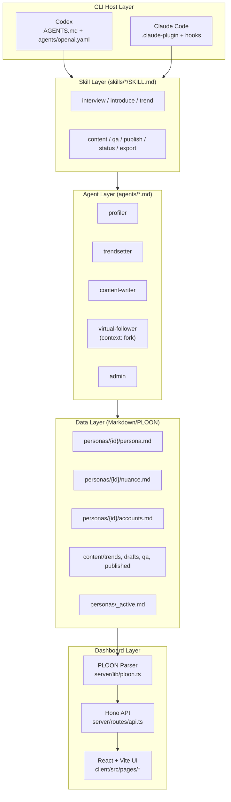
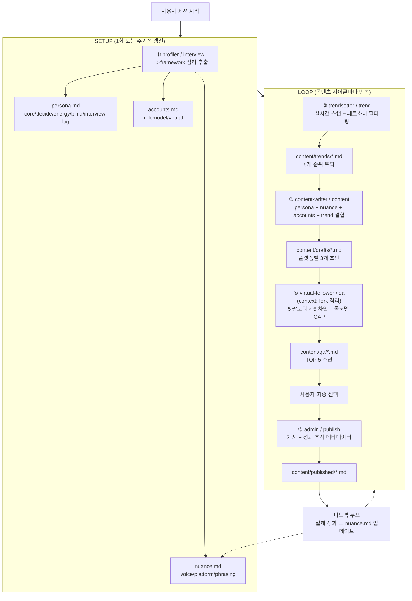
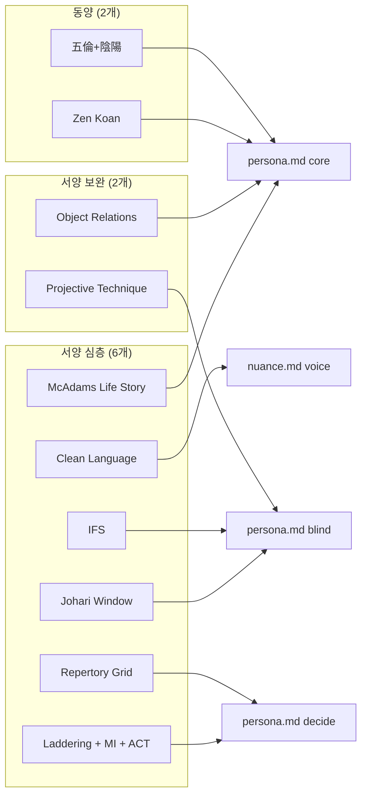
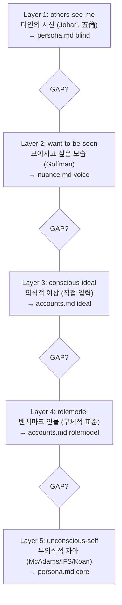
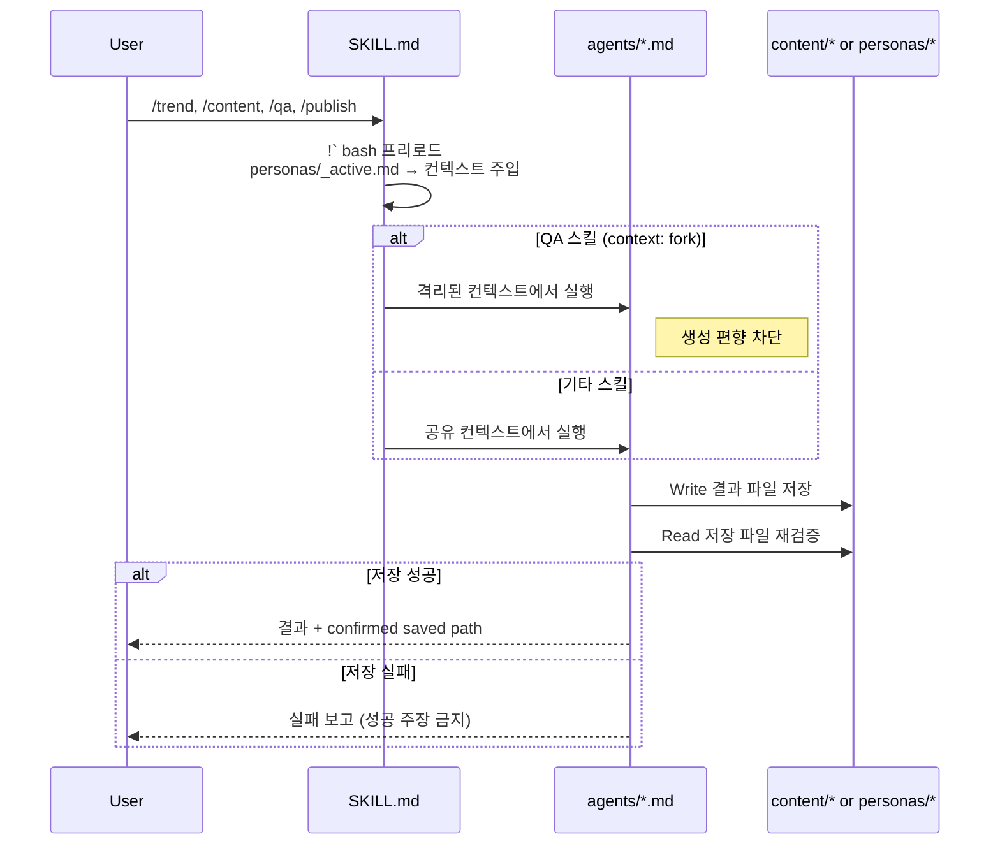
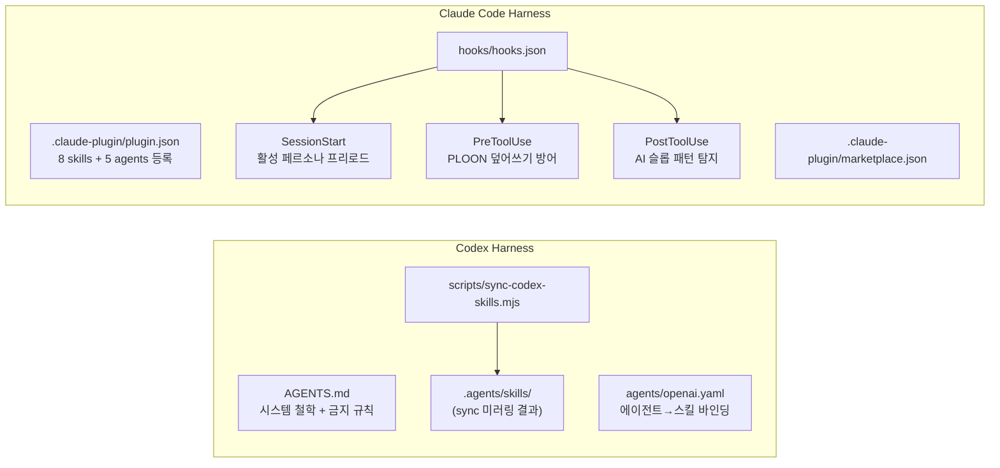
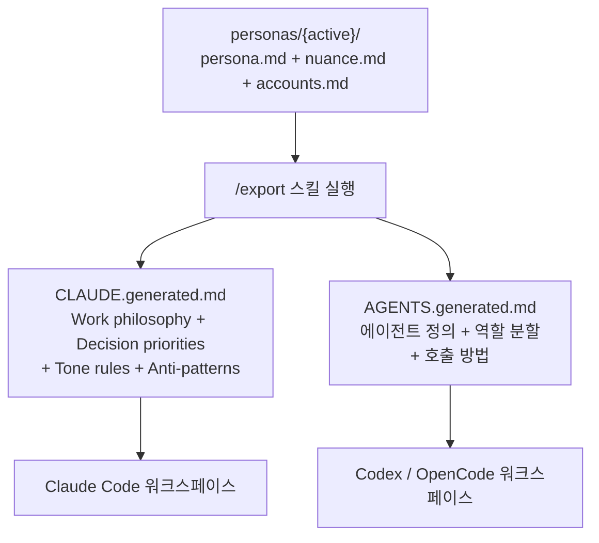
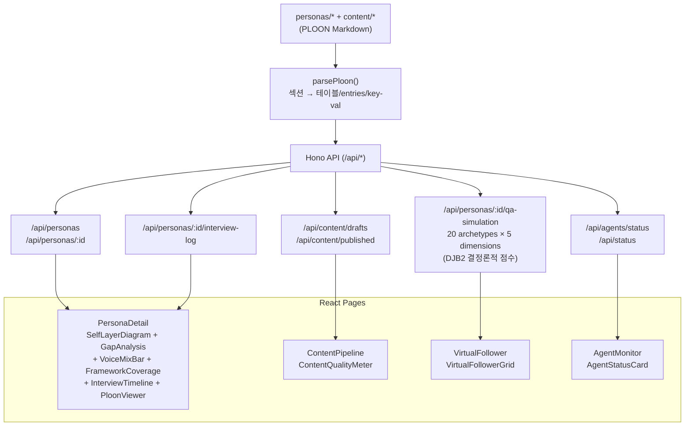

# Polysona 아키텍처 다이어그램

## 1. 전체 계층 구조

## 2. SETUP → LOOP 파이프라인

## 3. 10-Framework → 데이터 목적지 매핑

## 4. 5 에고 레이어 & GAP 모델

## 5. Write-then-Read 검증 & context:fork 격리

## 6. Codex/Claude 이중 하네스

## 7. Export 이식성 흐름

## 8. 대시보드 데이터 플로우

