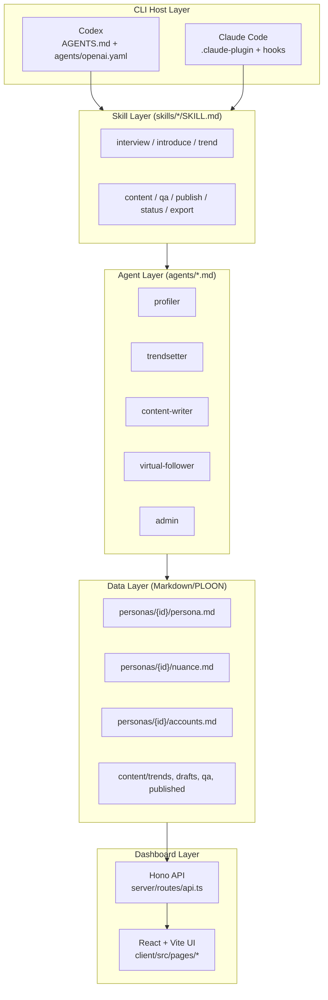
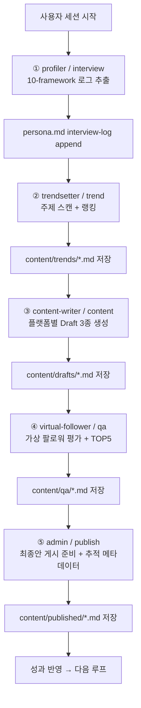
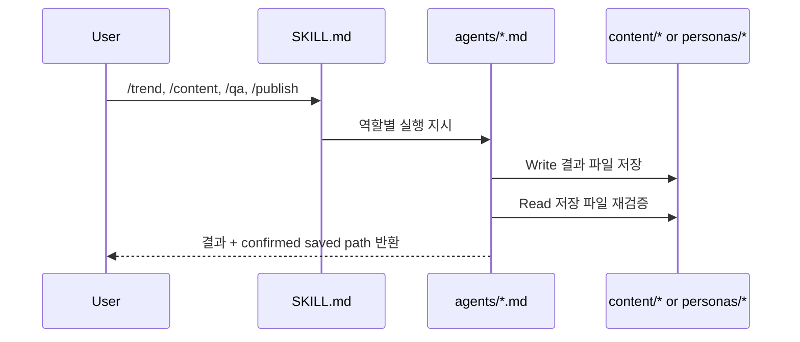
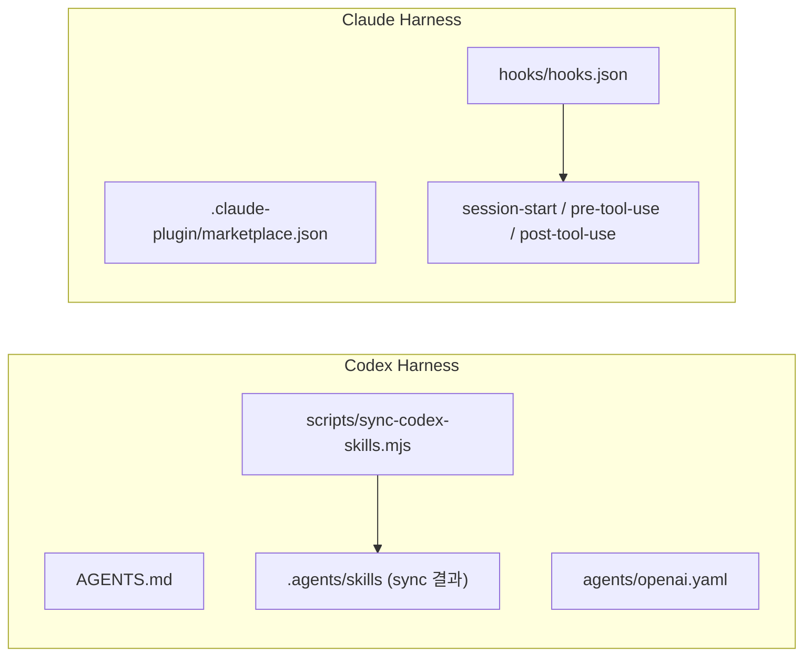
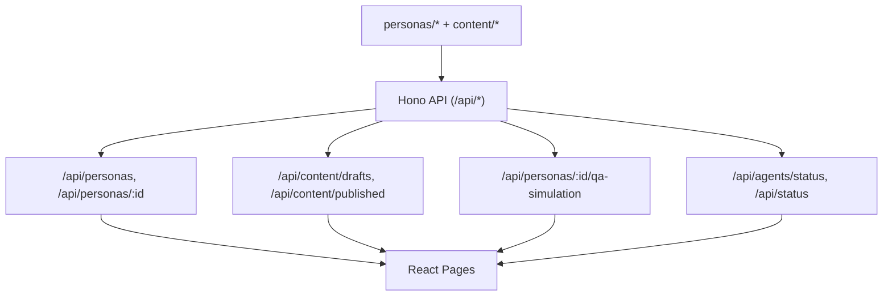

# Polysona 아키텍처 다이어그램

## 1. 전체 계층 구조

```mermaid
flowchart TD
    subgraph Host["CLI Host Layer"]
        H1["Codex<br/>AGENTS.md + agents/openai.yaml"]
        H2["Claude Code<br/>.claude-plugin + hooks"]
    end

    subgraph Skills["Skill Layer (skills/*/SKILL.md)"]
        S1["interview / introduce / trend"]
        S2["content / qa / publish / status / export"]
    end

    subgraph Agents["Agent Layer (agents/*.md)"]
        A1["profiler"]
        A2["trendsetter"]
        A3["content-writer"]
        A4["virtual-follower"]
        A5["admin"]
    end

    subgraph Data["Data Layer (Markdown/PLOON)"]
        D1["personas/{id}/persona.md"]
        D2["personas/{id}/nuance.md"]
        D3["personas/{id}/accounts.md"]
        D4["content/trends, drafts, qa, published"]
    end

    subgraph Dashboard["Dashboard Layer"]
        DB1["Hono API<br/>server/routes/api.ts"]
        DB2["React + Vite UI<br/>client/src/pages/*"]
    end

    H1 --> Skills
    H2 --> Skills
    Skills --> Agents
    Agents --> Data
    Data --> DB1
    DB1 --> DB2
```

## 2. 인터뷰 → 콘텐츠 발행 파이프라인

```mermaid
flowchart TD
    START["사용자 세션 시작"] --> I["① profiler / interview<br/>10-framework 로그 추출"]
    I --> P["persona.md interview-log append"]
    P --> T["② trendsetter / trend<br/>주제 스캔 + 랭킹"]
    T --> TF["content/trends/*.md 저장"]
    TF --> C["③ content-writer / content<br/>플랫폼별 Draft 3종 생성"]
    C --> DF["content/drafts/*.md 저장"]
    DF --> Q["④ virtual-follower / qa<br/>가상 팔로워 평가 + TOP5"]
    Q --> QF["content/qa/*.md 저장"]
    QF --> A["⑤ admin / publish<br/>최종안 게시 준비 + 추적 메타데이터"]
    A --> PF["content/published/*.md 저장"]
    PF --> LOOP["성과 반영 → 다음 루프"]
```

## 3. Skill → Agent 라우팅 및 저장 강제 흐름

```mermaid
sequenceDiagram
    participant User
    participant Skill as SKILL.md
    participant Agent as agents/*.md
    participant FS as content/* or personas/*

    User->>Skill: /trend, /content, /qa, /publish
    Skill->>Agent: 역할별 실행 지시
    Agent->>FS: Write 결과 파일 저장
    Agent->>FS: Read 저장 파일 재검증
    Agent-->>User: 결과 + confirmed saved path 반환
```

## 4. Codex/Claude 하네스 구성

```mermaid
flowchart LR
    subgraph Codex["Codex Harness"]
        C1["AGENTS.md"]
        C2["agents/openai.yaml"]
        C3[".agents/skills (sync 결과)"]
        C4["scripts/sync-codex-skills.mjs"]
        C4 --> C3
    end

    subgraph Claude["Claude Harness"]
        L1[".claude-plugin/marketplace.json"]
        L2["hooks/hooks.json"]
        L3["session-start / pre-tool-use / post-tool-use"]
        L2 --> L3
    end
```

## 5. 대시보드 데이터 플로우

```mermaid
flowchart TD
    FILES["personas/* + content/*"] --> API["Hono API (/api/*)"]
    API --> P1["/api/personas, /api/personas/:id"]
    API --> P2["/api/content/drafts, /api/content/published"]
    API --> P3["/api/personas/:id/qa-simulation"]
    API --> P4["/api/agents/status, /api/status"]
    P1 --> UI["React Pages"]
    P2 --> UI
    P3 --> UI
    P4 --> UI
```
